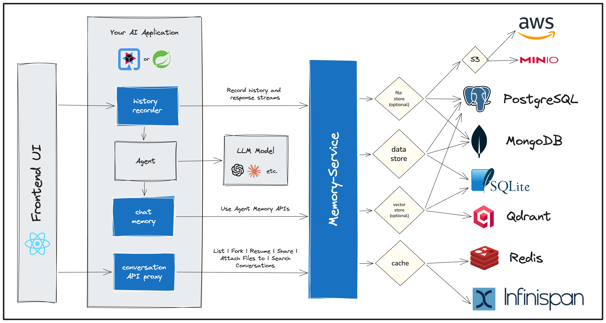

# Memory Service

[](https://github.com/chirino/memory-service/actions/workflows/pr-check.yml)

A persistent memory service for AI agents that stores and manages conversation history, enabling agents to maintain context across sessions, replay conversations, fork conversations at any point, and perform semantic search across all conversations.

## Features

- **Persistent conversation storage** - All messages are stored with full context and metadata
- **Resumable response streams** - Long lived response streams can survive client reconnects or user device swtiching
- **Conversation replay/audit** - Reconstruct converstation history and agent memory state as it was at any point in time
- **Conversation forking** - Fork a conversation at any message to explore alternative paths
- **Access control** - User-based ownership and sharing with fine-grained permissions
- **Multi-database support** - Works with PostgreSQL and MongoDB; local, Redis, and Infinispan caching; PGVector, Qdrant, and Infinispan for vector search
- **Semantic & Fulltext Search** - Search across all conversations using vector and/or Fulltext
- **File Attachments** - Durably store files attached to messages sent to your agent, or generated by you agent.
- **Encrypted** - All database/file stortage data is encrypted while at rest


## Project Status

This is a proof of concept (POC) currently under development.

## Architecture



## MCP Server

The Memory Service includes an [MCP](https://modelcontextprotocol.io/) server that lets AI coding assistants (Claude Code, Cursor, etc.) persist and search session notes across conversations.

**Install:**

```bash
go install github.com/chirino/memory-service/memory-service-mcp@latest
```

Or use the `mcp` subcommand of the main binary:

```bash
go install github.com/chirino/memory-service@latest
memory-service mcp remote
```

For an embedded local-memory setup:

```bash
memory-service mcp embedded --db-url ./memory.db
```

See [memory-service-mcp/README.md](memory-service-mcp/README.md) for full configuration and usage details.

## Documentation

Visit the [Memory Service Documentation](https://chirino.github.io/memory-service/docs/) for complete guides:

- **[Getting Started](https://chirino.github.io/memory-service/docs/getting-started/)** - Deploy Memory Service using Docker Compose
- **[Core Concepts](https://chirino.github.io/memory-service/docs/concepts/conversations/)** - Understanding conversations, messages, and forking
- **[Quarkus LangChain4j Integration](https://chirino.github.io/memory-service/docs/quarkus/getting-started/)** - Integrate with Quarkus LangChain4j agents
- **[Spring AI Integration](https://chirino.github.io/memory-service/docs/spring/getting-started/)** - Integrate with Spring AI agents
- **[Configuration](https://chirino.github.io/memory-service/docs/configuration/)** - Service configuration reference

## License

Apache 2.0
