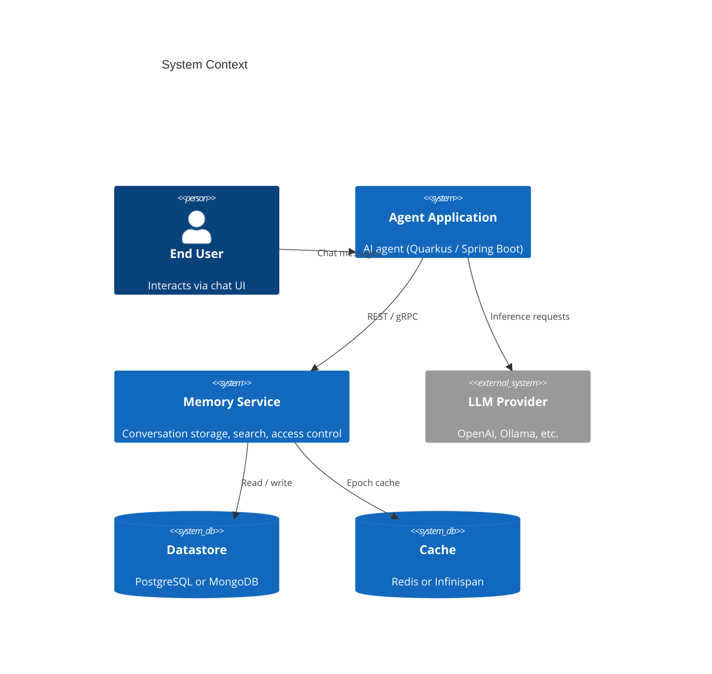
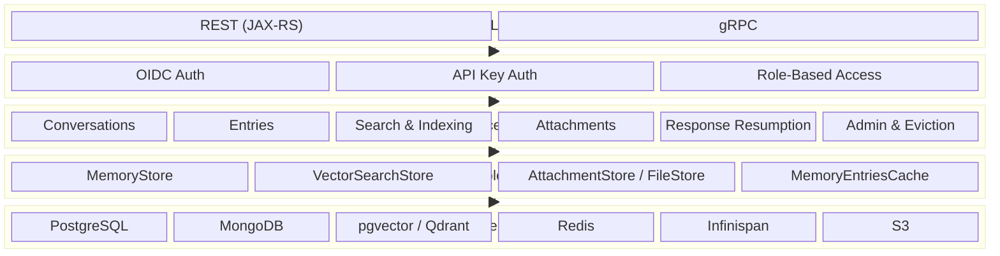
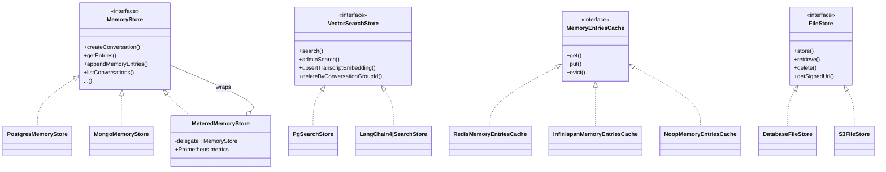
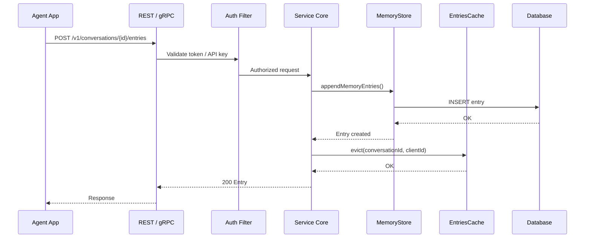
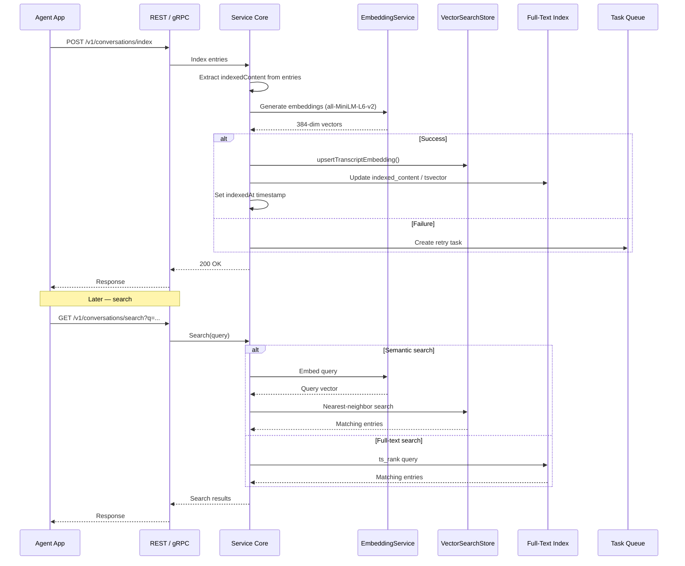
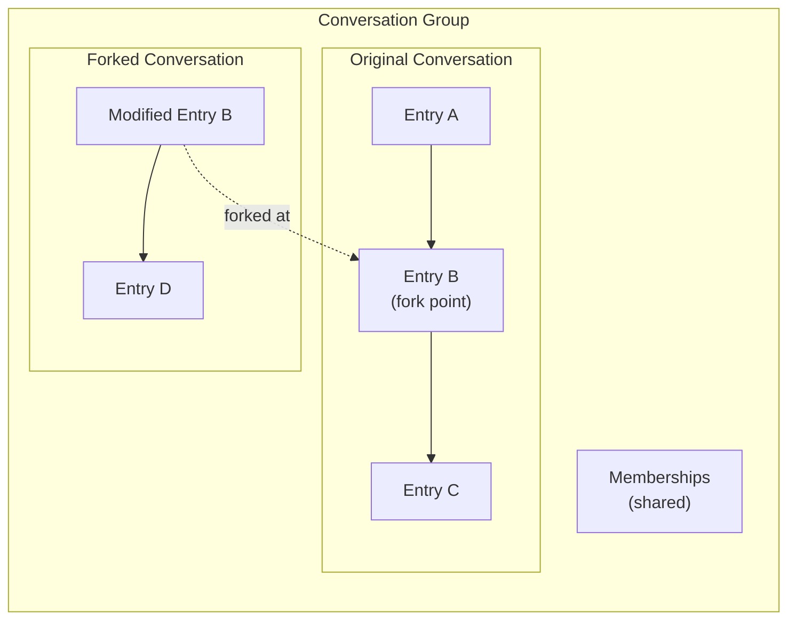
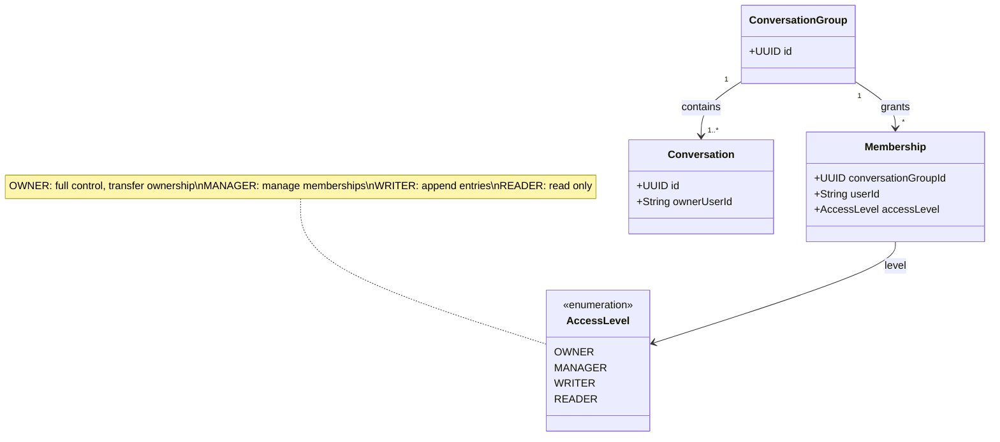
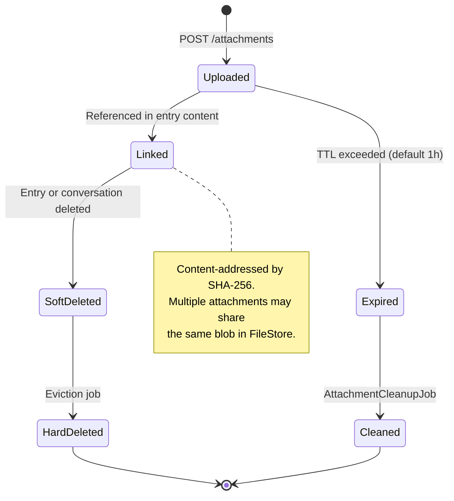
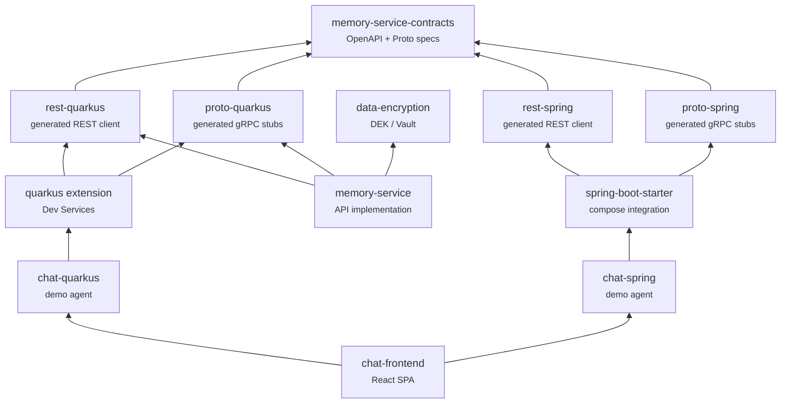

# Architecture

Memory Service is a stateless backend service that stores and indexes AI agent conversations. It exposes both REST and gRPC APIs, supports pluggable datastores and caching, and is designed for horizontal scaling.

## System Context

The following diagram shows how Memory Service fits into a typical deployment. Agent applications sit between end users and the memory service, mediating all interactions.

## Component Overview

Inside the memory-service, requests flow through API layers into a shared service core that delegates to pluggable store implementations.

## Store Abstraction

Memory Service uses interface-based abstractions so that datastores, caches, and file storage can be swapped via configuration. Each interface has two or more implementations selected at startup.

## Request Flow

A typical agent interaction — appending a conversation entry — flows through these layers:

## Search & Indexing Pipeline

Entries can be indexed asynchronously. The agent (or a background job) calls the indexing endpoint, which extracts text, generates embeddings, and stores them for later search.

## Conversation Forking

When a conversation is forked, the new conversation shares the same conversation group and inherits all access-control memberships. Entries before the fork point are shared; new entries diverge.

## Access Control Model

Access control is enforced at the conversation group level, so all conversations in a fork tree share the same permissions.

## Attachment Lifecycle

Attachments are uploaded independently, then linked to entries. Unlinked attachments expire automatically.

## Module Structure

The project is organized into a core service module plus framework-specific integration modules for Quarkus and Spring Boot.

