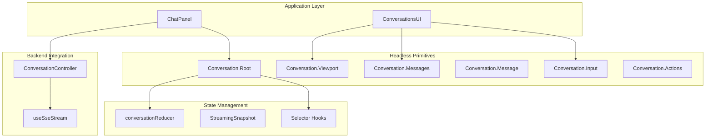
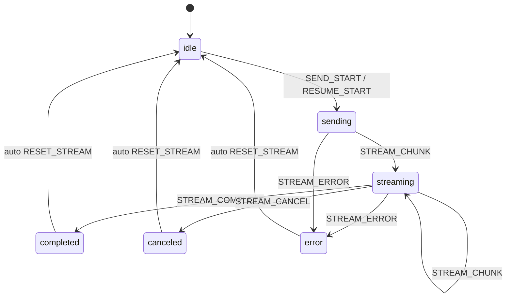
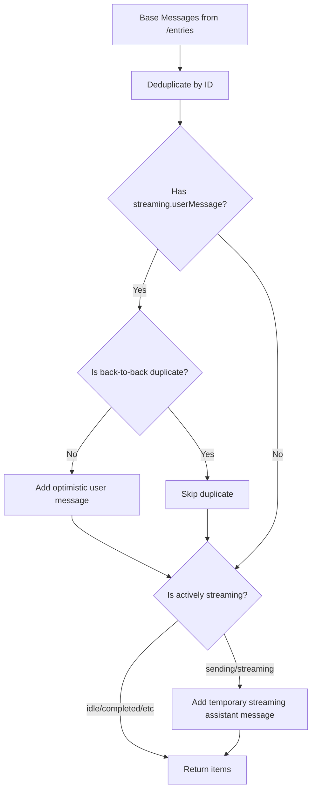
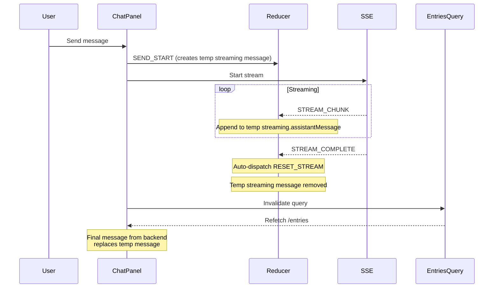
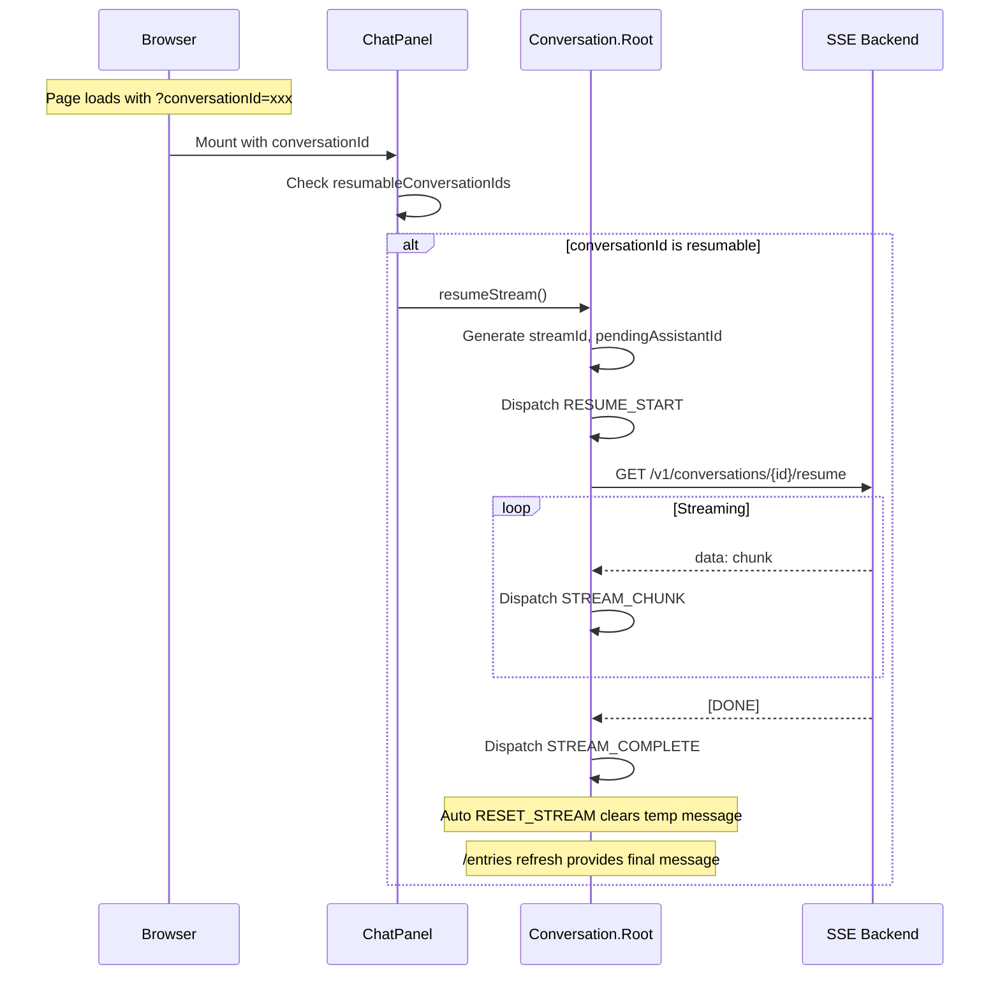
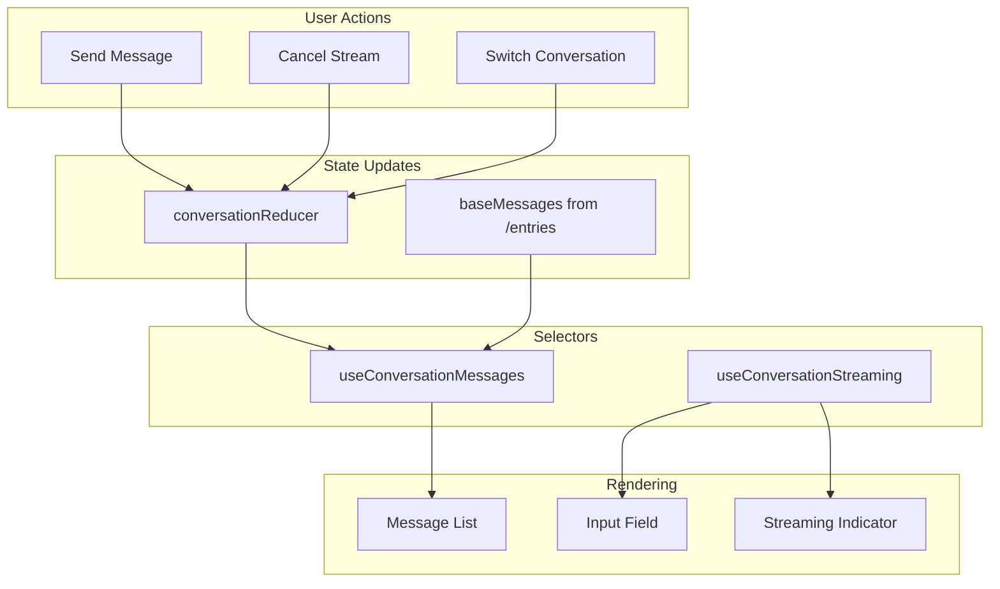

# Chat Frontend Design

This document describes the architecture of the chat frontend in `common/chat-frontend/`.

## Overview

The chat frontend is built using **headless conversation primitives** following the Radix UI pattern. This separates logic from presentation, allowing the conversation state machine to be reused with different UI implementations.



## Component Architecture

### Headless Components

The `Conversation` namespace exports headless components that manage state without prescribing UI:

| Component | Purpose |
|-----------|---------|
| `Conversation.Root` | Provider that initializes state and exposes context |
| `Conversation.Viewport` | Container with ARIA `role="log"` for accessibility |
| `Conversation.Messages` | Renders messages via render prop or children |
| `Conversation.Message` | Individual message wrapper with display state |
| `Conversation.Input` | Textarea with submit handling |
| `Conversation.Actions` | Render prop for send/resume/cancel actions |

### Hook Exports

| Hook | Purpose |
|------|---------|
| `useConversationMessages()` | Returns reconciled messages with display states |
| `useConversationStreaming()` | Returns streaming state and control functions |
| `useConversationInput()` | Returns input value/setValue/submit/reset |
| `useConversationContext()` | Full context (throws if outside Root) |
| `useOptionalConversationContext()` | Safe context access (returns null) |
| `useMessageContext()` | Access current message within Message component |

## State Machine

### Streaming Phases



### State Shape

```typescript
type ConversationState = {
  conversationId: string | null;
  conversationGroupId: string | null;
  baseMessages: ConversationMessage[];      // Messages from backend /entries
  inputValue: string;                        // Current input text
  streaming: StreamingSnapshot;              // Active stream state
};

type StreamingSnapshot = {
  phase: "idle" | "sending" | "streaming" | "completed" | "canceled" | "error";
  error: string | null;
  userMessage: ConversationMessage | null;   // Optimistic user message
  assistantMessage: ConversationMessage | null; // Streaming assistant content (temporary)
  streamId: string | null;                   // Prevents stale chunk application
  pendingAssistantId: string | null;         // Temporary ID for streaming message
};
```

### Reducer Actions

| Action | Effect |
|--------|--------|
| `SET_CONVERSATION` | Switch conversation, optionally reset stream |
| `SET_MESSAGES` | Update base messages from backend |
| `SET_INPUT` | Update input field value |
| `SEND_START` | Begin new message stream |
| `RESUME_START` | Begin resume stream |
| `STREAM_CHUNK` | Append chunk to assistant message |
| `STREAM_COMPLETE` | Mark stream as finished (auto-triggers RESET_STREAM) |
| `STREAM_CANCEL` | Mark stream as canceled (auto-triggers RESET_STREAM) |
| `STREAM_ERROR` | Store error (auto-triggers RESET_STREAM) |
| `RESET_STREAM` | Return to idle state, clear streaming message |

## Message Reconciliation

The `useConversationMessages()` hook reconciles base messages (from backend `/entries`) with streaming state.

**Key Principle**: Streaming messages are **temporary**. They're shown during active streaming and automatically removed when streaming completes. The backend's `/entries` endpoint provides the final, authoritative messages.



### Reconciliation Rules

1. **User Message Echo Detection**: Content-based matching (normalized text) because backends may assign new IDs
2. **Streaming Assistant Message**: Temporary - shown only during `sending` or `streaming` phases
3. **Auto-cleanup**: When streaming completes, `RESET_STREAM` is dispatched automatically, removing the temporary message
4. **Final Message**: The `/entries` query refreshes after stream completion, providing the authoritative final message

## Streaming Lifecycle



## Resume Flow

Resume handles the case where a page reloads while a response is in progress.



## StreamId Guards

StreamIds prevent stale chunks from previous (canceled/failed) streams from affecting current state.

```typescript
// Generated when starting a stream
const streamId = `stream-${Date.now()}-${Math.random().toString(36).slice(2, 9)}`;

// In reducer, all stream actions check:
case "STREAM_CHUNK": {
  if (state.streaming.streamId !== action.streamId) {
    return state; // Ignore stale chunk
  }
  // Apply chunk...
}
```

## Data Flow Summary



## Files Reference

| File | Purpose |
|------|---------|
| [conversation.tsx](../common/chat-frontend/src/components/conversation.tsx) | Headless primitives, reducer, hooks |
| [chat-panel.tsx](../common/chat-frontend/src/components/chat-panel.tsx) | Main chat UI, auto-resume |
| [useSseStream.ts](../common/chat-frontend/src/hooks/useSseStream.ts) | SSE stream handling |
| [conversations-ui.tsx](../common/chat-frontend/src/components/conversations-ui.tsx) | Styled UI components |

## Design Decisions

### Why Headless Primitives?
- Separates state machine from presentation
- Allows different UI implementations (ChatPanel, future mobile, etc.)
- Enables testing of logic without rendering

### Why Temporary Streaming Messages?
- Simple mental model: streaming message = preview, backend message = final
- No complex ID mapping between frontend-generated and backend-assigned IDs
- Auto-cleanup ensures no stale streaming messages remain
- `/entries` is the single source of truth for message history

### Why Content-Based User Echo Detection?
- Backends may not echo client-generated IDs for user messages
- Content matching (normalized) catches duplicates regardless of ID

### Why StreamId Guards?
- Prevents race conditions when streams overlap
- User might cancel and immediately send new message
- Stale chunks from old stream would corrupt new stream without guards
