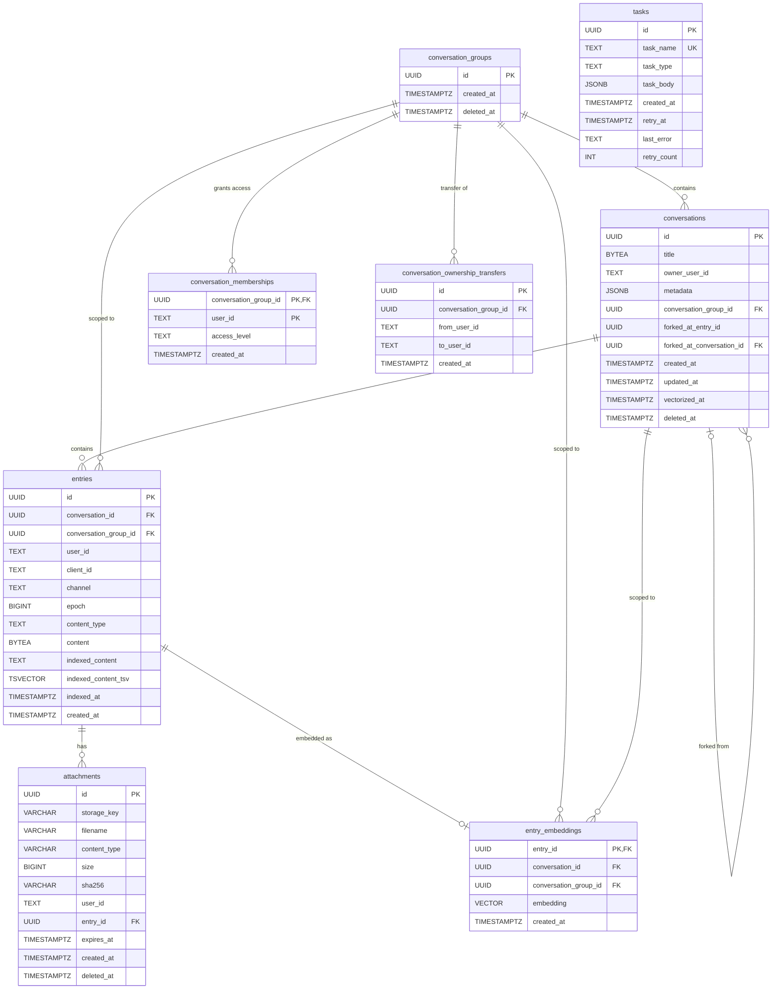

# Database Design

Memory Service uses a relational schema designed around conversation groups as the unit of access control,
with support for soft deletes, encrypted content, full-text search, and optional vector search.

## Entity Relationship Diagram

## Tables

### conversation_groups

The top-level grouping entity. Every conversation belongs to exactly one group, and all access control
(memberships) is defined at the group level. When a conversation is forked, the fork shares the same
group as the original, so all members retain access to the entire fork tree.

- Soft-deleted via `deleted_at`.

### conversations

Stores conversation metadata. Titles are stored as `BYTEA` to support encryption at rest.
The `metadata` column is a free-form `JSONB` field for agent-defined tags and properties.

- `conversation_group_id` links to the owning group.
- `forked_at_conversation_id` and `forked_at_entry_id` record the fork point when a conversation is created by forking.
- `vectorized_at` tracks when entries were last sent for vector embedding.
- Soft-deleted via `deleted_at`.

### conversation_memberships

Per-user access grants scoped to a conversation group. The composite primary key
`(conversation_group_id, user_id)` ensures one membership per user per group.

- `access_level` is one of: `owner`, `manager`, `writer`, `reader`.
- Exactly one `owner` row must exist per group.
- Hard-deleted (not soft-deleted) with audit logging.

### entries

Individual messages, memory records, and transcript items within a conversation.

- `channel` categorizes the entry: `history`, `memory`, or `transcript`.
- `epoch` supports memory compaction versioning (see [entry-data-model.md](entry-data-model.md)).
- `content` is stored as `BYTEA` (encrypted).
- `indexed_content` is a plaintext copy used for full-text search.
- `indexed_content_tsv` is a generated `tsvector` column maintained automatically by PostgreSQL, indexed with a GIN index for fast full-text queries.

### attachments

File attachments linked to entries.

- `storage_key` references the file in the configured blob store.
- `expires_at` enables automatic cleanup of temporary uploads.
- `sha256` provides integrity verification.
- Soft-deleted via `deleted_at`.

### conversation_ownership_transfers

Tracks pending ownership transfer requests. A conversation group can have at most one pending transfer
(enforced by a unique constraint on `conversation_group_id`). Accepted or rejected transfers are
hard-deleted.

- `from_user_id != to_user_id` is enforced by a check constraint.

### tasks

A lightweight background task queue with retry support.

- `task_name` is an optional unique identifier for singleton tasks (partial unique index allows multiple `NULL` values).
- `task_body` stores task parameters as `JSONB`.
- `retry_at` and `retry_count` support exponential backoff.

### entry_embeddings (optional, pgvector)

Vector embeddings for semantic search, created when the pgvector extension is enabled.

- Uses 384-dimensional vectors (all-MiniLM-L6-v2 model).
- HNSW index for fast approximate nearest-neighbor search with cosine similarity.
- `conversation_group_id` enables access-controlled search via join.

## Design Patterns

### Conversation Groups as the Access Control Boundary

Rather than attaching memberships directly to individual conversations, access is controlled at
the **group** level. A conversation group contains one or more conversations (a root plus its forks).
This means forking a conversation does not require copying membership rows &mdash; the fork
automatically inherits all access grants from the group.

### Soft Deletes with Retention Indexes

Conversations, conversation groups, and attachments use a `deleted_at` timestamp for soft deletion.
Partial indexes on `deleted_at IS NULL` and `deleted_at IS NOT NULL` keep queries efficient for
both active-record lookups and retention/eviction jobs that clean up expired soft-deleted rows.

### Encrypted Content Storage

Conversation titles and entry content are stored as `BYTEA`, allowing the application layer to
encrypt data before persistence. A separate `indexed_content` text column holds the plaintext
needed for full-text search, decoupling search indexing from content encryption.

### Full-Text Search

PostgreSQL's built-in `tsvector`/`tsquery` is used for keyword search. The `indexed_content_tsv`
column is a generated stored column that automatically stays in sync with `indexed_content`.
A GIN index on this column provides fast full-text queries without requiring an external search engine.

### Background Task Queue

The `tasks` table implements a simple, database-backed job queue. The `retry_at` column acts as
a visibility timeout &mdash; workers poll for tasks where `retry_at <= NOW()` and update the
timestamp on failure. This avoids the need for an external message broker for lightweight
background work like vectorization and cleanup.
