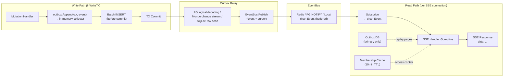
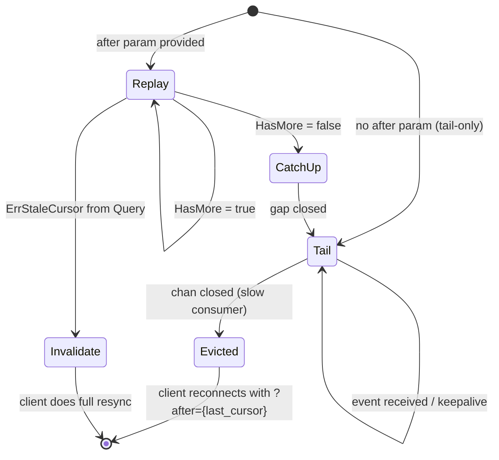
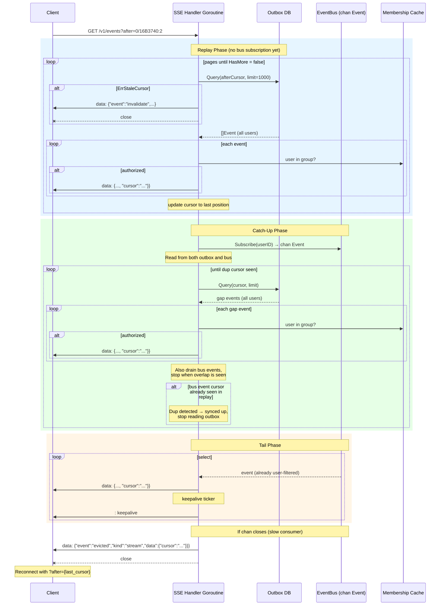

# Enhancement 090: Event Outbox for Reliable Delivery

> **Status**: Implemented, with Mongo transactional replay guarantees deferred to [091](091-mongo-outbox-transactions.md) and tracked in [TODO.md](../../TODO.md).
>
> **Current Contract Note**: Archive event semantics now follow [implemented/094-archive-operations.md](implemented/094-archive-operations.md). Conversation and memory archive operations emit `updated`; `deleted` is reserved for hard-delete or close semantics.
>
> **PostgreSQL Cursor Note**: PostgreSQL relay cursors now follow [096](implemented/096-postgres-relay-event-seq-cursor.md): replay/tail cursors are opaque numeric `event_seq` values assigned by the relay, request-path durable publishes are suppressed, and the `pgoutput` relay is the authoritative live publisher.

## Summary

Add an optional event outbox that durably persists events to the primary data store, enabling consumers to poll for events with cursor-based at-least-once delivery. This complements the existing best-effort SSE `/v1/events` stream with a reliable delivery path suitable for cache invalidation pipelines, audit systems, and external integrations.

## Motivation

The current event system ([087](implemented/087-user-scoped-event-routing.md)) is designed for real-time, best-effort delivery:

- **SSE streams are ephemeral** — if a consumer disconnects, events during the gap are lost. Clients must do a full refetch on reconnect.
- **No replay** — there is no way to ask "what changed since I last checked?" without re-reading every entity.
- **External integrations are fragile** — systems that need to react to memory-service changes (CDC pipelines, search indexers, webhook dispatchers) have no durable event feed to consume.
- **Cache invalidation is coarse** — after a reconnect, the `invalidate` stream event forces a full cache flush because there is no way to know which specific entities changed.

The outbox pattern solves these problems by writing events to a durable store at mutation time and letting consumers stream from a cursor, getting exactly the events they missed.

## Design

### Core Approach

1. **Write events to an outbox table/collection** in the same transaction (or write operation) as the entity mutation. This guarantees that an event exists if and only if the mutation committed.
2. **Extend the existing `/v1/events` endpoint** with optional `after` and `detail` query parameters for cursor-based replay and enriched data.
3. **Drive live tail delivery from a store-native outbox relay**. When the outbox is enabled, mutation handlers only persist outbox rows inside the write transaction. A PostgreSQL logical-decoding relay, MongoDB change-stream relay, or SQLite row-order relay then republishes committed outbox rows onto the existing EventBus with stable per-event cursors. Replay and tail therefore observe the same cursor space.
4. **Support two detail levels** — lightweight events (just identifiers, good for cache invalidation) and enriched events (current entity data fetched from source tables at read time).
5. **Each consumer tracks its own cursor** client-side. The server is stateless with respect to consumer progress.



### Outbox Record Schema

Each outbox record contains:

| Field | Type | Description |
|-------|------|-------------|
| `cursor` | `string` (API) | Opaque, per-event resume position. Each row gets its own cursor so that multi-event transactions are individually resumable. Store-specific representation: PostgreSQL uses WAL LSN + intra-transaction ordinal (e.g., `"0/16B3740:2"`), MongoDB uses change stream resume token (inherently per-document), SQLite uses auto-increment integer (safe because writes are single-threaded). Consumers treat `cursor` as an opaque string — pass it back via the `after` parameter as-is. |
| `event` | `int16` (DB) / `string` (API) | Action: `created`, `updated`, `deleted`. Stored as int16 in DB, serialized as string name in API responses. |
| `kind` | `int16` (DB) / `string` (API) | Resource type: `conversation`, `entry`, `response`, `membership`. Stored as int16 in DB, serialized as string name in API responses. |
| `data` | `jsonb` / `bson` | The same event `data` payload that `/v1/events` publishes. Contains all entity identifiers (`conversation`, `entry`, `conversation_group`, etc.). |
| `created_at` | `timestamp` | When the event was written. Used for time-based eviction. |

All event `data` payloads **must** include a `conversation_group` field for access control filtering at read time. Membership events already include it; entry and response events must be updated so every business event uses the same shape. This keeps replay filtering simple and keeps the normalized SSE payload consistent across kinds. Access control is resolved in-memory using a cached `conversation_group_id → membership` map (same pattern as the existing `/v1/events` handler), not via DB-level filtering.

#### Event Action Enum

| Value | Name | Description |
|-------|------|-------------|
| 0 | `created` | A new entity was created (conversation, entry, membership, response recording session) |
| 1 | `updated` | An existing entity was modified (conversation metadata, membership role) |
| 2 | `deleted` | An entity was hard-deleted or closed (membership removed, response recording completed or failed, eviction hard delete) |
| 3 | `evicted` | A stream connection was evicted (slow consumer or replaced) |
| 4 | `invalidate` | Pub/sub disruption — clients should treat cached state as stale |
| 5 | `shutdown` | An SSE session disconnected (internal only) |

#### Kind Enum

| Value | Name | Description |
|-------|------|-------------|
| 0 | `conversation` | Conversation lifecycle |
| 1 | `entry` | Conversation entry (message) |
| 2 | `response` | Response recording session |
| 3 | `membership` | Conversation group membership |
| 4 | `stream` | Stream control events (evicted, invalidate) |
| 5 | `session` | SSE session lifecycle (internal only, not stored in outbox) |

Using `int16` in the database keeps rows compact (4 bytes vs variable-length strings) and makes index scans on `kind` faster. The API (REST SSE, gRPC) uses string enum names for readability — the Go model layer maps between int16 and string during serialization.

**Note**: `stream` and `session` events are control/internal events — they are **not** written to the outbox. Only business entity events (`conversation`, `entry`, `response`, `membership`) are persisted.

#### Migration from Previous Event Types

This enhancement consolidates the previous event action strings (from Enhancement 086) into a smaller set. The mapping:

| Previous `event` | Previous `kind` | New `event` | New `kind` | Notes |
|-------------------|-----------------|-------------|------------|-------|
| `created` | `conversation` | `created` | `conversation` | Unchanged |
| `updated` | `conversation` | `updated` | `conversation` | Unchanged |
| `deleted` | `conversation` | `deleted` | `conversation` | Unchanged |
| `appended` | `entry` | `created` | `entry` | Entry append is entry creation |
| `started` | `response` | `created` | `response` | `data` includes `"status": "started"` |
| `completed` | `response` | `deleted` | `response` | `data` includes `"status": "completed"` |
| `failed` | `response` | `deleted` | `response` | `data` includes `"status": "failed"` and `"error": "<message>"` |
| `added` | `membership` | `created` | `membership` | `data` includes `"role": "<access-level>"` |
| `updated` | `membership` | `updated` | `membership` | `data` includes `"role": "<access-level>"` |
| `removed` | `membership` | `deleted` | `membership` | `data` includes `"previous_role": "<access-level>"` |
| `evicted` | `stream` | `evicted` | `stream` | Unchanged (control event, not stored in outbox) |
| `invalidate` | `stream` | `invalidate` | `stream` | Unchanged (control event, not stored in outbox) |
| `created` | `session` | `created` | `session` | Unchanged (internal, not stored in outbox) |
| `shutdown` | `session` | `shutdown` | `session` | Unchanged (internal, not stored in outbox) |

This is a **breaking change** to the SSE wire format. Existing consumers that match on `event: "appended"`, `event: "started"`, `event: "completed"`, `event: "failed"`, `event: "added"`, or `event: "removed"` must update to use the new names. The `kind` field disambiguates (e.g., `created` + `entry` vs `created` + `conversation`), and the collapsed semantics are preserved in the `data` field — consumers can distinguish `completed` from `failed` via `data.status`, and `added` from `removed` via `data.role` vs `data.previous_role`.

#### Event `data` Field Reference

Each event kind has a specific `data` payload shape. All UUIDs are serialized as strings.

**`conversation` events** (`created`, `updated`, `deleted`):
```json
{"conversation": "<uuid>", "conversation_group": "<uuid>"}
```

**`entry` events** (`created`):
```json
{"conversation": "<uuid>", "conversation_group": "<uuid>", "entry": "<uuid>"}
```
*Note: `conversation_group` is a new field added by this enhancement for outbox access control.*

**`response` events** (`created`):
```json
{"conversation": "<uuid>", "conversation_group": "<uuid>", "recording": "<session-id>", "status": "started"}
```

**`response` events** (`deleted` — completed):
```json
{"conversation": "<uuid>", "conversation_group": "<uuid>", "recording": "<session-id>", "status": "completed"}
```

**`response` events** (`deleted` — failed):
```json
{"conversation": "<uuid>", "conversation_group": "<uuid>", "recording": "<session-id>", "status": "failed", "error": "<message>"}
```

The `status` field preserves the original `started`/`completed`/`failed` distinction. Consumers that previously matched on event action can now match on `data.status` instead.

*Note: `conversation_group` is a new field added by this enhancement for outbox access control.*

**`membership` events** (`created`):
```json
{"conversation_group": "<uuid>", "user": "<user-id>", "role": "<access-level>"}
```
Where `role` is one of: `owner`, `manager`, `writer`, `reader`. Consumers that previously matched `added` can match `created` + `kind=membership`.

**`membership` events** (`updated`):
```json
{"conversation_group": "<uuid>", "user": "<user-id>", "role": "<access-level>"}
```

**`membership` events** (`deleted`):
```json
{"conversation_group": "<uuid>", "user": "<user-id>", "previous_role": "<access-level>"}
```
The `previous_role` field preserves the access level the user had before removal. Consumers that previously matched `removed` can match `deleted` + `kind=membership`.

**`stream` events** (`evicted`, `invalidate`) — *not stored in outbox*:
```json
{"reason": "<string>"}
```

**`session` events** (`created`, `shutdown`) — *internal only, not stored in outbox*:
```json
{"connection": "<uuid>", "user": "<user-id>", "node": "<node-uuid>", "createdAt": "<RFC3339Nano>"}
```

**Why commit-ordered cursors instead of auto-increment sequences?** Auto-increment sequences (PostgreSQL `BIGSERIAL`, MongoDB counters) are allocated at INSERT time within a transaction, not at commit time. With concurrent transactions, a higher sequence number can become visible before a lower one commits — making cursor-based resume miss events. The cursor must reflect commit order to provide reliable resume semantics:

- **PostgreSQL**: Logical decoding is the recommended source of truth. PostgreSQL emits committed transactions in commit order and exposes enough relay ordering information to assign a stable per-event cursor after commit. The current implementation uses a relay-assigned numeric `event_seq`, not a write-path sequence and not `pg_current_wal_lsn()` alone.
- **MongoDB**: Change streams expose a per-event resume token on the change event `_id`. The relay should use that token directly with `resumeAfter` / `startAfter` rather than inventing a numeric sequence.
- **SQLite**: Auto-increment integers are safe because SQLite serializes all writes — allocation order *is* commit order. There is no concurrent transaction reordering.

The API exposes `cursor` as an opaque `string` to accommodate the different store representations. Consumers must not parse, compare, or perform arithmetic on `cursor` values — they are passed back to the server as-is via the `after` parameter.

### Detail Levels

Consumers choose their detail level at query time via a `detail` query parameter:

| Level | `detail=` | Payload | Use Case |
|-------|-----------|---------|----------|
| **summary** (default) | `summary` | `cursor`, `event`, `kind`, `data` — the `data` field contains the normalized lightweight payload used by the enhanced `/v1/events` stream (e.g., `{"conversation":"...","entry":"..."}`) | Cache invalidation, lightweight sync |
| **full** | `full` | All summary fields + `data` is enriched with the full current entity state fetched from source tables | Audit logs, CDC pipelines, search indexers |

The outbox stores the normalized `data` JSON payload that the enhanced `/v1/events` endpoint publishes (lightweight identifiers like `{"conversation":"uuid","entry":"uuid"}` plus normalization fields such as `conversation_group`, `status`, or `previous_role`). Replay and live tail therefore use the same payload shape, even though that shape intentionally differs from the legacy `/v1/events` payloads.

When `detail=full` is requested, the server enriches `conversation` and `entry` events by fetching the current entity from source tables at read time (batch lookup using the entity identifiers in `data` + `kind`). `response` events are intentionally **not** enriched and keep the same compact payload as `detail=summary`. **No full entity snapshots are stored in the outbox table.** This keeps the write path minimal and avoids write amplification.

**Note**: `detail=full` is a new feature independent of the outbox. It works on both tail-only and replay streams, and should be implemented even when the outbox is not enabled. It enriches live EventBus events with current source-table data for `conversation` and `entry` events. `response` events stay compact even when `detail=full` is requested.

If the source entity has been evicted (hard deleted via admin eviction), the event is silently skipped — it is not sent to the consumer. Gaps are normal (they also occur due to access control filtering).

### API

The outbox extends the existing `/v1/events` and `/v1/admin/events` endpoints with new query parameters rather than introducing separate endpoints. When the outbox is disabled, these parameters return a `501 Not Implemented` error. When the outbox is enabled, the same endpoint handles both tail-only and replay+tail modes.

#### `GET /v1/events`

```
GET /v1/events?after={cursor}&kinds={csv}&detail={summary|full}
```

| Parameter | Type | Default | Description |
|-----------|------|---------|-------------|
| `after` | `string` | (unset) | **Requires outbox enabled.** Opaque cursor — start streaming events after this position. Pass the sentinel value `start` to replay from the beginning of the retained window. Pass any previously received `cursor` value to resume from that point. When omitted, the stream starts from the tail — only new events are delivered (same as current behavior). Returns `501` if provided when outbox is disabled. |
| `kinds` | `string` | all | Comma-separated kind filter: `conversation,entry,response,membership` (existing parameter) |
| `detail` | `string` | `summary` | Detail level: `summary` or `full`. Works regardless of whether the outbox is enabled — `full` fetches entity data from source tables at read time. |

**Behavior when outbox is disabled** (default, current behavior unchanged):
- `after` param → `501 Not Implemented` with error body explaining that the outbox feature must be enabled.
- `detail=full` → works normally. `conversation` and `entry` events are enriched from source tables at read time; `response` events stay compact.
- No `after` → streams events from the EventBus exactly as today.

**Behavior when outbox is enabled**:
- **No `after`**: Tail-only mode. Subscribes to EventBus and streams new events as they arrive. Events include the outbox `cursor` field. Functionally identical to the current `/v1/events` but events carry the outbox cursor so consumers can switch to replay mode on reconnect.
- **`after` provided**: Replay+tail mode. Replays stored events from the cursor, then tails live events.

**SSE stream format** (when outbox is enabled):

```
data: {"cursor":"0/16B3740:1","event":"created","kind":"entry","data":{"conversation":"def-456","conversation_group":"ghi-789","entry":"abc-123"}}

data: {"cursor":"0/16B3740:2","event":"created","kind":"conversation","data":{"conversation":"ghi-789","conversation_group":"jkl-012"}}

: keepalive

data: {"cursor":"0/16B3928:1","event":"created","kind":"entry","data":{"conversation":"def-456","conversation_group":"ghi-789","entry":"mno-345","content":[...],"role":"user"}}

```

- Each `data:` line is a self-contained JSON object followed by `\n\n`.
- The `cursor` field is the outbox cursor — consumers reconnect with `?after={last_seen_cursor}` to resume.
- When `detail=summary` (default), the `data` field contains the same lightweight identifier payload as current `/v1/events` (e.g., `{"conversation":"...","entry":"..."}`).
- When `detail=full`, `conversation` and `entry` events are enriched with the full current entity state from source tables. `response` events keep the same compact payload as `summary`. If an enrichable source entity has been evicted, the event is silently skipped (not sent).
- The `cursor` field is present only when the outbox is enabled. When the outbox is disabled, the normalized SSE event shape is unchanged except that `cursor` is omitted.
- Keepalive comments (`: keepalive\n\n`) are sent at the configured `SSEKeepaliveInterval`.

#### Read-Side Architecture

The read side is a single SSE handler goroutine per connection. It progresses through a state machine with three states: **replay**, **catch-up**, and **tail**.

**State transition diagram**:



**Sequence of operations**:



**Handler goroutine pseudocode**:

```go
func handleEvents(c *gin.Context, bus EventBus, outboxStore outbox.Store, cfg *config.Config) {
    afterCursor := parseAfterParam(c) // "" if unset (tail-only)
    var lastSentCursor string         // opaque — never compared client-side
    sentCursors := make(map[string]bool) // for dedup during catch-up

    // --- Replay phase (no bus subscription — avoids channel buffer pressure) ---
    if afterCursor != "" {
        cursor := afterCursor
        for {
            page, err := outboxStore.Query(ctx, QueryOptions{
                AfterCursor: cursor, Limit: cfg.OutboxReplayBatchSize,
            })
            if errors.Is(err, outbox.ErrStaleCursor) {
                writeInvalidateEvent(c)
                return
            }
            for _, ev := range page.Events {
                cursor = ev.Cursor // always advance, even for unauthorized events
                sentCursors[ev.Cursor] = true
                if !membershipCache.UserInGroup(userID, ev.ConversationGroup()) {
                    continue
                }
                writeOutboxEvent(c, ev, detail)
                lastSentCursor = ev.Cursor
            }
            if !page.HasMore {
                break // last page — replay complete
            }
        }
    }

    // --- Subscribe to EventBus (user-scoped: delivers only this user's events) ---
    sub, _ := bus.Subscribe(ctx, userID)

    // --- Catch-up phase: interleave outbox reads and bus events until synced ---
    if afterCursor != "" {
        outboxDone := false
        cursor := lastSentCursor
        if cursor == "" { cursor = afterCursor }
        for !outboxDone {
            page, _ := outboxStore.Query(ctx, QueryOptions{
                AfterCursor: cursor, Limit: cfg.OutboxReplayBatchSize,
            })
            for _, ev := range page.Events {
                cursor = ev.Cursor
                sentCursors[ev.Cursor] = true
                if !membershipCache.UserInGroup(userID, ev.ConversationGroup()) {
                    continue
                }
                writeOutboxEvent(c, ev, detail)
                lastSentCursor = ev.Cursor
            }
            if !page.HasMore {
                outboxDone = true
            }

            // Drain any bus events that arrived, dedup by cursor membership in sentCursors.
            for {
                select {
                case event, ok := <-sub:
                    if !ok {
                        writeEvictedEvent(c, lastSentCursor)
                        return
                    }
                    if sentCursors[event.OutboxCursor] {
                        // Already sent from outbox — dup means bus has caught up.
                        outboxDone = true
                        continue
                    }
                    writeEvent(c, event, detail)
                    if event.OutboxCursor != "" {
                        lastSentCursor = event.OutboxCursor
                    }
                default:
                    goto doneDraining
                }
            }
            doneDraining:
        }
        sentCursors = nil // free dedup set
    }

    // --- Tail phase: select loop over bus channel ---
    keepalive := time.NewTicker(cfg.SSEKeepaliveInterval)
    for {
        select {
        case <-ctx.Done():
            return
        case <-keepalive.C:
            writeKeepalive(c)
        case event, ok := <-sub:
            if !ok {
                writeEvictedEvent(c, lastSentCursor)
                return
            }
            // Bus events are already filtered to this user — no access control needed.
            writeEvent(c, event, detail)
            if event.OutboxCursor != "" {
                lastSentCursor = event.OutboxCursor
            }
        }
    }
}
```

**Key design points**:

- **Late subscription**: The EventBus subscription is deferred until replay completes. This avoids events accumulating in the channel buffer during potentially long replays. No channel buffer pressure during the bulk of the work.

- **Catch-up with exact-cursor overlap detection**: After subscribing, the handler reads from both the outbox and the bus channel. It continues replay until a bus event arrives whose `cursor` exactly matches one already observed during replay. That overlap means the bus relay has caught up to the replay stream. This works because replay and tail share the same authoritative cursor source.

- **Replay filters in-memory; tail is pre-filtered**: During replay and catch-up, the outbox query returns events for *all* users — the handler filters each event against the membership cache. During the tail phase, `bus.Subscribe(userID)` already delivers only events routed to the current user (via the user-scoped EventBus channels from Enhancement 087). No additional access control check is needed in the tail loop.

- **`cursor` is opaque**: Consumers must not parse, compare, or perform arithmetic on `cursor` values. They are store-specific resume tokens passed back to the server as-is via the `after` parameter. Any cursor ordering or stale-cursor detection uses store-native resume semantics behind the outbox interface.

- **Evicted source entities are silently skipped**: When `detail=full` encounters a source entity that has been hard-deleted (evicted), the event is **not** sent to the consumer — it is skipped entirely. The consumer may never have had access to that entity, so sending an `evicted` event would be confusing. The consumer simply sees a gap, which is normal.

- **Slow consumer recovery**: When the bus channel closes (slow consumer), the handler sends `{"event":"evicted","kind":"stream","data":{"cursor":"..."}}` with the last sent cursor. The client reconnects with `?after={cursor}` and re-enters the replay phase. This cycle is self-healing.

- **`cursor` field presence**: When the outbox is disabled, SSE events omit the `cursor` field entirely but otherwise keep the same normalized wire format. When the outbox is enabled, all events — including tail-only connections — carry `cursor` so consumers can switch to replay mode on reconnect.

```
data: {"event":"invalidate","kind":"stream","data":{"reason":"cursor beyond retention window"}}
```

**Tail-only mode** (no `after` param): The handler skips replay and catch-up, subscribes to the EventBus immediately, and enters the tail `select` loop — identical to the current `/v1/events` behavior.

**Access control**: During replay, events are filtered in-memory using the current `conversation_group → membership` view and eventual invalidation from membership events. This intentionally means current group members can replay normalized membership events for that group, even though live membership-change routing today is targeted to the affected user. During the tail phase, the EventBus user-scoped subscription already handles filtering — events are only delivered to users who are members of the relevant conversation groups at delivery time. The `conversation_group` field is part of the normalized SSE payload.

**Access control caveat — eventual revocation**: Replay authorization is intentionally eventual. A user may continue to see older group events until their membership-change event is delivered and the replay-side cache invalidates that group. This matches the accepted tradeoff for this enhancement:
- The tail phase remains authoritative for current membership at delivery time.
- Replay may continue to surface historical events until the membership change is observed.
- A follow-up improvement can invalidate affected group cache entries eagerly on all nodes, but that is not required for the initial implementation.

#### `GET /v1/admin/events`

```
GET /v1/admin/events?after={cursor}&kinds={csv}&detail={summary|full}&justification={reason}
```

Same new parameters (`after`, `detail`) added to the existing admin events endpoint. `after` returns `501` when outbox is disabled; `detail` works always. Required `justification` param is unchanged. Streams unfiltered events across all users.

#### gRPC `SubscribeEvents`

The existing `SubscribeEvents` RPC is extended with optional outbox fields:

```protobuf
message SubscribeEventsRequest {
  repeated bytes conversation_ids = 1;
  repeated string kinds = 2;
  optional string after_cursor = 3; // New: opaque outbox replay cursor. Omit for tail-only.
  optional string detail = 4;       // New: "summary" or "full". Requires outbox enabled.
}

message EventNotification {
  string event = 1;
  string kind = 2;
  bytes data = 3;                   // JSON-encoded data payload (same as SSE data field)
  optional string cursor = 4;       // New: opaque outbox cursor (present when outbox enabled)
}
```

When `after_cursor` is provided but the outbox is disabled, the RPC returns `UNIMPLEMENTED`. The `detail` field works regardless of outbox state.

### Outbox Writes

Events are written inside the same transaction as the entity mutation. This is the critical guarantee — no event without a committed mutation, no committed mutation without an event.

#### Transaction Context Pattern

Rather than scattering outbox writes and EventBus publishes across every mutation handler, the outbox integrates into the existing transaction infrastructure via a context value:

1. **Transaction begin**: The `InWriteTx` wrapper adds an event collector to the context (`[]OutboxEvent`).
2. **During the transaction**: Handlers call `outbox.Append(ctx, event)` to add events to the collector. This is a simple append to the in-memory slice — no DB write yet.
3. **Before commit**: The transaction wrapper flushes all collected events to the outbox table via batch INSERT.
4. **After commit**: The request returns. A separate store-native relay observes the committed outbox rows in commit order and publishes each event to the EventBus with its authoritative cursor.

This centralizes durable event capture in the transaction path while moving cursor assignment into the store-native relay, where commit-order information actually exists.

**Migration note**: The current codebase publishes EventBus events *outside* the write transaction, in the route/gRPC handler layer (e.g., `entries.go`, `conversations.go`, `memberships.go`, `server.go`). This enhancement requires moving event construction and routing metadata *into* the transactional path so that `outbox.Append()` has everything needed to persist one outbox row per business event. The relay then becomes the sole publisher for outbox-backed tail events. The existing direct publish call sites should remain only for the outbox-disabled path.

```go
// Transaction wrapper (simplified pseudocode):
func InWriteTx(ctx context.Context, fn func(txCtx context.Context) error) error {
    collector := &outboxCollector{}
    txCtx := outbox.WithCollector(ctx, collector)

    err := db.Transaction(func(tx *gorm.DB) error {
        txCtx = WithTx(txCtx, tx)
        if err := fn(txCtx); err != nil {
            return err
        }
        // Flush collected events to outbox table before commit.
        if cfg.OutboxEnabled && len(collector.Events) > 0 {
            tx.Create(&collector.Events) // batch INSERT
        }
        return nil
    })
    if err != nil {
        return err
    }

    return nil
}

// In a mutation handler — just append:
func appendEntry(ctx context.Context, entry *Entry, conv *Conversation) error {
    return store.InWriteTx(ctx, func(txCtx context.Context) error {
        tx := GetTx(txCtx)
        tx.Create(entry)
        outbox.Append(txCtx, outbox.Event{
            EventAction: OutboxEventCreated,
            Kind:        OutboxKindEntry,
            Data:        map[string]any{
                "conversation":       conv.ID,
                "conversation_group": conv.ConversationGroupID,
                "entry":              entry.ID,
            },
            // routing fields for EventBus publish:
            ConversationGroupID: conv.ConversationGroupID,
        })
        return nil
    })
}
```

#### Database Schemas

**PostgreSQL**:
```sql
CREATE TABLE outbox_events (
    id          BIGSERIAL PRIMARY KEY,
    event       SMALLINT NOT NULL,
    kind        SMALLINT NOT NULL,
    data        JSONB NOT NULL,
    created_at  TIMESTAMPTZ NOT NULL DEFAULT now()
);

CREATE INDEX idx_outbox_events_created_at ON outbox_events (created_at);
```

The `id` column provides stable row identity for multi-event transactions. The relay derives the public cursor by combining the logical-decoding commit LSN with that row identity, for example `"pg:0/16B3740:42"`. This ensures every event is individually resumable even when a transaction emits multiple events.

**Important: PostgreSQL requires a CDC pipeline.** Unlike SQLite (simple `WHERE id > ?` queries), the PostgreSQL outbox relies on **logical replication / CDC** to stream events in commit order. This is not a simple table-query API — it is an architectural dependency:

- A **logical replication slot** must be created for the `outbox_events` table (e.g., using `pgoutput` or `wal2json`).
- The outbox store implementation consumes the replication stream, which delivers rows in commit order with WAL LSN positions.
- The relay derives one cursor per row from the decoded commit LSN plus row identity.
- Replay resumes through the same logical-decoding stream and cursor format used by the relay.
- **Operational requirement**: The replication slot must be monitored — unread slots prevent WAL cleanup and can exhaust disk. This is a standard PostgreSQL CDC tradeoff.

This makes the PostgreSQL implementation materially more complex than SQLite or MongoDB. The store interface abstracts this behind `Query(afterCursor)` and `Relay(afterCursor)`, but operators must understand that enabling the outbox on PostgreSQL means running a CDC pipeline, not just adding a table.

**MongoDB**: Separate `outbox_events` collection. The target cursor is a **change stream resume token** — an opaque string that encodes the oplog position at commit time.

```json
{
  "event": 1,
  "kind": 1,
  "data": {"conversation": "def-456", "conversation_group": "ghi-789", "entry": "abc-123"},
  "created_at": "2026-03-24T10:00:00Z"
}
```

The recommended implementation is:
- Persist one outbox document per event.
- Open a change stream on `outbox_events`.
- Use the change event `_id` as the public cursor and `resumeAfter` / `startAfter` for replay.
- Use `postBatchResumeToken` as the relay checkpoint when the stream is idle.
- Publish EventBus tail events from the change-stream relay so live tail and replay use the same cursor source.

**Current Go implementation note**: The Go Mongo store now uses the same write-scope `AppendOutboxEvents(...)` interface as PostgreSQL/SQLite so mutation handlers do not need a separate Mongo-only path later. However, Mongo `InWriteTx` is still intent-only today — it does not yet open a `mongo.Session` transaction — so Mongo outbox appends are currently best-effort rather than atomic with the business write. Replay remains intentionally gated off until Mongo session transactions and a change-stream relay are added. This keeps the call sites future-safe without overstating the current durability guarantees.

**SQLite**:
```sql
CREATE TABLE outbox_events (
    seq         INTEGER PRIMARY KEY AUTOINCREMENT,
    event       INTEGER NOT NULL,
    kind        INTEGER NOT NULL,
    data        TEXT NOT NULL,
    created_at  TEXT NOT NULL DEFAULT (strftime('%Y-%m-%dT%H:%M:%fZ', 'now'))
);

CREATE INDEX idx_outbox_events_created_at ON outbox_events (created_at);
```

SQLite serializes all writes, so auto-increment allocation order equals commit order. The integer `seq` is converted to a `cursor` string for the API, and replay uses the SQLite query path directly. SQLite retains a primary key since `seq` is a real column here (unlike PostgreSQL/MongoDB where the cursor is external).

### Outbox Retention

Outbox retention is managed through the existing admin eviction system (`POST /v1/admin/evict`), not via automatic background cleanup. This keeps the operator in control and follows the same pattern used for conversation eviction.

Add `outbox_events` as a new resource type in the `EvictRequest.resourceTypes` enum:

```json
{
  "retentionPeriod": "P30D",
  "resourceTypes": ["outbox_events"],
  "justification": "Weekly outbox cleanup per retention policy"
}
```

Eviction deletes outbox events with `created_at < (now - retentionPeriod)`, using the same time-based retention pattern as conversation eviction. Deletes run in batches to minimize lock contention. It supports the same sync/async SSE progress modes as conversation eviction.

Consumers whose cursor falls behind the oldest retained event receive an `invalidate` stream event on their next connection, signaling that they must do a full resync.

### Interaction with Source Entity Eviction

When conversation groups are evicted (hard deleted via `POST /v1/admin/evict` with `resourceTypes: ["conversations"]`), the outbox events referencing those entities are **not** CASCADE deleted. They remain in the outbox table:

- **`detail=summary`**: Always works. The `data` JSON field contains the stored lightweight identifiers — no join against source tables needed.
- **`detail=full`**: When the source entity has been evicted, the event is **silently skipped** — it is not sent to the consumer. The consumer may never have had access to that entity, so sending an `evicted` event would be confusing. The consumer simply sees a gap, which is normal (gaps also occur due to access control filtering).

**Recommended eviction ordering**: Evict outbox events first (or at the same retention period as conversations) so that by the time source entities are evicted, any outbox events referencing them are already gone. This minimizes the window where `detail=full` must skip events.

### Scaling Considerations

**Write path**: Collected events are batch-INSERTed before commit — one batch per transaction. Each outbox row is small: two int16 enums, a lightweight JSON `data` payload, and a timestamp. This is O(N) per transaction where N is the number of events (typically 1-2). No full entity serialization occurs — the `data` field is just a compact ID map. After commit, the store-native relay observes those committed rows/documents and publishes EventBus events with stable cursors.

**Read path (replay)**: The replay phase streams outbox events in commit order after the consumer's cursor (via logical decoding for PostgreSQL, change streams for MongoDB, and `WHERE seq > ?` for SQLite). Replay queries **must read from the primary** — a lagging read replica could finish replay before seeing recently committed rows, then the late bus subscription would miss those events entirely.

**Read path (tail)**: After replay, the server consumes from the existing EventBus subscription. For `detail=summary`, this is zero-cost — the relay already published the normalized payload and cursor. For `detail=full`, the server enriches the `data` by fetching the current entity from source tables using the entity ID and kind from the bus event.

**Read replicas**: Not safe for replay with the late-subscription model. A lagging replica could return a "last page" (fewer events than the batch size) before the primary has flushed all committed rows, causing the handler to subscribe to the bus too late and miss events that were already published but not yet replicated. Replay must read from the primary. Read replicas could only be used if replay used subscribe-before-replay with a bounded handoff, which adds complexity not justified at expected scale.

**Multi-node**: Each node writes to the same durable store. The authoritative cursor source is the store-native relay stream: PostgreSQL logical decoding, MongoDB change streams, or SQLite's serialized row order. EventBus fan-out remains unchanged; the difference is that tail events originate from the relay rather than direct post-mutation publishes.

**Fan-out**: Outbox SSE connections share the same EventBus subscription model as `/v1/events`. No additional pub/sub channels or transports are needed. Slow consumers are handled identically — buffer overflow triggers eviction.

**High-throughput concern**: If mutation rates are very high (thousands/second), the outbox table becomes a write hotspot. Mitigations:
- No snapshots stored — the outbox write is just a small row of enums, JSON identifiers, and a timestamp.
- Admin eviction keeps the table bounded.
- For extreme scale, a future enhancement could shard the outbox by conversation_group_id, but this is not needed for the expected load model.

### Configuration

| Config Key | Type | Default | Description |
|------------|------|---------|-------------|
| `OutboxEnabled` | `bool` | `false` | Enable the event outbox. When disabled, no outbox writes occur and `after` param returns `501`. |
| `OutboxReplayBatchSize` | `int` | `1000` | Number of events fetched per batch during the replay phase. |

### Interaction with Existing EventBus

The outbox integrates with the existing EventBus rather than replacing it. The transaction context pattern handles durable writes, and the relay handles cursor-aware publishing:

```
InWriteTx:
  1. Handler calls outbox.Append(ctx, event) → in-memory collector
  2. Before commit: batch INSERT collector events → outbox table
  3. Commit
  4. After commit: store-native relay reads committed outbox rows/documents → EventBus.Publish(event + cursor)
                    └─→ /v1/events handler
                        ├─ no `after` param: tail-only (OutboxCursor in payload when enabled)
                        └─ `after` param: replay from outbox DB, then tail from bus
```

**EventBus Event change**: When the outbox is enabled, the `Event` struct gains an `OutboxCursor string` field (json tag `"outbox_cursor,omitempty"`). This field is populated by the store-native relay from the authoritative cursor source. Tail-only consumers see it as the `cursor` field in SSE events (useful for switching to replay mode on reconnect). When the outbox is disabled, `OutboxCursor` is `""` and omitted from output.

**No changes to EventBus transports**: The OutboxCursor is just additional data in the event payload. Redis pub/sub, PostgreSQL LISTEN/NOTIFY, and the local bus all carry it transparently.

**Consumer usage patterns**:
- **Outbox disabled** (default): `/v1/events` works exactly as today — tail-only, best-effort, accept gaps on reconnect. Events are still published to the EventBus after commit (the transaction context pattern handles this regardless of outbox state).
- **Outbox enabled, no `after`**: Same as above, but events include the outbox `cursor`. Consumers can store the last seen `cursor` and use it on reconnect.
- **Outbox enabled, `after={cursor}`**: Durable replay from cursor, then tail. No data loss on reconnect. Same real-time latency during tail phase.

### Outbox Store Interface

Following the existing plugin pattern, the outbox store is a new registry interface:

```go
// Package outbox defines the store interface for durable event persistence.
package outbox

type Event struct {
    Cursor      string          // Opaque, per-event resume position
    EventAction int16           // DB enum: created=0, updated=1, deleted=2. Mapped to string in API.
    Kind        int16           // DB enum: conversation=0, entry=1, response=2, membership=3. Mapped to string in API.
    Data        json.RawMessage // Same event data payload as /v1/events (contains entity IDs, conversation_group, etc.)
    CreatedAt   time.Time
}

type QueryOptions struct {
    AfterCursor string // Opaque cursor from previous query, EventBus event, or "start" sentinel
    Limit       int
    Kinds       []int16
}

type QueryResult struct {
    Events  []Event
    HasMore bool
}

type Store interface {
    // WriteBatch persists outbox events within the current transaction. Called by the transaction
    // wrapper before commit — not by mutation handlers directly.
    WriteBatch(ctx context.Context, events []Event) error

    // Query returns events after the given cursor in commit order, filtered by kind and limited.
    // Pass "start" to begin from the oldest retained event.
    // If the cursor has fallen behind the retention window, returns an error (stale cursor).
    // Access control is applied in-memory by the caller using the membership cache.
    Query(ctx context.Context, opts QueryOptions) (QueryResult, error)

    // Relay streams committed outbox events in the same cursor space used by Query.
    // It is the authoritative source for live-tail EventBus publication when the outbox is enabled.
    Relay(ctx context.Context, afterCursor string) (<-chan Event, error)

    // Evict deletes events older than the given time. Called by the admin eviction endpoint.
    // Returns the number of events deleted.
    Evict(ctx context.Context, olderThan time.Time, batchSize int) (int64, error)
}
```

Each data store implementation (PostgreSQL, MongoDB, SQLite) provides its own `outbox.Store`. The store is injected via context, same as other registry plugins.

## Testing

### BDD Scenarios

```gherkin
Feature: Event Outbox via /v1/events
  Background:
    Given the memory service is started with outbox enabled
    And a logged in user

  Scenario: Outbox stream replays events after mutation
    Given a conversation is created
    When I connect to the /v1/events SSE stream with after cursor "start"
    Then I should receive an SSE event with kind "conversation" and event "created"
    And the event should have a cursor value

  Scenario: Cursor-based replay resumes from last position
    Given 5 entries are appended to a conversation
    And I know the outbox cursor after the 2nd entry
    When I connect to the /v1/events SSE stream with after that cursor
    Then I should receive 3 entry events for the remaining entries

  Scenario: Live tail delivers new events
    Given I connect to the /v1/events SSE stream with after cursor "start"
    When a new entry is appended to a conversation
    Then I should receive an SSE event with kind "entry" and event "created"

  Scenario: Kind filtering
    Given a conversation is created
    And an entry is appended
    When I connect to the /v1/events SSE stream with kinds "entry"
    Then all received events should have kind "entry"

  Scenario: Summary detail contains lightweight data
    Given an entry is appended
    When I connect to the /v1/events SSE stream with detail "summary"
    Then received events should contain a data field with identifiers only

  Scenario: Full detail includes entity data
    Given an entry is appended
    When I connect to the /v1/events SSE stream with detail "full"
    Then received events should contain a non-null data field with the entry payload

  Scenario: Full detail silently skips evicted source entities
    Given an entry is appended to a conversation
    And the conversation is archived
    And the conversation group is evicted via admin eviction
    When I connect to the /v1/events SSE stream with detail "full"
    Then the event for the evicted entry should not be received
    And there should be a gap in cursor values

  Scenario: Access control filters events
    Given user A creates a conversation
    And user B creates a different conversation
    When user A connects to the /v1/events SSE stream
    Then user A should only receive events for their own conversations

  Scenario: Outbox disabled rejects after param with 501
    Given the memory service is started with outbox disabled
    When I connect to the /v1/events SSE stream with after cursor "start"
    Then the response status should be 501

  Scenario: Stale cursor triggers invalidate event
    Given events older than the retention window have been cleaned up
    When I connect to the /v1/events SSE stream with a cursor before the retention window
    Then I should receive an invalidate stream event with reason "cursor beyond retention window"

  Scenario: Admin eviction removes old outbox events
    Given outbox events older than 1h exist
    And outbox events newer than 1h exist
    When the admin calls POST /v1/admin/evict with resourceTypes "outbox_events" and retentionPeriod "1h"
    Then the response status should be 204
    And old outbox events should be deleted
    And recent outbox events should remain
```

### Unit Tests

- Outbox store Write + Query round-trip for each data store (PostgreSQL, MongoDB, SQLite)
- Cursor ordering correctness under concurrent writes
- Eviction deletes correct events via admin endpoint
- Access control filtering in Query
- `detail=full` fetches current entity from source tables
- `detail=full` silently skips events when source entity is evicted
- Query with stale cursor returns ErrStaleCursor after retention cleanup
- Replay-then-tail transition delivers no duplicate or missing events

## Tasks

- [ ] Define `outbox.Store` interface in `internal/registry/outbox/`
- [x] Add outbox configuration keys to `internal/config/`
- [x] Implement PostgreSQL outbox store with migration
- [x] Implement MongoDB outbox store
- [x] Write a follow-up enhancement for Mongo session transactions + change-stream replay so the Mongo outbox can become atomic and replay-capable
- [x] Implement SQLite outbox store
- [x] Persist outbox rows inside the write transaction and publish them after commit using the same cursor space
- [x] Add `OutboxCursor` field to `registryeventbus.Event`
- [x] Add `conversation_group` to `entry` and `response` event `data` payloads (currently missing)
- [x] Add `outbox.Append()` calls to conversation mutation handlers
- [x] Add `outbox.Append()` calls to entry append handler
- [x] Add `outbox.Append()` calls to membership mutation handlers
- [x] Add `outbox.Append()` calls to response recording handlers
- [x] Implement `detail=full` enrichment for `/v1/events` (works independently of outbox)
- [x] Extend `GET /v1/events` handler with `after` param and replay-then-tail logic
- [x] Extend `GET /v1/admin/events` handler with `after`, `detail` params
- [x] Extend gRPC `SubscribeEvents` with `after_cursor`, `detail` fields and replay-then-tail logic
- [x] Add `outbox_events` resource type to admin eviction endpoint (`POST /v1/admin/evict`)
- [x] Update replay-side membership cache when membership-change events are observed
- [x] Update OpenAPI spec for `/v1/events` and `/v1/admin/events` with new query params
- [x] Update protobuf definitions for `SubscribeEventsRequest` and `EventNotification`
- [x] Write BDD feature tests
- [ ] Write unit tests for each store implementation
- [ ] Add Prometheus metrics for outbox (min/max cursor, count, write rate, stream connections, eviction count)

## Files to Modify

| File | Planned Change |
|------|---------------|
| `internal/registry/eventbus/plugin.go` | Add `OutboxCursor string` field to `Event` struct |
| `internal/registry/outbox/plugin.go` | New file: outbox store interface and registry |
| `internal/config/config.go` | Add outbox configuration fields |
| `internal/plugin/store/postgres/outbox.go` | New file: PostgreSQL outbox store |
| `internal/plugin/store/postgres/migrations/` | New migration: `outbox_events` table |
| `internal/plugin/store/mongo/outbox.go` | New file: MongoDB outbox store |
| `internal/plugin/store/sqlite/outbox.go` | New file: SQLite outbox store |
| `internal/registry/store/plugin.go` (or tx wrapper) | Add event collector context value and batch INSERT before commit |
| `internal/service/outboxrelay/` | New package: store-native relay that republishes committed outbox events onto the EventBus |
| `internal/plugin/route/conversations/conversations.go` | Add `outbox.Append()` calls to create/update/delete handlers |
| `internal/plugin/route/entries/entries.go` | Add `outbox.Append()` calls to append handler |
| `internal/plugin/route/memberships/memberships.go` | Add `outbox.Append()` calls to add/update/remove handlers |
| `internal/grpc/server.go` | Add `outbox.Append()` calls to response recording; extend `SubscribeEvents` with outbox replay |
| `internal/plugin/route/agent/events.go` | Extend existing `/v1/events` handler with `after`, `detail` params and replay-then-tail logic |
| `internal/plugin/route/admin/events.go` | Extend existing `/v1/admin/events` handler with `after`, `detail` params |
| `contracts/openapi/openapi.yml` | Add `after`, `detail` query params to `/v1/events` |
| `contracts/openapi/openapi-admin.yml` | Add `after`, `detail` query params to `/v1/admin/events`; add `outbox_events` to `EvictRequest.resourceTypes` enum |
| `internal/plugin/route/admin/admin.go` | Add `outbox_events` handling to eviction endpoint |
| `internal/plugin/route/memberships/memberships.go` | Ensure membership-change payloads support replay-side cache updates |
| `contracts/protobuf/memory/v1/memory_service.proto` | Extend `SubscribeEventsRequest` and `EventNotification` with outbox fields |
| `internal/bdd/testdata/features/event-outbox.feature` | New file: BDD scenarios |
| `internal/bdd/steps_outbox.go` | New file: step definitions for outbox tests |

## Verification

```bash
# Compile Go
go build ./...

# Run BDD tests (PostgreSQL)
go test ./internal/bdd -run TestFeaturesPg -count=1 > test.log 2>&1
# Search for failures using Grep tool on test.log
```

## Design Decisions

#### Why extend `/v1/events` instead of creating a separate `/v1/events/outbox` endpoint?

The outbox doesn't change the fundamental nature of the event stream — it's the same events, same SSE format, same access control. The only difference is whether the server can replay from a durable store. Making this a parameter (`after`) on the existing endpoint keeps the API surface small and lets consumers upgrade from tail-only to replay by simply adding a query parameter on reconnect. When the outbox is disabled, the endpoint works exactly as before — the new params just return `501`.

#### Why client-side cursor tracking instead of server-side consumer groups?

Server-side consumer groups (like Kafka) add significant complexity: consumer registration, rebalancing, heartbeats, dead consumer cleanup. For the expected consumer count (tens, not thousands), client-side cursors are simpler and sufficient. The consumer just stores one opaque string. If a consumer needs coordination (e.g., exactly-once processing), it can use its own external state store.

#### Why commit-order cursors (WAL LSN / resume tokens) instead of auto-increment IDs or timestamps?

Auto-increment sequences are allocated at INSERT time, not commit time. With concurrent transactions, a higher sequence number can become visible before a lower one commits — breaking cursor-based resume semantics. Timestamps have similar ordering ambiguities under concurrent writes. Commit-order cursors from logical decoding or change streams reflect when changes actually became visible, providing reliable resume semantics. The trade-off is that cursors are opaque strings — consumers cannot compare or sort them client-side — but this is acceptable since all ordering stays inside the store-specific relay.

#### Why store the lightweight `data` payload but fetch full entities at read time?

The outbox stores the same compact normalized `data` JSON that the enhanced `/v1/events` endpoint publishes. This is cheap to write and means `detail=summary` replay and live tail use the same lightweight payload shape with zero reconstruction. Storing full entity snapshots at write time would mean serializing large objects on every mutation — significant write amplification for a table whose primary use case is lightweight cache invalidation. By fetching full entities at read time only when `detail=full` is requested, consumers pay the cost only when they actually need enriched data. The trade-off is that `detail=full` silently skips events whose source entities have been evicted, but operators can align eviction schedules to minimize this window.

#### Why consolidate entity IDs into the `data` JSON field instead of separate columns?

The `data` field already carries these identifiers — they are the same payload that the enhanced `/v1/events` endpoint publishes. Separate columns would duplicate this data. Access control is resolved in-memory using a cached `conversation_group → membership` map, not via DB-level filtering, so no JSON index is needed. This keeps the schema lean (`event`, `kind`, `data`, `created_at`, plus any store-local row identity) and avoids schema changes when the event payload evolves.

#### Why not CASCADE delete outbox events when source entities are evicted?

The outbox exists for reliable delivery — CASCADE deleting events when their source entities are evicted would silently drop events for consumers that have not caught up yet. Instead, outbox events survive source eviction: `detail=summary` always works (data is in the outbox row), and `detail=full` silently skips events whose source entities have been evicted. Consumers control their own retention by tracking cursors, and operators control outbox retention independently via the admin eviction endpoint.

#### Why reuse the EventBus for the tail phase instead of a separate notification mechanism?

The EventBus already solves cross-node event fan-out with user-scoped routing. Adding a separate SSE-specific notification system would duplicate routing and transport logic for no benefit. The outbox relay republishes committed outbox events onto the existing EventBus with authoritative cursors, so the SSE handler gets DB-free tail delivery while replay and tail still share one cursor space. The EventBus itself remains best-effort and ephemeral; durability comes from the outbox store and relay, not from the bus.

## Non-Goals

- **Exactly-once delivery**: The outbox provides at-least-once semantics. Consumers may see the same event twice (e.g., if they crash after processing but before advancing their cursor). Idempotent consumers are the expected pattern.
- **Push-based outbox delivery** (webhooks): This enhancement is SSE streaming only. A future enhancement could add webhook dispatch from the outbox, but that is a separate concern.
- **Cross-service event streaming**: The outbox is internal to the memory service. Integration with external message brokers (Kafka, NATS, etc.) is out of scope.
- **Per-conversation or per-user outbox partitioning**: The single-table design is sufficient for the expected load. Partitioning can be added later if needed without API changes.
- **Outbox consumer registration or management API**: Consumers are anonymous and stateless from the server's perspective.

## Resolved Questions

1. **Webhook push delivery**: Deferred by design. The outbox schema (`event`, `kind`, `data`) is webhook-friendly as a source. A future webhook enhancement would add its own infrastructure (subscriber registration, delivery tracking, retry with exponential backoff, HMAC signatures) as a separate component that consumes from the outbox — not changes to the outbox itself.

2. **SSE `Last-Event-ID` header**: Not needed. The `after` query param already handles reconnection — clients track the last seen `cursor` and pass it on reconnect. Adding `Last-Event-ID` would be a redundant second mechanism for the same cursor.

3. **Eviction schedule and tooling**: Expose outbox stats (count, write rate, oldest `created_at`) via Prometheus metrics rather than a dedicated admin endpoint. Operators use their existing monitoring stack to observe outbox growth and choose an appropriate `retentionPeriod` for `POST /v1/admin/evict`. Recommended pattern: a daily cron/job applies a time-based retention policy. Evict outbox events before conversations to minimize the window where `detail=full` must skip events.

4. **Replay authorization — eventual consistency is acceptable**: Full point-in-time membership lookups (membership history table, per-event authorization queries) are deferred. Replay is intentionally eventual: a user may continue to see older group events until the relevant membership-change event is observed and the replay-side cache updates. Defer full membership history unless an audit compliance requirement surfaces.

5. **Mongo write-scope upgrade is a follow-up**: The Go Mongo store now shares the same `AppendOutboxEvents(...)` write-path contract as the relational stores so producers do not fork by datastore. That is deliberate: once `MongoStore.InWriteTx` is upgraded to use `mongo.Session` / `WithTransaction`, the outbox append will automatically become part of the same write scope. Until that refactor lands, Mongo replay stays disabled and Mongo outbox durability is best-effort.
