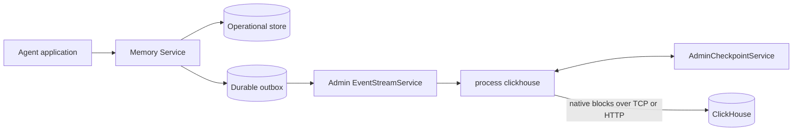

# Enhancement 404: ClickHouse analytics export

> **Status**: Implemented — PostgreSQL, SQLite, and MongoDB feed a leased, restartable exporter through full admin events, current-state initialization, typed projections, retention, and hard-delete purging.
>
> This enhancement specifies the design requested by [GitHub issue #567](https://github.com/chirino/memory-service/issues/567).

## Summary

Add an independently deployable `memory-service process clickhouse` process that copies
conversation, entry, lineage, episodic-memory, and lifecycle data into ClickHouse. The
processor runs outside the Memory Service request path. It consumes the durable event
outbox through `EventStreamService.SubscribeEvents`, writes client-side batches with
`clickhouse-go/v2`, and records safe progress through `AdminCheckpointService`.

The repository's ready-to-run deployments enable a pinned ClickHouse server and one
processor replica by default. This includes `compose.yaml` and both top-level Kustomize
examples under `deploy/kustomize/overlays/`. Other production deployments remain free to
omit the analytics components.

The integration provides generic tables that work for every supported record. Operators
can also define immutable, versioned projections selected by an exact entry
`contentType` or memory `kind`. A projection writes approved, typed fields into its own
table without replacing the generic record.

One implementation supports both self-managed ClickHouse and ClickHouse Cloud. The
project verifies only a pinned local ClickHouse server. ClickHouse Cloud is configuration
compatible, but is not part of project CI or the verified support matrix.

ClickHouse is a separate persistence and trust boundary. Export does not preserve Memory
Service field-level encryption. The processor therefore supports `metadata`, `projected`,
and `full` payload modes. The repository examples use `metadata`. `projected` is the
recommended mode for domain analytics. `full` requires an explicit operator
acknowledgment that decrypted content will be stored outside Memory Service.

## Motivation

The operational stores are designed for agent memory access, authorization, replay,
forking, and search. They are not designed for large scans, long-term trend analysis, or
high-cardinality dashboards. Direct analytical queries can compete with request traffic
and expose datastore-specific schemas to reporting applications.

A separate ClickHouse copy lets users:

- build dashboards without loading the operational datastore
- measure conversation volume, active users, client and agent activity, entry channels,
  content types, fork behavior, and retention trends
- analyze memory creation, revision, use, expiration, archival, and eviction over time
- report on typed domain fields such as task outcomes, tool calls, customer attributes,
  and application events
- keep a generic record when no content-specific projection exists
- recover after processor or ClickHouse outages by replaying the durable outbox
- choose self-managed ClickHouse or ClickHouse Cloud based on cost, residency,
  compliance, and operational needs

## User stories

- As an operator, I can enable analytics without adding ClickHouse latency or
  availability dependencies to Memory Service writes.
- As an analyst, I can query stable generic tables without knowing which operational
  datastore stores the source records.
- As an application owner, I can publish a versioned projection for one exact entry
  content type or memory kind and receive typed ClickHouse columns.
- As a security owner, I can choose which decrypted data crosses into the analytics
  boundary and audit the selected mode.
- As a platform owner, I can stop and restart the processor without silent gaps or
  unbounded duplicate results.
- As a self-managed user, I can connect through native TCP or HTTP and control storage,
  backups, users, and retention.
- As a ClickHouse Cloud user, I can use the same processor and schema without a separate
  cloud-specific implementation.

## Goals

- Keep ClickHouse completely off the Memory Service request path.
- Export a current-state analytical replica and an append-only lifecycle event log.
- Cover conversations, entries, conversation lineage, and episodic memories.
- Backfill records that predate retained outbox history.
- Resume from a durable checkpoint with at-least-once delivery.
- Make ordinary retries idempotent at the logical row and batch levels.
- Provide generic schemas and optional typed projections.
- Propagate archive, expiration, eviction, and hard-delete state.
- Make privacy boundaries and unsupported security claims explicit.
- Support both ClickHouse connection protocols offered by `clickhouse-go/v2`.
- Make the default Compose and Kustomize examples immediately queryable without an
  additional analytics profile or manual processor deployment.

## Non-goals

- Distributed exactly-once delivery across Memory Service and ClickHouse.
- An exact event-time snapshot of every version of a mutable source record.
- Synchronous dual writes from Memory Service request handlers to ClickHouse.
- A general change-data-capture framework for arbitrary destinations.
- A second analytics database in the first release.
- Project CI against ClickHouse Cloud.
- Automatic verification of ClickHouse disk, backup, cache, or temporary-file
  encryption.
- Arbitrary SQL, table names, or ClickHouse types derived from entry or memory content.
- Analytical query APIs served by Memory Service.

## Terminology

| Term | Meaning |
| --- | --- |
| Source event | A durable Memory Service outbox event. |
| Generic record | A row in a standard table that is independent of content type or memory kind. |
| Projection | An immutable rule that extracts approved typed fields from one exact content type or memory kind. |
| Safe cursor | The newest source cursor for which every required ClickHouse write has been acknowledged. |
| Frozen batch | A bounded in-memory set of source events and derived rows retried unchanged during one process run. |
| Ingest version | A monotonic version composed from a lease generation and batch sequence. |
| Exporter ID | A stable identifier that isolates one logical analytics export in shared tables. |
| Tombstone | A newer current-state row with `is_deleted=1` and no exported payload. |
| Payload mode | The `metadata`, `projected`, or `full` boundary selected by the operator. |

## Design

### Architecture



Memory Service commits a source mutation and its outbox event together where the backing
store supports an atomic transaction. The processor reads full admin resource events,
applies its configured payload policy and projections, writes batches into ClickHouse,
and then advances the checkpoint. There is no per-event resource RPC.

This follows the processor model in [Enhancement 102](../102-event-processor-turn-traces.md).
It does not add a ClickHouse plugin to the server write path.

### Product semantics

The first release exports two related datasets:

1. `lifecycle_events` is an append-only fact log of retained outbox notifications.
2. Generic and projection tables are versioned current-state replicas.

For a resolvable event, `detail=full` places the exact scope-appropriate OpenAPI resource
in the event `data`: agent streams use agent resources and admin streams use admin
resources. The admin resources include internal output-only identifiers such as
`clientId` and `conversationGroupId`. OpenAPI request and response schemas share base
schemas through `allOf` where their fields have the same meaning.

A resource can be hard-deleted before a lagging subscriber receives its event. In that
case the stream preserves the summary payload so the processor can still write lifecycle
and deletion information, and `snapshot_available` is false. The envelope keeps the
stable lifecycle `change` separately when a full resource replaces the summary payload.

Entries are immutable after creation, so their full content normally represents the
created state. Conversations and memories are mutable and follow current-state semantics.
The design does not claim to reconstruct an exact payload for every historical transition.

### Deployment and support matrix

The processor is a separately scalable process:

```text
memory-service process clickhouse
```

One active process owns a given `exporter_id` and checkpoint client ID. Multiple
processors can export to different databases or with different payload policies by using
different IDs. A compare-and-swap checkpoint lease prevents two replicas from owning the
same ID during a rollout. The supplied deployments use one replica per ID.

| Target | Configuration support | Project verification |
| --- | --- | --- |
| Self-managed ClickHouse | Supported | Verified against a pinned local container |
| ClickHouse Cloud | Supported through the same driver settings | Compatible, not project-tested |

The local test stack uses the exact ClickHouse image tag in `compose.yaml`. At the time
of this proposal, that tag is `clickhouse/clickhouse-server:26.8.2.7`. Tests must not use
an unpinned `latest` image.

Production analytics requires a primary datastore and event transport that support
durable replay through the gRPC event stream. PostgreSQL and MongoDB are both required
because the supplied Kustomize examples cover both datastores. The implementation must
complete [Enhancement 091](091-mongo-outbox-transactions.md) before enabling the
processor in the MongoDB overlay. Tail-only operation is allowed only with an explicit
development flag and reports an unhealthy durability status.

`compose.yaml` starts ClickHouse and the processor without a profile. The existing
Langfuse profile reuses the server through a separate database and user. A new
`deploy/kustomize/components/analytics/clickhouse` owns the self-managed ClickHouse
StatefulSet, persistent volume claim, and Service.
`deploy/kustomize/components/processor/clickhouse` owns the processor Deployment,
configuration, and demo Secret. Both top-level overlays include both components; the kind
overlays inherit them. A ClickHouse Cloud deployment omits the server component and
patches the processor endpoint and TLS Secret. Reference credentials and
API keys are development values and the operator documentation requires their replacement
outside local examples.

### Source event contract

The processor subscribes with `scope=ADMIN` and `detail=full` to these event kinds:

| Kind | Purpose |
| --- | --- |
| `conversation` | Conversation creation, title or metadata update, archive, unarchive, eviction, and hard delete. |
| `entry` | Immutable entry creation and later eviction or hard delete. |
| `memory` | Memory creation, revision, archive, expiration, eviction, and hard delete. |

Lineage does not introduce a separate public event kind. A full admin conversation
resource includes `forkedAtConversationId` and optional `forkedAtEntryId`. The processor
writes one direct parent-to-child edge from those fields. Roots have no lineage row, and
queries derive transitive ancestry recursively.

The outbox action stays compatible with its existing `created`, `updated`, and `deleted`
values. When multiple lifecycle operations share an action, the envelope's stable
`change` field identifies the more precise operation:

| Action | Example `change` values |
| --- | --- |
| `created` | `created`, `forked` |
| `updated` | `updated`, `archived`, `unarchived`, `expired` |
| `deleted` | `evicted`, `hard_deleted` |

`EventNotification` carries the typed protobuf envelope fields `event`, `kind`, `cursor`,
`occurred_at`, and `change`. Its `data` field remains JSON-encoded bytes. SSE uses the
same JSON event envelope. In full mode, `data` is the exact REST/OpenAPI resource shape
for the selected scope rather than a serialized internal Go model. The server does not
remove user metadata from this resource; the ClickHouse processor applies its storage
policy after decoding it.

Replay populates the occurrence time from `OutboxEvent.CreatedAt`, and live outbox events
preserve the same timestamp. Deleted resources that can no longer be read retain their
small summary data so identifiers needed for tombstones and lifecycle rows are not lost.

The implementation adds outbox events to every episodic-memory mutation path. Memory
read activity remains available through Prometheus metrics rather than being copied into
ClickHouse. PostgreSQL and SQLite append mutation and outbox data atomically. MongoDB
uses replica-set transactions and supports ordered replay and stale-cursor detection.

### Full event and current-state contract

The same admin event stream supplies live changes and initial current state. It does not
expose a separate analytics hydration service.

An admin subscription can set `initial_state=current`. This requires `detail=full`, an
enabled replayable outbox, and no caller-supplied `after_cursor`. The stream then:

1. opens the live subscription and captures the durable outbox high-water cursor
2. emits `event=phase`, `kind=stream`, `data.phase=snapshot`, with that cursor
3. emits `event=snapshot` for each current conversation, entry, and memory selected by
   the request filters; each `data` value is a full admin OpenAPI resource
4. emits `phase=replay` and replays events after the captured boundary
5. emits `phase=live` and continues with live events

The bounded source scans are internal datastore capabilities used only to implement this
event contract. They include archived resources and hydrate direct fork fields so the
same conversation resource can create both the conversation row and its direct lineage
edge.

All payload modes receive full resources over the protected admin stream. The processor
then applies the configured ClickHouse storage boundary:

- `metadata` stores generic fields and only the configured conversation metadata keys
- `projected` evaluates configured projections and does not persist unprojected content
- `full` persists the selected decrypted source fields and requires the explicit
  `allowDecryptedContent` acknowledgment

Checkpoints, logs, metrics, operation events, and projection-failure rows never contain
source payloads.

### Bootstrap and backfill

`after_cursor=start` alone cannot include entities created before retained outbox history.
The processor therefore starts a full admin subscription with
`initial_state=current`, captures the snapshot boundary, and writes snapshot resources in
bounded ClickHouse batches. When the stream reaches `phase=replay`, the processor saves
the boundary and reconnects after it through the normal restartable event runtime.

Snapshot rows receive lower ingest versions than subsequent replay rows, so replayed
mutations supersede stale values observed during the scan. Snapshot writes use stable
resource keys and are logically idempotent; if the process stops during the scan, it can
restart the current-state scan from the beginning without creating additional canonical
rows.

If the captured cursor becomes stale before catch-up completes, the processor stops with
`backfill_required`; it never jumps silently to the tail. Current-state initialization
includes archived conversations and active historical entry branches. Resources
hard-deleted before the snapshot boundary cannot be recovered.

### Checkpoint schema

The processor stores a versioned checkpoint:

```text
application/vnd.memory-service.clickhouse-checkpoint+json;v=1
```

Example:

```json
{
  "version": 1,
  "exporterId": "primary-analytics",
  "projectionSetDigest": "sha256:...",
  "safeCursor": "pg:00000000000000000420",
  "bootstrap": {
    "state": "complete",
    "backfillStartCursor": "pg:00000000000000000100"
  }
}
```

The checkpoint contains identifiers, cursors, bootstrap state, and configuration hashes
only. It is capped at 64 KiB and does not grow with batch size. It does not contain titles,
entry content, memory values, metadata values, projected values, or SQL. Snapshot progress
is deliberately restartable from the beginning; stable resource keys make repeated
snapshot rows logically idempotent.

The processor runtime uses a write-then-checkpoint contract:

1. Freeze a bounded batch in memory.
2. Send every table block in the batch.
3. After ClickHouse acknowledges every table write, advance `safeCursor` and save the
   checkpoint.

During one process run, an ambiguous insert retries the same frozen rows, batch ID, and
insertion tokens. After a restart, the processor subscribes after `safeCursor` and may
form different batch boundaries or observe a newer current snapshot. It uses a new batch
ID. Stable logical event and resource IDs plus canonical current-state ordering make that
replay idempotent. A partially written batch can be visible until retry or replay writes
the remaining rows. This temporary cross-table inconsistency is acceptable for the
analytics store.

`AdminCheckpointService` gains an opaque revision, compare-and-swap updates, and
`AcquireLease`, `RenewLease`, and `ReleaseLease` operations. The service stores a hashed
lease token, monotonic generation, and expiry beside the encrypted checkpoint payload.
It evaluates expiry with the datastore clock so pod clock skew cannot create two owners.
The processor stops before its lease can expire if renewal fails. Existing checkpoint
callers retain last-write-wins behavior on checkpoints with no active lease. A write to a
leased checkpoint requires its lease token and expected revision.

Each batch receives an `ingest_version` composed from the lease generation and a 32-bit
batch sequence. A new owner increments the generation before it can write, so a replay
after a crash is newer than a batch that finished before the safe-cursor save. The
processor must reacquire a lease before the batch sequence can overflow.

### Delivery and duplicate handling

The end-to-end guarantee is at-least-once. The processor does not describe the result as
exactly-once because the source checkpoint and ClickHouse writes do not share a
transaction, and ClickHouse insert-deduplication history is finite.

Each source event gets a stable ID:

```text
SHA-256(exporter_id + "\n" + source_cursor + "\n" + kind + "\n" + event + "\n" + change)
```

Each frozen batch gets a cryptographically random 32-byte ID encoded as 64 lowercase hex
characters. It remains stable for retries during that process run. Each table insert
uses a deterministic `insert_deduplication_token` derived from the batch ID and table
schema version.

The processor must send the same rows in the same order when retrying a frozen batch in
the same process run.
Self-managed non-replicated deployments must configure a positive
`non_replicated_deduplication_window`. The schema readiness check rejects a zero window
unless the operator explicitly accepts weaker retry behavior.

Generic current-state tables use `ReplacingMergeTree(ingest_version)` and stable sorting
keys. A canonical view selects the latest row by `(ingest_version, event_id)`, so
correctness does not depend on background merge timing. This limits the effect of a retry
that falls outside the ClickHouse deduplication window.

ClickHouse does not provide a transaction across all target tables. The processor accepts
temporary cross-table inconsistency and advances `safeCursor` only after ClickHouse
acknowledges every table write. If a process stops after a partial write, it resumes after
the prior safe cursor and replays the source events. All exported rows retain `batch_id`
for retry identity and diagnostics; canonical views deduplicate by stable event or
resource keys rather than by batch state.

### Batching and backpressure

Default batch limits are:

| Limit | Default |
| --- | --- |
| Source events | 10,000 |
| Encoded rows | 100,000 |
| Encoded bytes | 8 MiB |
| Single encoded record | 48 MiB |
| Maximum delay | 1 second |

The first reached limit freezes the batch. Limits are configurable and bounded. One
oversized source record can form a single batch up to a separate maximum-record limit.
In `full` mode, a larger source record stops the processor with `record_too_large`; it
cannot fall back to a generic row without silently violating the selected export policy.
In `projected` mode, a projection output over the limit follows the projection failure
policy while the metadata-only generic row remains exportable.

The processor has one bounded in-memory batch and one bounded receive buffer. It stops
reading the gRPC stream when those limits are reached, which applies transport
backpressure. It never spills decrypted data to local disk. ClickHouse errors keep the
batch frozen and retry with exponential backoff and jitter. Source lag can grow while
ClickHouse is unavailable, so the outbox retention period must exceed the maximum planned
outage plus backfill duration.

The processor sets `async_insert=0` explicitly. Client-side batching plus synchronous
`Batch.Send` acknowledgment defines the checkpoint boundary. A future opt-in asynchronous
mode must set `wait_for_async_insert=1` and prove retry behavior before it can advance a
checkpoint.

### ClickHouse driver and protocol

Use `github.com/ClickHouse/clickhouse-go/v2` through its native client API:

- `clickhouse.Open`
- `PrepareBatch`
- `Append` or `AppendStruct`
- `Send`

Do not use `database/sql`, row-at-a-time inserts, or `JSONEachRow` for the primary ingest
path. The driver sends ClickHouse native blocks over either supported transport.

| Protocol | Default port | Intended use |
| --- | --- | --- |
| Native TCP | `9000`, or `9440` with TLS | Default and preferred when direct connectivity is available. |
| HTTP or HTTPS | `8123`, or commonly `8443` with TLS | Networks and proxies that do not allow native TCP. |

The port is configuration, not a deployment-type switch. The processor does not infer
`self-managed` or `cloud`. TLS is on by default for every non-loopback address. Disabling
TLS remotely requires an explicit insecure-development acknowledgment.

### Schema ownership and versioning

The processor can run in either schema mode:

- `manage`: create the V1 database objects and verify their recorded checksum
- `validate`: require a separately provisioned V1 schema and only verify compatibility

Production deployments should use separate ClickHouse roles for schema management and ingestion.
The steady-state ingest role needs `INSERT` and limited metadata-read permissions, not
`ALTER USER`, `DROP DATABASE`, or broad administrative rights.

`schema_versions` records the component version, checksum, and
application time. The exporter ships with schema V1; V2, V3, and V4 were unreleased
development drafts and are not supported upgrade sources. Development databases created
from those drafts must be reset. After V1 is released, later schema changes require an
explicit data-preserving migration and upgrade test.

### Generic schema

All exporter-owned physical tables are placed in the configured database. The database is
the Memory Service analytics namespace, so processor-owned relations do not repeat a
`memory_service_` prefix. Neither resource content nor source metadata controls an
identifier. Deployment-owned projection manifests declare their own physical table and
column names as described in [Typed projections](#typed-projections).

| Table | Engine | Purpose |
| --- | --- | --- |
| `schema_versions` | `MergeTree` | Installed schema version and checksum. |
| `projection_registry` | `ReplacingMergeTree` | Projection name, digest, selector, declared table, and state. |
| `lifecycle_events` | `ReplacingMergeTree` | Durable lifecycle facts keyed by stable event ID. |
| `resources` | `ReplacingMergeTree` | Versioned generic resource rows and tombstones. |
| `deletion_fences` | `ReplacingMergeTree` | Payload-free latest deletion version per resource. |
| `conversations` | `ReplacingMergeTree` | Versioned current conversation rows and tombstones. |
| `conversation_lineage` | `ReplacingMergeTree` | Ancestor, descendant, depth, and fork-point rows. |
| `entries` | `ReplacingMergeTree` | Immutable entry rows and deletion tombstones. |
| `memories` | `ReplacingMergeTree` | Versioned memory rows and tombstones. |
| `projection_failures` | `ReplacingMergeTree` | Payload-free projection failure records. |
| `retention_policy` | `ReplacingMergeTree` | Shared retention settings and live exporter ownership. |
| `purge_subjects` | `ReplacingMergeTree` | Payload-free dependent identifiers retained while a purge runs. |
| `purge_queue` | `ReplacingMergeTree` | Durable purge requests and completion state. |

Every data table has these columns:

| Column | Type | Meaning |
| --- | --- | --- |
| `exporter_id` | `String` | Stable export identity. |
| `batch_id` | `FixedString(64)` | Frozen batch identity. |
| `event_id` | `FixedString(64)` | Stable source-event identity, or stable synthetic backfill identity. |
| `source_cursor` | `String` | Opaque outbox cursor, empty for backfill rows. |
| `ingest_version` | `UInt64` | Lease generation in the high 32 bits and batch sequence in the low 32 bits. |
| `observed_at` | `DateTime64(9, 'UTC')` | When the processor observed the state. |
| `schema_version` | `UInt16` | Row schema version. |

Identifier columns contain source Memory Service identifiers. They use `String` to
preserve the source identifier format and support direct retrieval of the authoritative
resource through the Memory Service API.

#### Lifecycle events

`lifecycle_events` adds `occurred_at`, `resource_kind`, `analytics_resource_id`,
`action`, `change`, `conversation_id`, `conversation_group_id`, `content_type`,
`memory_kind`, `snapshot_available`, and `summary_json`.

`summary_json` is canonical JSON stored as `String`, not ClickHouse's dynamic `JSON` type.
The event shape is small and controlled, while `String` avoids creating dynamic paths from
user metadata. Frequently queried values have dedicated typed columns.

The table partitions by `toYYYYMM(occurred_at)` and sorts by
`(exporter_id, resource_kind, occurred_at, event_id)`. A retried event uses the same
`occurred_at`, so all versions of that event stay in one partition.

#### Conversations

Conversation rows include:

- `conversation_id`, `conversation_group_id`, and `owner_user_id`
- `client_id` and nullable `agent_id`
- `created_at`, `updated_at`, and nullable `archived_at`
- `is_archived` and `is_deleted`
- nullable `title` according to payload mode
- canonical `metadata_json` according to payload mode

The sorting key is `(exporter_id, conversation_id)`. The table is not time-partitioned so
all versions of one conversation share a replacement key.

#### Conversation lineage

Lineage rows store one direct parent-to-child edge for each fork. Full admin conversation
resources supply `forkedAtConversationId` and optional `forkedAtEntryId` during both the
current-state snapshot and live delivery. Roots therefore have no lineage row, and recursive
ClickHouse queries derive transitive ancestry from the direct edges. Columns include `ancestor_conversation_id`,
`descendant_conversation_id`, `depth`, nullable `forked_at_entry_id`,
`conversation_group_id`, and `is_deleted`. The sorting key is the exporter plus ancestor
and descendant IDs.

#### Entries

Entry rows include:

- `entry_id`, `conversation_id`, and `conversation_group_id`
- `channel`, `content_type`, and nullable `role`
- nullable `user_id`, `client_id`, and `agent_id`
- `created_at` and `is_deleted`
- canonical nullable `metadata_json`
- canonical nullable `content_json` according to payload mode

Attachment bytes are never exported. Content can contain attachment identifiers and
non-secret media metadata only when allowed by the selected payload mode.

The sorting key is `(exporter_id, entry_id)`.

#### Memories

Memory rows include:

- `memory_id` and a stable `logical_memory_id`
- `memory_kind`, `revision`, and lifecycle timestamps
- `created_at`, `updated_at`, nullable `expires_at`, and nullable `archived_at`
- `is_archived`, `is_expired`, and `is_deleted`
- canonical nullable `attributes_json`, `metadata_json`, and `value_json` according to
  payload mode

The processor stores source identifiers for users, conversations, groups, entries, and
memory records. `logical_memory_id` is the stable hexadecimal encoding of the source
logical-memory identity supplied by Memory Service. Memory rows also retain namespace and
key fields so an analytics workflow has the inputs needed to retrieve the authoritative
memory through the Memory Service API.

The sorting key is `(exporter_id, logical_memory_id)`. `revision` remains available for
current-state conflict analysis; historical value payloads are outside this design.

### Canonical views and materialized views

The processor creates canonical views such as
`conversations_current`. These views:

- select the latest row by `(ingest_version, event_id)` with a window query
- exclude tombstones from the default current view
- expose separate `*_all` views when analysts need archived or deleted state

`ReplacingMergeTree` merges are asynchronous. Consumers must not query a physical table
and assume duplicates are already removed.

Incremental materialized views process inserted blocks. They do not automatically correct
an aggregate after a later source-table replacement, merge, mutation, or tombstone.
Therefore, the integration does not create naive incremental count or sum views over
current-state tables. Operators can use:

- incremental views over the append-only, logically deduplicated lifecycle stream when
  the aggregation tolerates its event semantics
- refreshable views over canonical current-state views
- version-aware `argMax` aggregation with tests for updates and deletes

The documentation must call out this rule in every dashboard example.

### Typed projections

Projection definitions are deployment-owned YAML loaded by the processor. They are not
accepted from entry content or memory values.

```yaml
apiVersion: memory-service/v1alpha1
kind: AnalyticsProjection
metadata:
  name: support_ticket_v1
spec:
  resource: entry
  selector:
    contentType: support-ticket/v1
  columns:
    outcome:
      type: string
      nullable: false
    latency_ms:
      type: uint64
      nullable: true
    tags:
      type: string_array
      nullable: false
  projectionRego: |
    package memoryservice.analytics
    ticket := input.content[0]
    output := {
      "outcome": ticket.outcome,
      "latency_ms": object.get(ticket, "latencyMs", null),
      "tags": object.get(ticket, "tags", []),
    }
```

Entry `content` is the source entry's content-block array. By default, a projection
produces one row per matching entry. It can select a block by index or preserve the array
in a JSON column. A projection that sets `spec.rows: many` produces one row per element of
an `output` array instead; see [Multi-row projections](#multi-row-projections).

Each projection:

- has one canonical immutable name that is also its exact physical table name
- selects either one exact entry `contentType` or one exact memory `kind`
- has a content digest stored in the checkpoint and projection registry
- defines columns from an allowlisted type system with explicit provider support
- writes one row per matching generic record into a dedicated versioned table, or zero or
  more rows when the manifest sets `rows: many`
- never replaces the generic row

`metadata.name` maps directly to the ClickHouse table name without sanitizing, prefixing,
or adding a digest. Each key under `spec.columns` maps directly to a SQL column name. The
generated canonical views are named `<metadata.name>_current` and `<metadata.name>_all`.
For example, the manifest above creates `support_ticket_v1`,
`support_ticket_v1_current`, and `support_ticket_v1_all`, with a column named
`latency_ms`.

| Manifest value | ClickHouse identifier |
| --- | --- |
| `metadata.name: history_lc4j_events_v1` | Table `history_lc4j_events_v1` |
| `spec.columns.event_type` | Column `event_type` |
| Generated current view | `history_lc4j_events_v1_current` |
| Generated all-rows view | `history_lc4j_events_v1_all` |

Projection table and column names must match `^[a-z][a-z0-9_]{0,62}$`. The processor
reserves the system relation names listed in the generic schema, plus
`deletion_fence_writer`. Projection names must not end with `_current` or `_all`, which
are reserved for generated views. The processor also rejects conflicting table
registrations, names that collide with another projection's generated views, and names
that already exist in the configured database unless the projection registry contains
the identical manifest digest for that relation.
Repeating the identical manifest is idempotent. A changed manifest under the same name is
an error; a deployment creates a newly named projection to add, remove, or change a
column. The digest remains in the checkpoint and projection registry but is not part of
the physical table name. Names are immutable; an `_vN` suffix is the recommended,
human-readable version convention, but the processor does not rewrite or infer it.

Multiple projections may select the same entry `contentType` or memory `kind`. Each must
have a distinct `metadata.name`, and each produces its own table. Selector values never
become SQL identifiers. The processor quotes every validated identifier.

The portable field types are `string`, `bool`, `int64`, `uint64`, `float64`, `timestamp`,
`string_array`, and `json_string`. `json_string` stores canonical JSON as an opaque SQL
`String`; it remains the portable choice when queries do not need native traversal of
arbitrary paths.

Projection manifests may also declare these provider-specific types:

| Type | Projection declaration | ClickHouse type | Provider support |
| --- | --- | --- | --- |
| Variant | `type: variant` plus a required `variants` list | `Variant(T1, T2, ...)` | ClickHouse only until another provider advertises equivalent union-type support. |
| Native JSON | `type: json` | `JSON` | ClickHouse only until another provider advertises native semi-structured-column support. |

```yaml
spec:
  columns:
    result:
      type: variant
      variants: [string, int64, bool]
      nullable: true
    content:
      type: json
      nullable: false
      clickhouse:
        maxDynamicPaths: 256
        maxDynamicTypes: 16
```

`variant` alternatives use the allowlisted portable scalar and array type names. They
must map to distinct ClickHouse types, must not contain multiple numeric alternatives,
and must not contain another `variant`. The Rego output for a variant column is either
`null` or a tagged object such as `{"type": "string", "value": "resolved"}` so
conversion never depends on inference.
ClickHouse `Variant` columns can be queried by alternative type and report their active
alternative with `variantType`.

`json` accepts a Rego object with arbitrary nesting. It maps to ClickHouse's native
`JSON` type, which stores paths as subcolumns and can accommodate changing nested shapes.
The manifest may set bounded `maxDynamicPaths` and `maxDynamicTypes` options under a
`clickhouse` block; omitted values use processor-owned limits rather than unbounded or
server-dependent defaults. Native JSON is appropriate when analysts query unpredictable
nested paths. Use `json_string` when the value is opaque or normally retrieved whole.

The processor validates the selected analytics provider against every declared column
type before creating or writing a table. It fails startup for an unsupported type and
does not silently downgrade `variant` or `json` to `String`. Exporter-owned control,
lifecycle, generic-resource, failure, and purge tables use only the portable type
set. Provider-specific types are available only to deployment-owned projection tables.
This keeps the automatically managed base schema portable across analytics providers.

ClickHouse documents `JSON` as production-ready starting in 25.3 and defines `Variant`
as a union whose alternatives are fixed by the column declaration. The processor's
minimum supported ClickHouse version must satisfy those requirements before either type
can be enabled. See the ClickHouse documentation for
[`JSON`](https://clickhouse.com/docs/reference/data-types/newjson) and
[`Variant`](https://clickhouse.com/docs/reference/data-types/variant).

Projection Rego receives a bounded typed input containing the generic resource fields and
the decrypted source payload available under the selected mode. It has no network, file,
clock, random, or database capabilities. Output must exactly match declared columns,
types, nullability, string-size limits, and array-size limits.

For memory records, the existing immutable `MemoryKindVersion` attributes are the default
typed projection when their fields are sufficient. The processor can map those already
computed attributes directly without re-running the memory value projection. A separate
`AnalyticsProjection` is required when analytics needs a different schema. This keeps
`MemoryKindVersion` responsible for operational memory attributes instead of adding
ClickHouse-specific concerns to it.

Changing the active projection set while a frozen batch exists is rejected. After the
batch finishes, a new projection set starts with a new digest. A projection schema change
uses a new manifest name and therefore a new physical table.
Historical projection backfill is an explicit command, not an automatic startup side
effect.

#### Multi-row projections

Some content holds a list whose items analysts want to filter and aggregate individually,
such as the messages in a chat-memory entry or the events in a history entry. Returning
those items as parallel arrays in one row loses per-item types, nullability, and sort keys.
`spec.rows` accepts `one` (the default) or `many`. With `many`, `output` must be an array
of objects, and each object must match the declared columns exactly.

- `rows` is part of the immutable manifest digest. The digest omits the field when it is
  absent or `one`, so single-row manifests keep the digests they had before the field
  existed.
- Multi-row tables add processor-owned `row_index UInt32` (position in the `output`
  array) and `row_count UInt32` (rows produced by the same resource version) columns, and
  use `ORDER BY (exporter_id, resource_id, row_index)`. `row_index` and `row_count` are
  reserved column names for every projection.
- Rows are validated as a unit. One invalid row records a single payload-free projection
  failure for the resource and writes none of its rows. A resource may produce at most
  1,024 rows.
- A version that produces an empty array writes one marker row with `row_count = 0` so
  rows from older versions stop being current. Tombstones are also single rows with
  `row_count = 0` and `is_deleted = 1`.
- The `_all` view keeps every row of each resource's newest `(ingest_version, event_id)`
  and deduplicates replays per `row_index`. It drops marker rows by requiring
  `row_index < row_count` unless the row is a tombstone. Rows beyond a shrunken version's
  row count are never replaced by the `ReplacingMergeTree` key, so the view filters them
  by version. Existing retention validation already requires projection retention to be
  no longer than tombstone retention, and the newest version is always observed after
  older rows, so TTL cannot expire a newer marker or tombstone before older rows. Deletion
  fences still govern `_current`.
- The registry does not record the row mode. Views for registered projections that are no
  longer configured derive it from the physical table's sorting key.
- A memory projection that sets `rows: many` must define `projectionRego`; attribute
  mapping always yields one row.

The bundled example-app projections use multi-row tables for chat-memory formats
(`spring_ai_messages_v1`, `lc4j_messages_v1`, and `vercelai_messages_v1`: one row per
message) and history events (`history_lc4j_events_v1` and `history_vercelai_events_v1`:
one row per event, with tool call, model, finish reason, and token usage fields). The
per-entry `history*_v1` projections remain for entry-level counts.

### Projection failures

The generic record remains authoritative when a projection does not match, returns an
invalid result, or exceeds a limit.

The default `continue-generic` policy writes the generic row and a payload-free record to
`projection_failures`. That record includes event ID, analytics resource
ID, projection name, stable error code, attempt count, and timestamps.
It does not include
the source payload, Rego source, raw error, namespace, key, or projected values.

An optional `stop` policy keeps the batch frozen and reports the processor unready until
the projection or source record is corrected. The retry count is bounded and exposed as a
metric. Setting a new projection replay ID performs a checkpointed entry-and-memory scan
after a new projection version or source-data correction; the scan reprocesses failed
current records without retaining source payloads in the failure table. The resource ID
is the source Memory Service identifier.

### Lifecycle, deletion, and retention

Lifecycle changes are represented in both the fact log and current-state tables:

| Source change | ClickHouse behavior |
| --- | --- |
| Archive or unarchive | Insert a newer current-state version with the new flags. |
| Memory expiration | Record `change=expired`, then insert an expired row or tombstone according to source behavior. |
| Eviction | Record `change=evicted` and insert a tombstone. |
| Hard delete | Record `change=hard_deleted` when lifecycle output is enabled, insert a tombstone, and apply the configured purge mode. |
| Retention timeout | Apply table TTL independently according to analytics policy. |

Current views hide tombstoned rows immediately after the replacement is visible. They
also compare active rows with `deletion_fences`, whose
payload-free records have no TTL, so a tombstone part expiring before an older active part
cannot resurrect the old row. A later recreation has a greater ingest version and becomes
visible. Schema V1 creates the fence table and tombstone materialized view from the
start. Old physical parts can still contain prior plaintext until ClickHouse merges or
deletes them. In managed and record-only modes, every hard-delete batch inserts a request into
`purge_queue` before checkpoint advancement. In managed mode, a worker issues targeted
`ALTER TABLE ... DELETE` mutations for generic and projection tables, coalesces requests
to control rewrite cost, and tracks them through `system.mutations`. It marks a request
complete only after every affected table reports completion, and records only analytics
IDs and stable status codes. The queue makes a crash after checkpoint
advancement recoverable. Managed purge is the default in every payload mode because
identifiers and projected fields can still be personal data. It is not immediate
cryptographic erasure. It cannot erase independent backups or replicas outside the configured
ClickHouse cluster.

Conversation purge requests carry source conversation and group correlation IDs.
Before deleting lookup rows, the processor resolves and durably records dependent
analytics resource IDs. It removes lifecycle, projection, and projection-failure rows
before deleting their generic and typed discovery sources and fences.
Projection and failure rows also persist the payload-free correlation IDs
so they remain purgeable after generic payload TTL. Purge enumerates validated physical
tables from the projection registry, including versions no longer present in the current
configuration. Managed purge removes deletion fences after the dependent data mutations
complete. The exporter begins with this
correlation data in schema V1, so no legacy-correlation backfill is required.

`retention-mode=external` skips retention ownership, TTL validation, and TTL DDL. All
processor retention durations must be zero in this mode. Existing TTL expressions remain
unchanged for the external owner to replace or remove. `purge-mode=record-only` writes a pending
purge request but leaves physical deletion to an external worker.
`purge-mode=external` does not write the queue or execute purge mutations. The operator then
owns hard-delete discovery and deletion across generic, typed, lifecycle, projection,
projection-failure, and deletion-fence tables. Delete each fence only after its
dependent data. `deletion_fences` remain required in every purge mode
because the processor-owned current views use them to prevent deleted rows from resurfacing.
The schema remains stable across modes, so unused control tables can remain empty.

Analytics retention is explicit per table class:

- lifecycle-event retention
- current-state tombstone retention
- generic payload retention
- projection-table retention
- projection-failure retention

In managed retention mode, the processor never assumes that source retention automatically
removes ClickHouse data. When tombstone retention is enabled, generic active-row retention
must be positive and cannot exceed tombstone retention. Projection active-row retention has the same rule when
projections are configured. ClickHouse can materialize TTLs for different parts in either
order, so the deletion fence, rather than duration ordering, provides current-view
correctness. The duration constraint limits how long older physical payload rows remain.
Retention changes apply to all validated projection-registry tables, including projections
removed from the current configuration.
Schema V1 installs a materialized view so every generic tombstone creates a deletion
fence. Current views enforce the latest fence by ingest version. Historical tables in
the projection registry use the same fence-aware current-view definition.
Full and projected export documentation must require operators to configure ClickHouse
tables, replicas, object storage, snapshots, backups, caches, and disaster-recovery copies
to satisfy the same or stricter deletion policy.

### Encryption and privacy

Memory Service encrypts selected operational fields before writing them to its primary
store. The processor receives authorized plaintext after Memory Service decrypts those
fields. Writing that plaintext or any derivative to ClickHouse creates a second at-rest
copy outside the Memory Service encryption envelope.

| Mode | Exported content | Source detail | Intended use |
| --- | --- | --- | --- |
| `metadata` | Source IDs, routing fields, timestamps, lifecycle fields, approved non-content metadata | `METADATA` export records | Strictest content boundary and operational metrics. |
| `projected` | Metadata plus explicitly released typed projection fields | `FULL` export records, discarded after projection | Recommended domain analytics. |
| `full` | Decrypted titles, entry content, memory values, and allowed metadata | `FULL` export records | Trusted analytics environments that need raw content. |

All modes export source resource IDs, routing fields, lifecycle state, and timestamps.
User-controlled metadata values export only for keys on an
operator allowlist; the default allowlist is empty. Conversation titles export only in
`full`. Generic entry content and memory values export only in `full`. In `projected`,
released entry and memory fields appear only in the matching projection table, while
reusable `MemoryKindVersion` attributes can appear as declared typed projection fields.

`full` mode refuses to start unless `allowDecryptedContent=true`. Source identifiers are
stored directly in every mode so ClickHouse results can be resolved through the Memory
Service API. Startup emits a
payload-free admin audit record containing the exporter ID, mode, destination host class,
and configuration digest. It never records credentials or content.

`projected` mode protects ClickHouse from storing the unprojected payload, but the
processor still handles that plaintext in memory. Deployments that cannot grant the
processor full-read authority must use `metadata` mode until server-side projection is
implemented.

Remote gRPC and ClickHouse connections require TLS by default. Credentials come from
environment variables, mounted secret files, or the existing secret-resolution
mechanism. Passwords are not accepted as ordinary CLI arguments because process listings
and shell history can expose them.

Self-managed operators are responsible for ClickHouse storage policies, encrypted disks,
filesystem encryption, object-storage encryption, backups, temporary files, logs,
replicas, user roles, and key rotation. ClickHouse disk encryption is not equivalent to
Memory Service field-level encryption because ClickHouse queries and privileged operators
can still read plaintext columns.

### Configuration

Representative settings are:

| Setting | Default | Purpose |
| --- | --- | --- |
| `--client-id` | required | Admin checkpoint identity. |
| `--exporter-id` | value of `--client-id` | Stable row namespace. |
| `--endpoint` | required | Memory Service gRPC endpoint, shared with other processors. |
| `--grpc-tls` | automatic | Required for non-loopback Memory Service endpoints. |
| `--grpc-ca-file` | system roots | Custom Memory Service CA bundle. |
| `--allow-insecure-grpc` | `false` | Explicit development acknowledgment for remote plaintext gRPC. |
| `--clickhouse-address` | required | One or more ClickHouse endpoints. |
| `--clickhouse-protocol` | `native` | `native` or `http`. |
| `--clickhouse-database` | `memory_service` | Target database. |
| `--clickhouse-username` | required | Ingest or migration user. |
| `MEMORY_SERVICE_CLICKHOUSE_PASSWORD` | unset | ClickHouse password supplied directly through the environment. |
| `--clickhouse-password-file` | unset | Mounted credential file. |
| `--clickhouse-tls` | automatic | Required for non-loopback endpoints. |
| `--clickhouse-ca-file` | system roots | Custom CA bundle. |
| `--allow-insecure-clickhouse` | `false` | Explicit development acknowledgment for remote plaintext ClickHouse. |
| `--schema-mode` | `manage` | `manage` or `validate`. |
| `--payload-mode` | `metadata` | `metadata`, `projected`, or `full`. |
| `--allow-decrypted-content` | `false` | Required acknowledgment for `full`. |
| `--metadata-key` | none | Repeatable allowlist entry for exported user metadata. |
| `--disable` | repeatable | Disable a resource or resource feature. `MEMORY_SERVICE_CLICKHOUSE_DISABLE` accepts comma-separated selectors. |
| `--projection-path` | repeatable | Projection YAML file or directory; directories load their direct `*.yaml` and `*.yml` files and ignore documents whose `kind` is not `AnalyticsProjection`. |
| `--projection-failure-policy` | `continue-generic` | Continue with a payload-free failure row, or stop the frozen batch. |
| `--projection-replay-id` | unset | New operator-supplied ID that triggers one checkpointed entry-and-memory rescan. |
| `--retention-mode` | `managed` | `managed` owns ClickHouse TTLs; `external` leaves TTL policy to the operator. |
| `--purge-mode` | `managed` | `managed`, `record-only`, or `external` hard-delete handling. |
| `--lifecycle-retention` | `0` | ClickHouse lifecycle TTL; `0` leaves it unmanaged. |
| `--tombstone-retention` | `0` | Current-state and projection tombstone TTL. When positive, active-row retention must also be positive and no greater. |
| `--generic-payload-retention` | `0` | Generic active-row TTL. |
| `--projection-retention` | `0` | Typed projection active-row TTL. |
| `--projection-failure-retention` | `0` | Projection-failure TTL. |
| `--batch-events` | `10000` | Source-event limit. |
| `--batch-rows` | `100000` | Encoded-row limit. |
| `--batch-bytes` | `8MiB` | Encoded-byte limit. |
| `--max-record-bytes` | `48MiB` | Maximum encoded size of one source record. |
| `--batch-delay` | `1s` | Maximum collection delay. |
| `--tail-only-development` | `false` | Explicitly bypass durable replay and backfill. |

Environment-variable names follow the normal Memory Service CLI binding convention.
Secrets must be redacted from diagnostics and configuration dumps.

Disable selectors use `RESOURCE`, `RESOURCE:FEATURE`, or `*:FEATURE`. Resources are
`conversations`, `entries`, and `memories`. Features are `lifecycle_events`, `lineage`,
and `projections`. Lineage applies only to conversations, and projections apply only to
entries and memories. The processor
rejects unknown and unsupported combinations. A bare resource selector disables its current
state and all applicable features. Disabled outputs remain in the common schema but receive no
new rows. Managed and record-only purge modes continue consuming hard-delete notifications for
disabled resources so they can remove rows written before the configuration changed.

The checkpoint stores the normalized enabled-output set. Removing outputs can continue from
the current cursor. Enabling lifecycle, lineage, or a full resource requires a reset or a new
exporter ID because backfill cannot reconstruct skipped history. Enabling projections requires
a new projection replay ID.

### Failure handling

| Failure | Behavior |
| --- | --- |
| ClickHouse unavailable | Keep the frozen batch, retry with bounded exponential backoff, and do not advance the safe cursor. |
| Ambiguous insert result | Retry the identical table block with the same insertion token. |
| One table succeeds and another fails | Retry the complete logical batch. Partial rows can be visible until replay fills the other tables; canonical views deduplicate stable event and resource keys. |
| Checkpoint save fails after every table write succeeds | Keep retrying the checkpoint save without consuming; after a process restart, replay after the prior safe cursor under a newer lease generation. |
| Source cursor is stale | Stop with `backfill_required`; never jump to tail automatically. |
| Projection error | Follow `continue-generic` or `stop`; never persist the source payload in the failure row. |
| Oversized full record | Stop with `record_too_large`; never silently omit selected content. |
| Managed purge request pending | Keep current views tombstoned, retry from the durable purge queue, and report purge delay. |
| Schema mismatch | Refuse readiness before consuming events. |
| Credential or TLS error | Fail startup with a sanitized error. |
| Shutdown | Stop receiving, flush within the shutdown deadline, save safe state, and report cancellation rather than failure. |

There is no local payload dead-letter file. Generic data plus the payload-free projection
failure table provides a retry reference without creating an unmanaged plaintext copy.

### Health, metrics, and operational logging

The process does not become ready until schema setup succeeds, bootstrap completes, the
checkpoint lease is owned, and the event subscription is active. Bootstrap failure,
stale cursors, and lease loss stop the run. Tail-only development mode remains unready by
design. Liveness reports whether the process can continue its retry loop.

Metrics include:

- source events and exported rows by kind, action, and table
- successful batch writes, attempts, and last-write time
- source lag seconds
- current buffered rows and estimated bytes
- bootstrap pages and rows by phase
- projection successes and failures by projection and stable error code
- deletion and compliance-purge delay

Metrics must not use conversation IDs, user IDs, content types with unbounded cardinality,
memory kinds with unbounded cardinality, namespaces, keys, or content as labels.

The process owns one canonical `job.process.clickhouse` operation for its run. It emits at
most one start record and one terminal record. Retry attempts can emit
`job.process.clickhouse.insert` records with `retrying` results. Operation events use
typed, bounded fields for exporter ID, phase, batch row count, retry count, protocol,
payload mode, and stable failure reason. They never include endpoints with credentials,
raw driver errors, SQL, cursors, entity IDs, metadata, namespaces, keys, or payloads.

Connection state changes and retry-loop transitions can remain point logs. Recovered
panics follow `internal/operationevent` recovery rules and retain stacks only in the
separate diagnostic log.

### Analytics sink abstraction

The first release does not expose a public generic analytics-sink API. ClickHouse table
management, insert tokens, engines, and native batches are destination-specific, and a
premature public interface would either leak ClickHouse concepts or hide required
semantics.

The implementation should keep derivation separate from delivery through a small internal
boundary:

```go
type BatchSink interface {
    Validate(context.Context, SchemaPlan) error
    Commit(context.Context, FrozenBatch) error
    Close(context.Context) error
}
```

`FrozenBatch` contains typed generic and projection rows, not raw event envelopes. The
interface is internal and can change when a second analytics database supplies evidence
for a stable abstraction.

### Compatibility and rollout

The full admin event and current-state options are additive event-stream capabilities.
The processor remains optional in custom deployments and does not add ClickHouse to the
request path. The repository's Compose and
Kustomize examples enable ClickHouse and the processor by default in `metadata` mode.
Adding the `memory` kind is additive to the event contract. Existing subscribers that
request explicit kinds do not receive it. Subscribers that request all kinds must
tolerate new kind values as already required for an extensible stream.

Rollout phases are:

1. Add memory outbox events, MongoDB transactional replay, live-phase high-water
   cursors, checkpoint compare-and-swap leases, and focused replay tests.
2. Add full admin resource events, current-state initialization, ClickHouse schema
   management, generic tables, metadata mode, and the required purge queue.
3. Enable the pinned ClickHouse and metadata processor by default in Compose and both
   Kustomize examples, then verify rendered deployments locally.
4. Add projected mode, immutable projection manifests, and projection-failure handling.
5. Add full mode with explicit acknowledgments and end-to-end deletion-purge tests.
6. Publish operator documentation and dashboard-safe query examples.

The initial release creates ClickHouse schema V1. During development, databases made by
older drafts are reset instead of migrated. After V1 is released, upgrades must preserve
existing ClickHouse tables and checkpoints. A checkpoint content-type version mismatch
fails with upgrade guidance and never silently rewrites a newer checkpoint.

## Testing

### Unit tests

- Stable event IDs are deterministic across restarts.
- A frozen batch keeps the same batch ID, row order, and insertion tokens for in-process
  retries.
- `Snapshot` never advances `safeCursor` before every table write succeeds.
- Size, row, count, and timer limits freeze a bounded batch.
- Metadata mode never encodes unselected decrypted fields into ClickHouse rows.
- Full mode refuses startup without `allowDecryptedContent`.
- Source identifiers are preserved exactly so exported rows can resolve authoritative resources.
- Checkpoint compare-and-swap permits only one unexpired lease owner.
- A new lease generation produces ingest versions above every batch from the prior owner.
- Checkpoint size remains bounded at the maximum source-event batch size.
- Projection selectors match exact content types or memory kinds only.
- Projection output enforces type, nullability, name, string, and array limits.
- Projection table and column names map unchanged to validated ClickHouse identifiers.
- Projection validation rejects exporter-reserved names and collisions with generated
  current/all views.
- Provider validation accepts `variant` and `json` for ClickHouse projections, rejects
  them for providers without those capabilities, and keeps exporter-owned tables on the
  portable type set.
- Variant output requires an allowed explicit type tag, and native JSON honors its
  configured dynamic-path and dynamic-type limits.
- MemoryKindVersion attributes map without re-running the source projection.
- Logs, metrics, checkpoints, and failure rows do not contain payloads or credentials.
- Current views handle replacement rows and tombstones correctly.

### Integration tests

The project uses a pinned local ClickHouse container. It does not call ClickHouse Cloud.
The required source matrix is PostgreSQL and MongoDB durable outbox replay to local
ClickHouse over native TCP because those are the two published Kustomize examples.
Focused tests also cover the driver's HTTP transport. TLS tests use a local test CA.

```gherkin
Feature: ClickHouse analytics export

  Scenario: Initial backfill closes the live-update gap
    Given durable PostgreSQL outbox replay is enabled
    And a conversation, entry, fork, and memory exist before the processor starts
    When the ClickHouse processor captures a high-water cursor and starts backfill
    And the conversation is archived during backfill
    Then ClickHouse contains the generic backfill records
    And the replayed archive row supersedes the backfill conversation row
    And the processor checkpoint reaches the live phase without a gap

  Scenario: Acknowledged batches advance the checkpoint
    Given the processor has frozen a batch ending at cursor "cursor-20"
    When ClickHouse acknowledges every table insert
    Then the checkpoint safe cursor becomes "cursor-20"

  Scenario: A partial batch is retried safely
    Given ClickHouse acknowledges the lifecycle table insert
    And the connection fails before the entry table insert is acknowledged
    When the processor reconnects
    Then it sends the same ordered rows with the same insertion tokens
    And one logical lifecycle event is visible by event ID
    And replay supplies the missing entry row

  Scenario: A stale cursor requires a new backfill
    Given the checkpoint cursor is older than retained outbox history
    When the ClickHouse processor resumes
    Then it stops with reason "backfill_required"
    And it does not subscribe from the current tail

  Scenario: Projected mode releases only declared fields
    Given an entry projection for content type "support-ticket/v1"
    And the entry contains a declared outcome and an undeclared secret
    When the processor exports the entry in projected mode
    Then the generic entry row does not contain full content
    And the projection row contains the outcome
    And no ClickHouse table, checkpoint, log, or failure row contains the secret

  Scenario: Projection names map directly to ClickHouse identifiers
    Given a projection named "history_lc4j_events_v1" with a column named "event_type"
    When schema management applies the projection
    Then ClickHouse contains a table named "history_lc4j_events_v1"
    And that table contains a column named "event_type"
    And ClickHouse contains views named "history_lc4j_events_v1_current" and "history_lc4j_events_v1_all"

  Scenario: Multi-row projections expose only the newest version's rows
    Given a projection with rows set to many
    When an entry version produces three rows, is replayed, and is then updated to one row
    Then the current view contains only the updated row
    And a later version with no rows hides all earlier rows
    And a tombstone leaves one row in the all view and none in the current view

  Scenario: ClickHouse projections support provider-specific semi-structured types
    Given a ClickHouse projection with a declared Variant column and a native JSON column
    When a matching record contains a tagged variant and deeply nested JSON content
    Then the row preserves the selected Variant alternative
    And the nested JSON paths can be queried from the native JSON column
    And exporter-owned tables contain no Variant or native JSON columns

  Scenario: Full mode requires explicit acknowledgment
    Given payload mode is "full"
    And allowDecryptedContent is false
    When the ClickHouse processor starts
    Then startup fails before it subscribes to events

  Scenario: Memory lifecycle reaches ClickHouse
    Given a memory is created, revised, expired, and evicted
    When the processor consumes all memory events
    Then the lifecycle table records each mutation change
    And the current memory view excludes the final tombstone

  Scenario: HTTP transport uses native block batches
    Given a local ClickHouse HTTPS endpoint signed by the test CA
    And the processor protocol is "http"
    When a batch is exported
    Then ClickHouse acknowledges the batch over HTTPS
    And the checkpoint advances after the acknowledgment

  Scenario: Default Compose stack exports generic and projected data
    Given no Compose profile is selected
    When the default stack becomes healthy
    And an entry is appended through Memory Service
    Then ClickHouse and the ClickHouse processor are running
    And the entry appears in the canonical metadata view
    And a matching example-app entry appears in its bundled projection view

  Scenario Outline: Kustomize examples enable analytics
    Given the "<overlay>" Kustomize example is rendered
    When it is deployed to a local kind cluster
    Then ClickHouse and the ClickHouse processor become ready
    And a source mutation reaches the canonical metadata view

    Examples:
      | overlay |
      | postgresql-infinispan |
      | mongodb-redis |
```

### Failure and upgrade tests

- Kill the processor before send, during one table send, after all table writes, and before
  the final checkpoint save.
- Restart ClickHouse during a batch and verify bounded retry and no silent cursor advance.
- Exhaust the insert deduplication window and verify canonical views still return one
  logical current row.
- Create schema V1 from an empty database and reject prerelease draft version markers with reset guidance.
- Change a projection digest under the same version and verify startup rejects it.
- Reject invalid, exporter-reserved, existing, generated-view-colliding, and conflicting
  projection table registrations before executing DDL.
- Reject `variant` and `json` when the selected analytics provider does not advertise
  support, without falling back to an opaque string.
- Rotate credentials and TLS certificates without logging secret material.
- Verify archive, unarchive, expiration, eviction, hard delete, and compliance-purge
  timing.
- Start two processors with one exporter ID and verify only the lease owner consumes.
- Render both top-level Kustomize overlays and their kind wrappers, and validate all
  resource references before the local kind smoke test.

## Security considerations

- The processor needs admin event and checkpoint privileges. Use a
  dedicated identity with no agent API authority.
- The ClickHouse user follows least privilege and is separate from the schema migration
  user where practical.
- Projection Rego is sandboxed, deterministic, bounded, and capability-free.
- TLS certificate verification is on for non-loopback endpoints.
- Credential values never appear in flags, logs, metrics, checkpoints, operation events,
  table comments, or migration history.
- ClickHouse access is trusted to expose source identifiers used to resolve authoritative
  Memory Service resources.
- Generic JSON is canonicalized and size-limited before insertion.
- Identifiers used in SQL come only from validated configuration and fixed templates.
- Full or projected export broadens the trusted computing base to the processor,
  ClickHouse, its storage, its backups, and every principal with column access.
- ClickHouse encryption at rest does not restore Memory Service field-level isolation.

## Resolved design decisions

- Checkpoint ownership uses an explicit renewable compare-and-swap lease. Client-ID
  restriction alone does not prevent overlapping pods during a rollout.
- Managed purge is the default in every payload mode. Operators can select record-only or
  external ownership when another system handles deletion across all analytics tables.
- `detail=full` uses scope-appropriate OpenAPI resources, and
  `initial_state=current` adds a bounded current-state phase to the admin event stream.
  This removes the per-event analytics RPC and keeps one source contract for bootstrap,
  replay, and live delivery.
- Both published Kustomize datastore examples must provide durable replay before their
  default analytics processor is considered ready. This makes MongoDB transaction and
  replay support part of this enhancement rather than a documented best-effort gap.

## Implemented scope

The implementation provides:

- a `process clickhouse` command with native or HTTP transport, TLS policy, environment or file-based credentials, payload acknowledgments, and source identifiers for API drill-through
- an admin-only `detail=full&initial_state=current` event subscription that emits OpenAPI resource snapshots behind a durable boundary
- restartable conversation, entry, and memory current-state initialization behind a captured durable high-water cursor, with direct lineage derived from conversations and followed by gap-closing replay
- client-side frozen batches whose checkpoint cursor advances only after every ClickHouse table write is acknowledged
- opaque checkpoint revisions, renewable single-owner leases, and lease-generation ingest fencing
- versioned schema setup/validation, dedicated generic resource tables, and logically idempotent canonical views
- durable source timestamps, gRPC live-phase high-water cursors, and transactional lifecycle events for PostgreSQL, SQLite, and MongoDB
- managed, record-only, and external hard-delete ownership with payload-free queue records and synchronous managed mutations
- processor-side metadata and projection filtering of full admin resource events, plus an explicit acknowledgment before full payload persistence
- strict immutable projection manifests, sandboxed Rego execution, MemoryKindVersion attribute reuse, typed versioned tables, opt-in multi-row projections, payload-free failure records, and explicit projection replay scans
- managed or external retention ownership plus lifecycle, generic, tombstone, projection, and failure retention settings
- pinned Compose and PostgreSQL/MongoDB Kustomize deployments, bundled example-app projections, operator documentation, native/HTTP integration tests, fixture-backed documentation query tests, and Compose/kind smoke tasks

## Tasks

- [x] Add durable `memory` lifecycle events for create, revision, archive, expiration,
  eviction, and hard delete.
- [x] Add a durable high-water cursor to the live-phase event marker.
- [x] Complete [Enhancement 091](091-mongo-outbox-transactions.md), including
  transactional MongoDB mutations and outbox appends, ordered replay, stale-cursor
  detection, and the MongoDB gRPC outbox test suite.
- [x] Extend the processor runtime with bounded write-then-checkpoint batching and an
  explicit safe resume cursor.
- [x] Add checkpoint revisions, compare-and-swap updates, and renewable ownership leases.
- [x] Add scope-appropriate full event resources and admin-only current-state
  initialization with a durable replay boundary.
- [x] Add `memory-service process clickhouse` lifecycle API and CLI wrapper.
- [x] Add `clickhouse-go/v2` native client integration for native and HTTP protocols.
- [x] Add schema creation and validation modes with an initial V1 checksum marker.
- [x] Create generic lifecycle, conversation, lineage, entry, memory, and purge-queue tables.
- [x] Create logically idempotent canonical current-state views.
- [x] Implement bootstrap, paginated backfill, replay catch-up, and stale-cursor recovery.
- [x] Implement deterministic event IDs, stable in-process batch IDs and insertion
  tokens, monotonic ingest versions, and deterministic row ordering.
- [x] Implement metadata, projected, and full payload modes.
- [x] Preserve source identifiers for API drill-through and require explicit
  acknowledgment for decrypted content.
- [x] Add immutable projection manifest parsing, validation, Rego execution, and registry.
- [x] Add default-on conversation, entry, and memory output controls with resource, feature,
  and wildcard disable selectors, filtered backfill and subscriptions, and checkpoint-aware
  reconfiguration.
- [x] Package example-app projections as individually selectable manifests and expose typed
  history role, text, event, tool, and attachment analytics without retaining raw history JSON.
- [x] Project Spring AI context entries into ordered role/text arrays and per-role counts
  without retaining raw Spring AI content JSON.
- [x] Reuse MemoryKindVersion attributes when they satisfy a memory projection.
- [x] Add projection failure records and explicit replay-scan tooling.
- [x] Add lifecycle tombstones, retention settings, a durable purge worker, and purge
  completion monitoring.
- [x] Add TLS, secret-file, least-privilege, and startup security checks.
- [x] Add health, metrics, canonical operation events, and privacy-safe diagnostics.
- [x] Add pinned local ClickHouse native, HTTP, TLS-policy, replay, failure, and schema V1 creation and validation tests.
- [x] Map `AnalyticsProjection.metadata.name` directly to the physical table name and
  reject invalid, reserved, existing, generated-view-colliding, and conflicting names.
- [x] Add ClickHouse `variant` and native `json` projection column types, capability
  validation, bounded JSON settings, tagged Variant values, and integration coverage.
- [x] Verify that exporter-owned tables continue to use only portable column types.
- [x] Move the pinned `clickhouse` service out of the Langfuse-only Compose profile,
  replace its data `tmpfs` with a named development volume, isolate the analytics and
  Langfuse databases and users through idempotent init scripts, and add a default
  `clickhouse-processor` service in projected mode with bundled example-app projections,
  a dedicated admin API-key client, explicit local-plaintext acknowledgments, health
  checks, and dependencies.
- [x] Add `deploy/kustomize/components/analytics/clickhouse` with a pinned ClickHouse
  StatefulSet, persistent storage, Service, probes, and NetworkPolicy.
- [x] Add `deploy/kustomize/components/processor/clickhouse` with the processor
  Deployment, probes, configuration, dedicated admin API-key client patch, explicit
  local-plaintext acknowledgments, and demo Secret. Document how a Cloud deployment
  omits the server component and supplies a TLS endpoint and Secret.
- [x] Include both components by default from the PostgreSQL/Infinispan and MongoDB/Redis
  top-level overlays; verify that both kind overlays inherit them.
- [x] Add Compose and local kind smoke tests that write a source record and query it from
  the canonical ClickHouse metadata view for both datastore examples.
- [x] Document self-managed setup, ClickHouse Cloud-compatible configuration, query
  semantics, retention, encryption boundaries, and verified support limits.
- [x] Package projections for the entry content types and memory kinds used by the shipped
  examples, load them from Compose, and verify the documented queries against a visible
  relative-time fixture in the site BDD suite.
- [x] Update this enhancement as implementation choices or support status change.

## Files to modify

| Area | Expected changes |
| --- | --- |
| `contracts/protobuf/memory/v1/memory_service.proto` | Full/current event options, event timestamp and change fields, checkpoint revisions, event-kind documentation, and live-phase high-water contract. |
| `contracts/openapi/` | Scope-appropriate resource schemas, output-only fields, and admin SSE current-state options. |
| `internal/registry/eventbus/plugin.go` | Preserve the source occurrence timestamp through live delivery. |
| `internal/service/eventstream/` | Shared memory event normalization, replay capability, and occurrence-time preservation. |
| `internal/grpc/` | Full resource event handling, current-state delivery, live-phase high-water cursor, and checkpoint compare-and-swap. |
| `internal/registry/store/event_outbox.go` | Durable high-water cursor capability. |
| `internal/plugin/store/postgres/` | Atomic memory outbox writes, current-state scans, checkpoint revisions, and high-water cursor. |
| `internal/plugin/store/sqlite/` | Atomic memory outbox writes, current-state scans, checkpoint revisions, and high-water cursor. |
| `internal/plugin/store/mongodb/` | Transactional core writes, ordered outbox replay, current-state scans, checkpoint revisions, and high-water cursor. |
| `internal/cmd/process/runtime/` | Commit-then-checkpoint lifecycle, CAS leases, TLS, and safe-cursor semantics. |
| `internal/cmd/process/clickhouse/` | Processor, backfill, schemas, projections, batching, and sink. |
| `internal/cmd/commands/` | ClickHouse process command and lifecycle wrapper. |
| `internal/operationevent/` | Allowlisted ClickHouse processor job names and typed fields if required. |
| `internal/bdd/` | Durable outbox and ClickHouse processor scenarios. |
| `internal/testutil/` | Pinned local ClickHouse and TLS test fixtures. |
| `compose.yaml` | Default pinned ClickHouse and processor services with isolated analytics and Langfuse databases. |
| `deploy/kustomize/components/analytics/clickhouse/` | Self-managed ClickHouse storage, service, network policy, and health resources. |
| `deploy/kustomize/components/processor/clickhouse/` | Processor deployment, configuration, authentication, and health resources. |
| `deploy/kustomize/overlays/*/kustomization.yaml` | Include the analytics component in each published datastore example. |
| `deploy/kustomize/envs/kind/` | Local overlay patches and smoke-test support for analytics. |
| `Taskfile.yml` | Local processor development and focused verification commands. |
| `go.mod`, `go.sum` | `clickhouse-go/v2` dependency. |
| `site/` | Operator configuration, security boundary, schemas, and query guidance. |

The exact store files depend on the event and episodic-store interfaces selected during
implementation. Generated contract files change through the repository generation
workflow rather than by hand.

## Verification

Run focused package tests while implementing each phase, then run the supported Go and
site suites sequentially:

```bash
go test -race ./internal/cmd/process/runtime ./internal/cmd/process/clickhouse -count=1
go test -race ./internal/service/eventstream ./internal/operationevent -count=1
go test ./internal/bdd -run '^TestFeaturesPg(Outbox|ClickHouse)$' -count=1
go test ./internal/bdd -run '^TestFeaturesMongo(Outbox|ClickHouse)$' -count=1
docker compose config --quiet
kubectl kustomize deploy/kustomize/overlays/postgresql-infinispan >/dev/null
kubectl kustomize deploy/kustomize/overlays/mongodb-redis >/dev/null
kubectl kustomize deploy/kustomize/envs/kind/overlays/postgresql-infinispan >/dev/null
kubectl kustomize deploy/kustomize/envs/kind/overlays/mongodb-redis >/dev/null
go build ./...
task test:go > test-go.log 2>&1
rg -n 'ERROR|FAIL|panic|--- FAIL:' test-go.log
task test:site > test-site.log 2>&1
rg -n 'ERROR|FAIL|panic|--- FAIL:' test-site.log
```

Before the final implementation commit, regenerate contracts and formatting through the
repository workflow and verify that generated changes are included:

```bash
task generate
git diff --check
```

Do not run the Go and site suites concurrently in the same worktree.

## References

- [ClickHouse Go integration](https://clickhouse.com/integrations/go)
- [ClickHouse insert retry and deduplication guidance](https://clickhouse.com/blog/common-getting-started-issues-with-clickhouse)
- [ClickHouse current-state deduplication guidance](https://clickhouse.com/resources/engineering/clickhouse-optimize-table-final)
- [ClickHouse incremental materialized-view behavior](https://clickhouse.com/resources/engineering/clickhouse-vs-postgresql-analytics)
- [ClickHouse immutable parts and delete mutations](https://clickhouse.com/resources/engineering/what-is-columnar-storage)
- [Memory Service event outbox enhancement](../090-event-outbox.md)
- [MongoDB transactional event outbox enhancement](091-mongo-outbox-transactions.md)
- [Memory Service checkpointed processor enhancement](../102-event-processor-turn-traces.md)
- [Memory Service memory-kind versioning enhancement](115-episodic-policy-versioning-and-migration.md)
- [Memory Service encryption documentation](../../encryption.md)
