# Entry Data Model

This document explains how entries are stored and retrieved in the memory service, covering the core data structure, channels, memory epochs, conversation forking, and how these concepts interact.

## Overview

An **Entry** is the fundamental unit of stored data in a conversation. Entries represent various types of content: chat messages, agent memory snapshots, tool results, or any structured data an agent needs to persist.

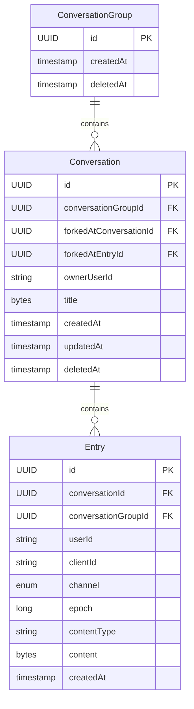

## Entry Fields

| Field | Type | Description |
|-------|------|-------------|
| `id` | UUID | Unique entry identifier |
| `conversationId` | UUID | The conversation this entry belongs to |
| `conversationGroupId` | UUID | The conversation group (for efficient fork queries) |
| `userId` | string | Human user who created the entry (null for agent entries) |
| `clientId` | string | Agent/client identifier from API key (null for user entries) |
| `channel` | enum | Logical channel: `HISTORY` or `MEMORY` |
| `epoch` | long | Memory epoch number (only for MEMORY channel) |
| `contentType` | string | Schema identifier describing the content format |
| `content` | bytes | Encrypted JSON content array |
| `createdAt` | timestamp | When the entry was created |

## Channels

Entries are organized into logical **channels** that serve different purposes:

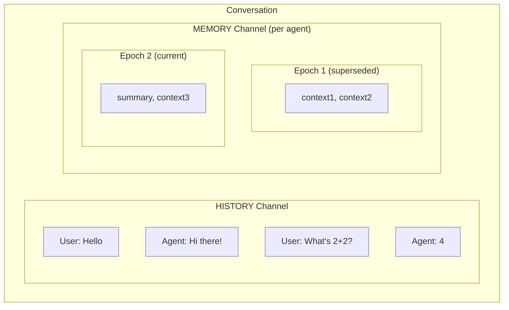

**Typical interaction order**: User HISTORY → Agent MEMORY updates → Agent HISTORY response → *(repeat)*

### HISTORY Channel

The **HISTORY** channel contains the visible conversation between users and agents. These entries form the chat transcript that users see in the UI.

- **Created by**: Users (via chat UI) or agents (responses)
- **Visible to**: All participants in the conversation
- **Epoch**: Always `null` (not epoch-scoped)
- **Content**: Chat messages in a common format across frameworks

### MEMORY Channel

The **MEMORY** channel stores agent-internal state that persists between interactions. This is the agent's "working memory" - context it needs to continue conversations coherently.

- **Created by**: Agents only (via API key authentication)
- **Visible to**: Only the agent that created it (filtered by `clientId`)
- **Epoch**: Required - memory entries are versioned by epoch
- **Content**: Agent-specific format (e.g., `LC4J` for LangChain4j, `SpringAI` for Spring AI)

## Multi-Agent Support

Multiple agents can participate in the same conversation without interfering with each other's memory. This is achieved through the `clientId` field.

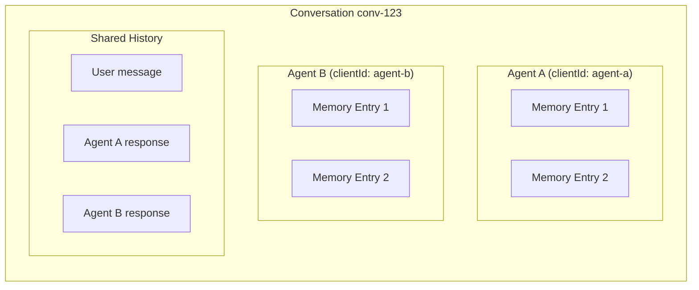

### Client ID Resolution

The `clientId` is derived from the API key used to authenticate the request. The mapping is configured as:

```properties
memory-service.api-keys.agent-a=key1,key2
memory-service.api-keys.agent-b=key3
```

When an agent queries the MEMORY channel, entries are automatically filtered to only return entries matching their `clientId`.

---

## Memory Epochs

Memory epochs enable agents to version their memory state. When an agent's context changes significantly (e.g., after summarization), it creates a new epoch.

### How Epochs Work

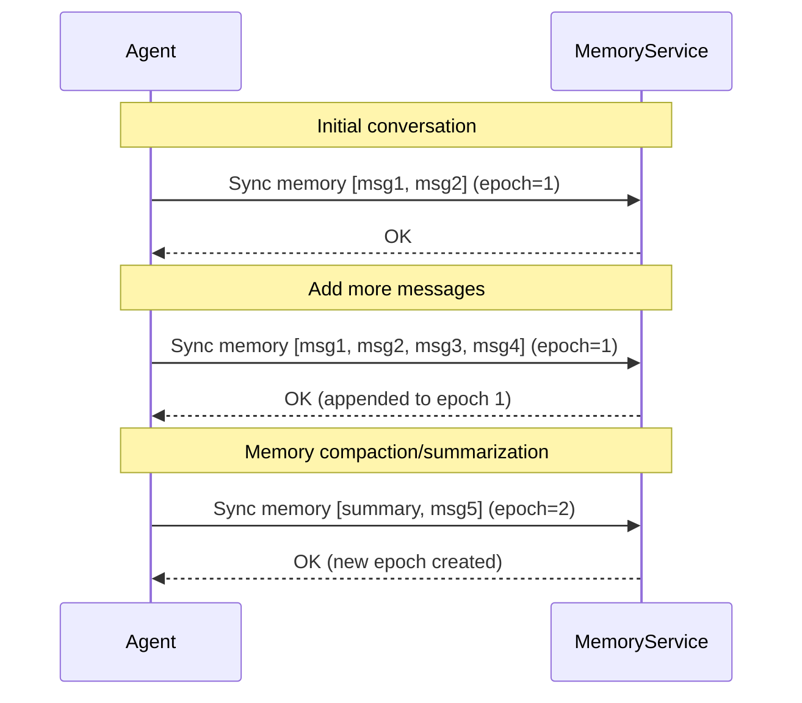

### Epoch Semantics

| Scenario | Result |
|----------|--------|
| Incoming content **exactly matches** existing | No-op (no writes) |
| Incoming content **extends** existing (prefix match) | Append delta to current epoch |
| Incoming content **diverges** from existing | Create new epoch with new content |

### Retrieving Memory by Epoch

When querying memory entries:

- **`epoch=latest`** (default): Returns only entries from the highest epoch number
- **`epoch=all`**: Returns entries from all epochs (for debugging)
- **`epoch=N`**: Returns entries from a specific epoch number

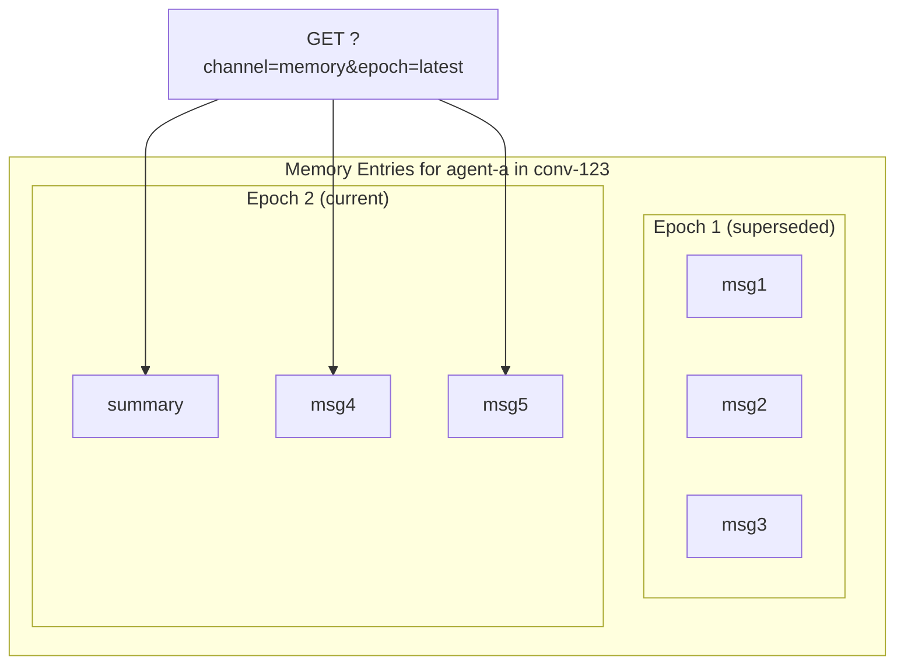

### Epoch Isolation per Client

Each `(conversationId, clientId)` pair has its own independent epoch sequence:

```
Conversation: conv-123
├── Agent A (clientId: agent-a)
│   ├── Epoch 1: [msg1, msg2]
│   └── Epoch 2: [summary, msg3]  <- Agent A's latest
│
└── Agent B (clientId: agent-b)
    └── Epoch 1: [context1, context2]  <- Agent B's latest
```

Agent A advancing to epoch 2 does not affect Agent B's epoch sequence.

---

## Conversation Forking

Conversations can be forked to create alternative branches from any point. Forking is "cheap" - it doesn't copy entries, but instead uses metadata to define which parent entries are visible to the fork.

### Fork Data Model

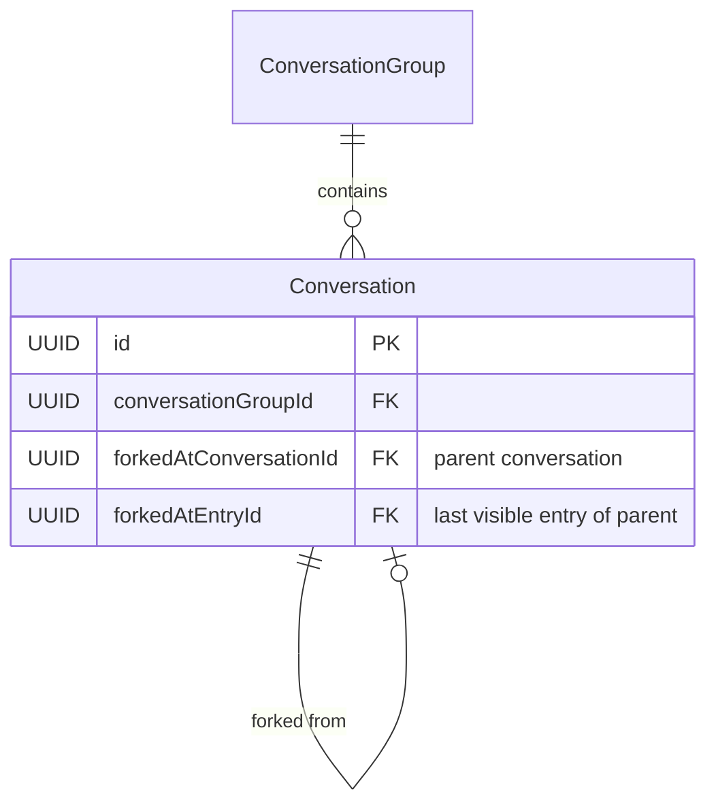

- **`conversationGroupId`**: All forks share the same group (for access control)
- **`forkedAtConversationId`**: The parent conversation this was forked from
- **`forkedAtEntryId`**: The last visible entry of the parent conversation

### Fork Semantics: "Fork at Entry X"

When we say "fork at entry X", it means **branch before X**. The fork sees all parent entries up to and including `forkedAtEntryId`, but **not** entry X itself.

A typical chat interaction follows this pattern:
1. **User HISTORY message** - User asks a question
2. **Agent MEMORY entries** - Agent stores/updates its working memory
3. **Agent HISTORY message** - Agent responds to the user
4. *(repeat)*

Forks are typically requested at a **User HISTORY message** - the user wants to "try a different question" at that point in the conversation. The fork excludes the selected user message and includes everything before it.

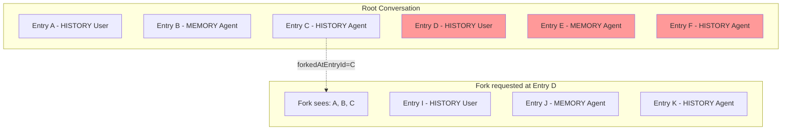

When the user calls the fork API at entry D (a User HISTORY message):
- The API call: `POST /v1/conversations/{id}/entries/D/fork`
- The system calculates `forkedAtEntryId = C` (the entry immediately before D)
- Fork sees: A, B, C (from parent), then its own entries I, J, K
- Fork does **NOT** see: D, E, F (the requested entry and everything after)

### Fork at Beginning

A fork can also occur at the very beginning of a conversation. In this case, `forkedAtEntryId = null`:

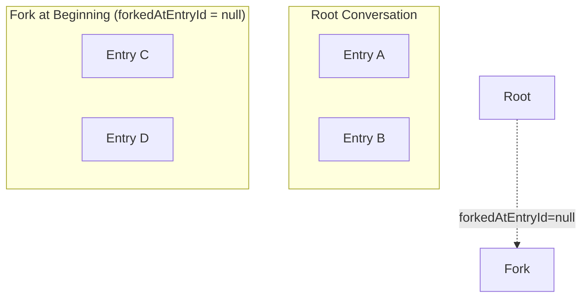

This fork sees **none** of the parent's entries - it's a "blank slate" that shares the conversation group (for access control) but starts fresh.

### Multi-Level Forks

Forks can be nested arbitrarily deep:

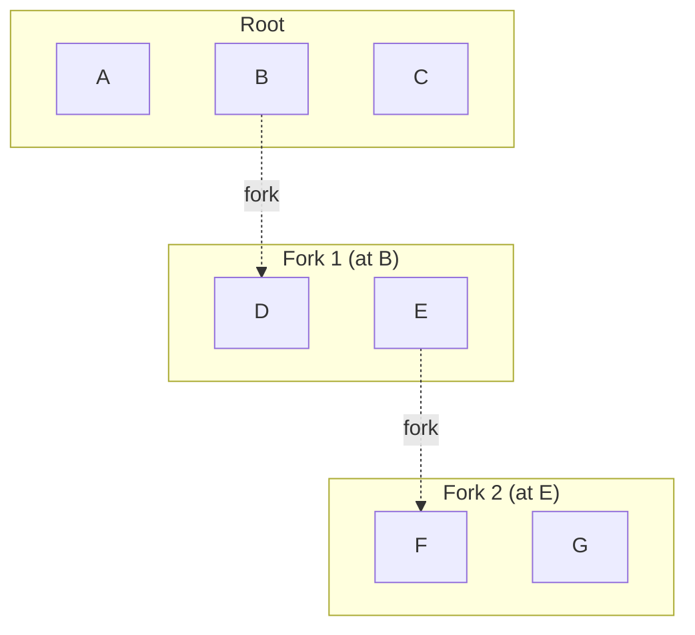

When querying Fork 2:
- Ancestry chain: Root → Fork 1 → Fork 2
- Fork 2 sees: A, D, F, G

### Entry Retrieval Algorithm

When fetching entries for a forked conversation, the algorithm:

1. **Build ancestry stack**: Walk up the parent chain collecting `(conversationId, forkPointEntryId)` pairs
2. **Query by conversation group**: Fetch all entries ordered by `createdAt`
3. **Filter based on ancestry**: Include entries according to the fork boundaries

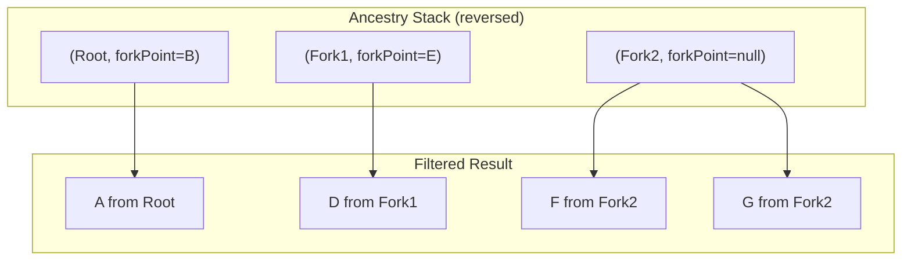

**Important**: The fork point stored on a conversation indicates where it was forked **FROM** in its parent. When building the ancestry stack, this fork point is "shifted" to apply to the parent conversation:

| Conversation | Fork Point (stop after this entry) |
|--------------|-----------------------------------|
| Root         | B (from Fork1's `forkedAtEntryId`) |
| Fork1        | E (from Fork2's `forkedAtEntryId`) |
| Fork2        | null (include all its entries)     |

---

## Epochs in Forked Conversations

Memory epochs interact with forking in a specific way: epochs are per-conversation, not per-group. A fork starts its own independent epoch sequence.

### Epoch Divergence at Fork Points

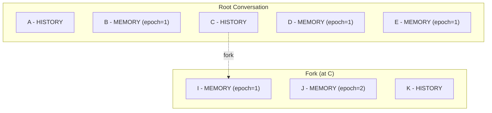

**Key concept**: Epochs with the same number in different conversations are **completely independent**. The root's epoch=1 is different from the fork's epoch=1.

### Query Results with Epochs

When querying MEMORY with `epoch=latest` from the fork:

| Scenario | Result | Explanation |
|----------|--------|-------------|
| Fork has epoch 2 | J only | Fork's epoch 2 supersedes all previous |
| Fork only has epoch 1 | B, I | Both at epoch 1 from their respective conversations |
| Query root with `epoch=latest` | B, D, E | Root's entries only, fork doesn't affect it |

### Epoch Filtering Algorithm

When iterating through entries in fork order, track the maximum epoch seen:

```
maxEpochSeen = 0
result = []

for entry in entries (following fork ancestry path):
    if entry.channel == MEMORY and entry.clientId == requestedClientId:
        if entry.epoch > maxEpochSeen:
            result.clear()  // New epoch supersedes all previous
            maxEpochSeen = entry.epoch
        if entry.epoch == maxEpochSeen:
            result.add(entry)
```

This ensures that when a fork creates a new epoch, it supersedes both its own previous epochs AND any inherited parent epochs.

---

## Edge Cases

### 1. Fork at First Entry

When forking at the very first HISTORY entry:

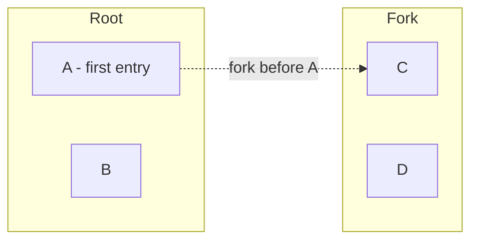

- `forkedAtEntryId = null` (no previous entry exists)
- Fork sees none of the parent's entries
- Fork has its own independent entry sequence

### 2. Fork with No Memory Entries

A fork may not have any MEMORY entries of its own:

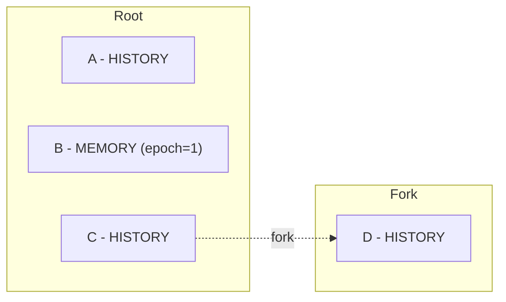

Querying MEMORY from the fork returns: B (inherited from parent at epoch=1)

### 3. Multiple Agents in Forked Conversation

Each agent's memory is independently scoped by `clientId`:

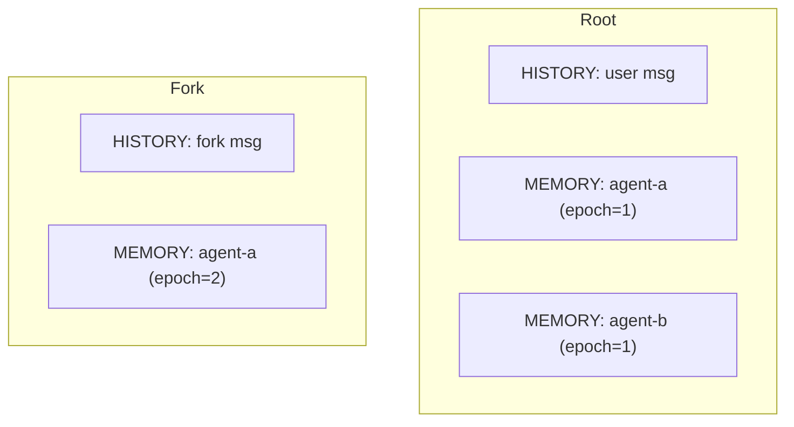

- Query fork as `agent-a`: Gets `agent-a`'s epoch=2 entries only (supersedes inherited epoch=1)
- Query fork as `agent-b`: Gets inherited `agent-b` epoch=1 entries from root

### 4. Sibling Forks

Multiple forks can branch from the same point:

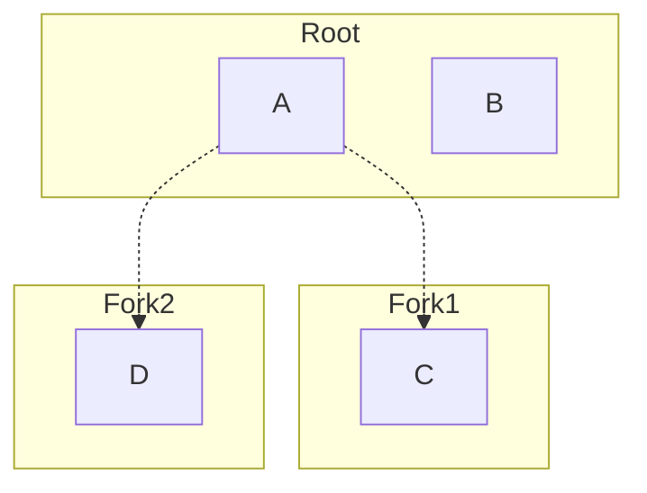

- Fork1 and Fork2 both have `forkedAtEntryId = A`
- They share entry A from the root
- They are independent and don't see each other's entries
- The `allForks=true` query option returns entries from all forks

### 5. Deleted Parent Entry at Fork Point

Entries are never deleted individually - they are only removed when the entire conversation group is deleted. If you see a "deleted" entry in the fork ancestry, the entire group would be inaccessible.

### 6. Empty Content Arrays

A MEMORY entry can have an empty content array `[]` after all messages are removed. This is valid and represents "memory cleared":

```json
{
  "channel": "memory",
  "epoch": 3,
  "content": []
}
```

The empty content at epoch 3 supersedes all entries from epochs 1 and 2.

---

## API Query Parameters

### Entry Retrieval Parameters

| Parameter | Description | Default |
|-----------|-------------|---------|
| `channel` | Filter by channel (`history`, `memory`) | All channels |
| `epoch` | Epoch filter (`latest`, `all`, or specific number) | `latest` for MEMORY |
| `afterEntryId` | Pagination cursor | None (start from beginning) |
| `limit` | Maximum entries to return | 50 |
| `allForks` | Return entries from all forks in the group | `false` |

### Example Queries

```bash
# Get all HISTORY entries for a conversation
GET /v1/conversations/{id}/entries?channel=history

# Get latest MEMORY entries for an agent
GET /v1/conversations/{id}/entries?channel=memory&epoch=latest

# Get all entries across all forks (admin/debug)
GET /v1/conversations/{id}/entries?allForks=true

# Paginated retrieval
GET /v1/conversations/{id}/entries?afterEntryId={lastSeenId}&limit=50
```

---

## Summary

The entry data model supports:

1. **Multiple channels** for different data types (HISTORY, MEMORY)
2. **Multi-agent support** through `clientId` isolation
3. **Memory epochs** for versioning agent context with superseding semantics
4. **Efficient forking** without copying data, using ancestry-based retrieval
5. **Nested forks** with proper epoch handling across fork boundaries

The key insight for forked entry retrieval is the "fork point shifting" - each conversation in the ancestry chain uses its child's `forkedAtEntryId` to determine where to stop including entries.
