# Entry Data Model

This document explains how entries are stored and retrieved in the memory service, covering the core data structure, channels, context epochs, sequence cursors, conversation forking, and conversation-level identity.

## Overview

An **Entry** is the fundamental unit of stored data in a conversation. Entries represent various types of content: chat messages, agent memory snapshots, tool results, or any structured data an agent needs to persist.

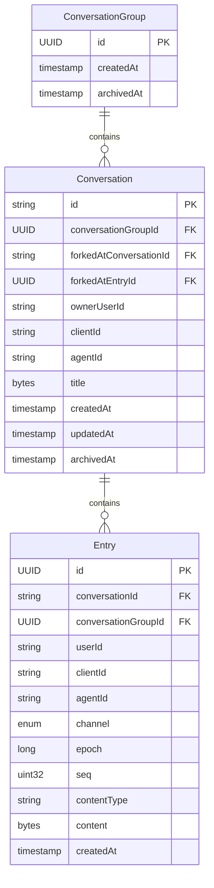
```mermaid
erDiagram
    ConversationGroup ||--o{ Conversation : "contains"
    Conversation ||--o{ Entry : "contains"
    ConversationGroup {
        UUID id PK
        timestamp createdAt
        timestamp archivedAt
    }
    Conversation {
        string id PK
        UUID conversationGroupId FK
        string forkedAtConversationId FK
        UUID forkedAtEntryId FK
        string ownerUserId
        string clientId
        string agentId
        bytes title
        timestamp createdAt
        timestamp updatedAt
        timestamp archivedAt
    }
    Entry {
        UUID id PK
        string conversationId FK
        UUID conversationGroupId FK
        string userId
        string clientId
        string agentId
        enum channel
        long epoch
        uint32 seq
        string contentType
        bytes content
        timestamp createdAt
    }
```

## Entry Fields

| Field | Type | Description |
|-------|------|-------------|
| `id` | UUID | Unique entry identifier |
| `conversationId` | string | The conversation this entry belongs to |
| `conversationGroupId` | UUID | The conversation group (for efficient fork queries) |
| `userId` | string | Human user who created the entry (null for agent entries) |
| `clientId` | string | Authenticated client that wrote the entry (internal/admin only) |
| `agentId` | string | Optional logical agent associated with the entry |
| `channel` | enum | Logical channel: `history`, `context`, or `journal` |
| `epoch` | long | Context epoch number (only for `context` channel) |
| `seq` | uint32 | Optional caller-supplied sequence number unique within the conversation |
| `contentType` | string | Schema identifier describing the content format |
| `content` | bytes | Encrypted JSON content array |
| `createdAt` | timestamp | When the entry was created |

## Channels

Entries are organized into logical **channels** that serve different purposes:

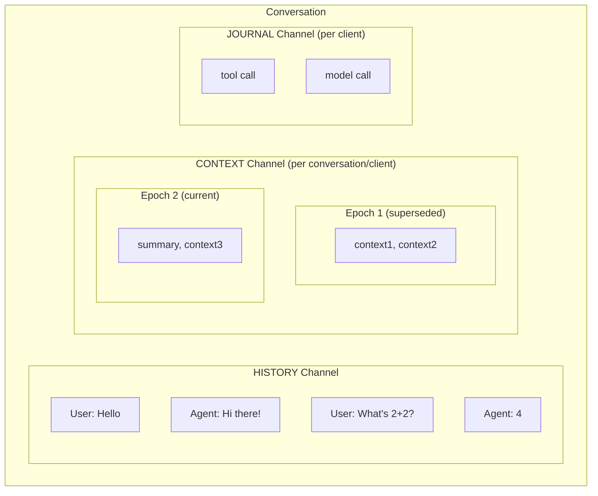
```mermaid
flowchart TB
    subgraph Conversation
        subgraph "HISTORY Channel"
            H1[User: Hello]
            H2[Agent: Hi there!]
            H3[User: What's 2+2?]
            H4[Agent: 4]
        end
        subgraph "CONTEXT Channel (per conversation/client)"
            subgraph "Epoch 1 (superseded)"
                M1[context1, context2]
            end
            subgraph "Epoch 2 (current)"
                M2[summary, context3]
            end
        end
        subgraph "JOURNAL Channel (per client)"
            J1[tool call]
            J2[model call]
        end
    end
```

**Typical interaction order**: User `history` → agent `context` updates and optional `journal` records → agent `history` response → *(repeat)*

### `history` Channel

The `history` channel contains the visible conversation between users and agents. These entries form the chat transcript that users see in the UI.

- **Created by**: Users (via chat UI) or agents (responses)
- **Visible to**: All participants in the conversation
- **Epoch**: Always `null` (not epoch-scoped)
- **Content**: Chat messages in a common format across frameworks

### `context` Channel

The `context` channel stores agent-internal state that persists between interactions. This is the agent's working memory: context it needs to continue conversations coherently.

- **Created by**: Agents only (via API key authentication)
- **Visible to**: Callers whose authenticated client matches the conversation's stored `clientId`
- **Epoch**: Required - context entries are versioned by epoch
- **Content**: Agent-specific format (e.g., `LC4J` for LangChain4j, `SpringAI` for Spring AI)

### `journal` Channel

The `journal` channel stores opaque execution records, such as tool calls, model calls, planner steps, or other replay/debug state that should not be part of user-visible history.

- **Created by**: Agents only (via API key authentication)
- **Visible to**: Callers whose authenticated client matches the entry's `clientId`
- **Epoch**: Always `null` (not epoch-scoped)
- **Search indexing**: Not supported; `indexedContent` is rejected for non-history channels
- **Content**: Agent-defined JSON payloads

End-user reads without a client identity default to `history`. Explicit reads of `context` or `journal` require an authenticated client identity. Event streams also default entry events to `history`; trusted consumers must opt into `entry_channels=context`, `entry_channels=journal`, or both.

## Conversation Identity

Each conversation stores:

- `clientId`: required authenticated app/system identity derived at conversation creation time
- `agentId`: optional logical agent associated with that conversation

The public entry model no longer exposes `clientId` or `agentId`. Context and journal isolation are client-scoped. Access to the `context` channel is authorized using the conversation's stored `clientId`, and `journal` entries are filtered to the authenticated client that wrote them.

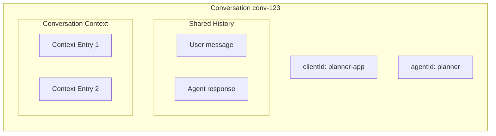
```mermaid
flowchart LR
    subgraph "Conversation conv-123"
        CID[clientId: planner-app]
        AG[agentId: planner]
        subgraph "Shared History"
            H1[User message]
            H2[Agent response]
        end
        subgraph "Conversation Context"
            MA1[Context Entry 1]
            MA2[Context Entry 2]
        end
    end
```

### Client ID Resolution

The `clientId` is derived from the API key or authenticated client context used to create the conversation.

```properties
memory-service.api-keys.agent-a=key1,key2
memory-service.api-keys.agent-b=key3
```

When a caller queries the `context` or `journal` channel, the service requires an authenticated client identity. History entries continue to follow normal conversation membership rules.

## Entry Sequence Numbers

Entries may include an optional `seq` value. Sequence numbers are caller-supplied unsigned 32-bit integers and must be unique within a conversation when present. They are useful for clients that need deterministic cross-channel replay across `history`, `context`, and `journal` entries.

When listing entries, `fromSeq=N` returns entries with `seq >= N`, excludes entries without a sequence number, and orders the response by `seq` ascending. Without `fromSeq`, entries use the normal conversation order (`createdAt` ASC, `seq` ASC NULLS FIRST for timestamp ties, then `id` ASC) and cursor pagination.

---

## Memory Epochs

Context epochs enable agents to version their working context. When an agent's context changes significantly (e.g., after summarization), it creates a new epoch.

### How Epochs Work

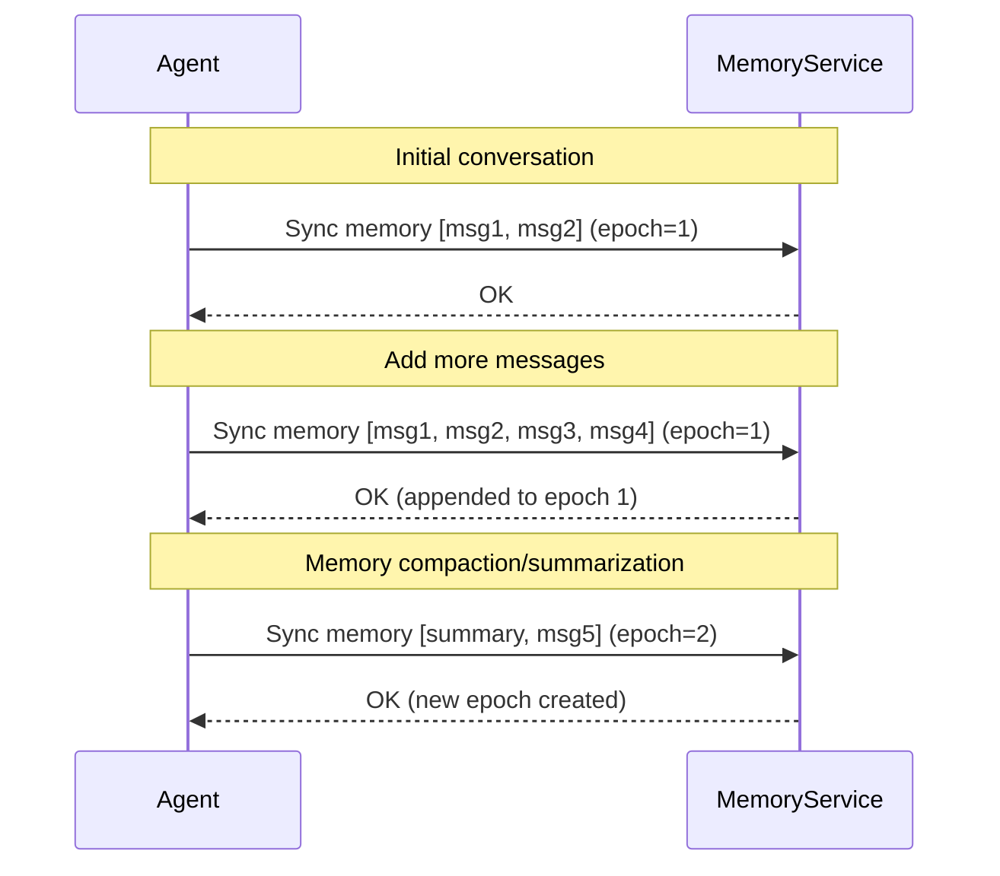
```mermaid
sequenceDiagram
    participant Agent
    participant MemoryService

    Note over Agent,MemoryService: Initial conversation
    Agent->>MemoryService: Sync memory [msg1, msg2] (epoch=1)
    MemoryService-->>Agent: OK

    Note over Agent,MemoryService: Add more messages
    Agent->>MemoryService: Sync memory [msg1, msg2, msg3, msg4] (epoch=1)
    MemoryService-->>Agent: OK (appended to epoch 1)

    Note over Agent,MemoryService: Memory compaction/summarization
    Agent->>MemoryService: Sync memory [summary, msg5] (epoch=2)
    MemoryService-->>Agent: OK (new epoch created)
```

### Epoch Semantics

| Scenario | Result |
|----------|--------|
| Incoming content **exactly matches** existing | No-op (no writes) |
| Incoming content **extends** existing (prefix match) | Append delta to current epoch |
| Incoming content **diverges** from existing | Create new epoch with new content |

### Retrieving Context by Epoch

When querying context entries:

- **`epoch=latest`** (default): Returns only entries from the highest epoch number
- **`epoch=all`**: Returns entries from all epochs (for debugging)
- **`epoch=N`**: Returns entries from a specific epoch number

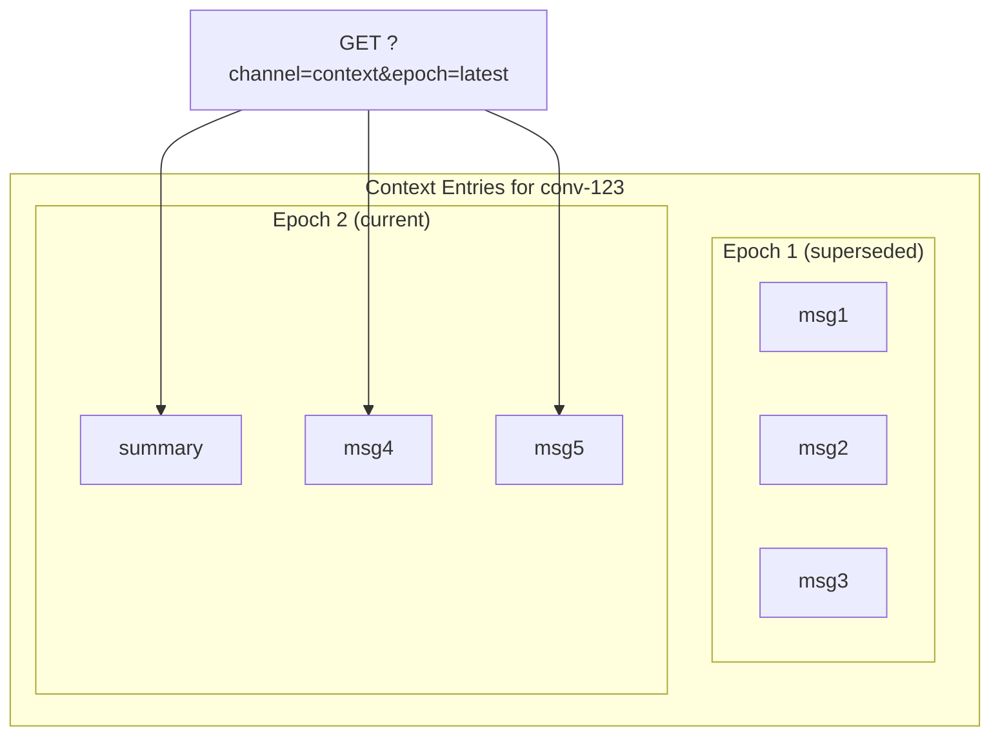
```mermaid
flowchart TB
    subgraph "Context Entries for conv-123"
        subgraph "Epoch 1 (superseded)"
            E1M1[msg1]
            E1M2[msg2]
            E1M3[msg3]
        end
        subgraph "Epoch 2 (current)"
            E2M1[summary]
            E2M2[msg4]
            E2M3[msg5]
        end
    end

    Query["GET ?channel=context&epoch=latest"] --> E2M1
    Query --> E2M2
    Query --> E2M3
```

### Epoch Isolation Per Conversation

Each conversation has its own independent context epoch sequence:

```
Conversation: conv-123
├── clientId: planner-app
├── agentId: planner
├── Epoch 1: [msg1, msg2]
└── Epoch 2: [summary, msg3]  <- latest
```

A different conversation may have a different `clientId` and its own independent epoch sequence. Parent and child conversations do not share epochs.

---

## Conversation Forking

Conversations can be forked to create alternative branches from allowed entry boundaries. Forking is "cheap" - it doesn't copy entries, but instead uses metadata to define which parent entries are visible to the fork.

### Fork Data Model

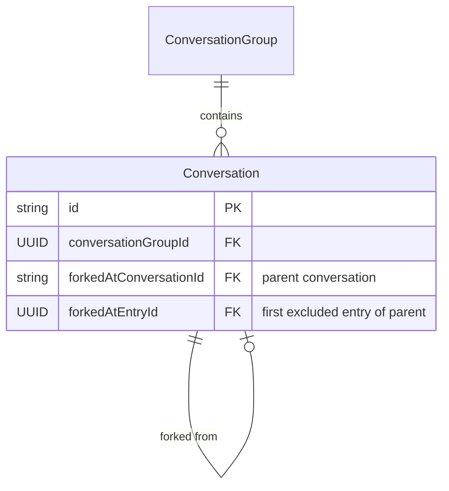
```mermaid
erDiagram
    ConversationGroup ||--o{ Conversation : contains
    Conversation ||--o| Conversation : "forked from"

    Conversation {
        string id PK
        UUID conversationGroupId FK
        string forkedAtConversationId FK "parent conversation"
        UUID forkedAtEntryId FK "first excluded entry of parent"
    }
```

- **`conversationGroupId`**: All forks share the same group (for access control)
- **`forkedAtConversationId`**: The parent conversation this was forked from
- **`forkedAtEntryId`**: The first excluded entry of the parent conversation (`null` for blank-slate forks)

### Fork Semantics: "Fork at Entry X"

When we say "fork at entry X", it means **branch before X**. The fork sees all parent entries before `forkedAtEntryId`, but **not** entry X itself.

A typical chat interaction follows this pattern:
1. **User HISTORY message** - User asks a question
2. **Agent CONTEXT entries** - Agent stores/updates its working memory
3. **Agent HISTORY message** - Agent responds to the user
4. *(repeat)*

User-facing chat forks are typically requested at a **User HISTORY message** - the user wants to "try a different question" at that point in the conversation. Trusted runtime clients may also fork at **JOURNAL** entries for replay, rollback, and debugging. The fork excludes the selected history or journal entry and includes everything before it.

Allowed fork anchors:

- `history`: visible conversation entries, usually user messages in chat UIs.
- `journal`: opaque execution records. The caller must authenticate as the same client that can read the journal entry.

`context` entries cannot be fork anchors because they are derived, epoch-scoped state rather than append-only event boundaries.

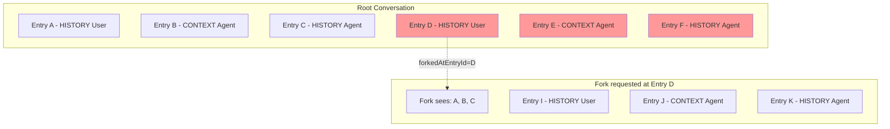
```mermaid
flowchart TB
    subgraph "Root Conversation"
        A[Entry A - HISTORY User]
        B[Entry B - CONTEXT Agent]
        C[Entry C - HISTORY Agent]
        D[Entry D - HISTORY User]
        E[Entry E - CONTEXT Agent]
        F[Entry F - HISTORY Agent]
    end

    subgraph "Fork requested at Entry D"
        FA[Fork sees: A, B, C]
        FI[Entry I - HISTORY User]
        FJ[Entry J - CONTEXT Agent]
        FK[Entry K - HISTORY Agent]
    end

    D -.->|forkedAtEntryId=D| FA

    style D fill:#ff9999
    style E fill:#ff9999
    style F fill:#ff9999
```

When the caller forks at entry D (a User HISTORY message in this example):
- The first append to the forked conversation supplies `forkedAtConversationId` and `forkedAtEntryId = D`
- The system stores `forkedAtEntryId = D` (the first parent entry to exclude)
- Fork sees: A, B, C (from parent), then its own entries I, J, K
- Fork does **NOT** see: D, E, F (the requested entry and everything after)

### Fork at Beginning

A fork can also occur at the very beginning of a conversation. In this case, `forkedAtEntryId = null`:

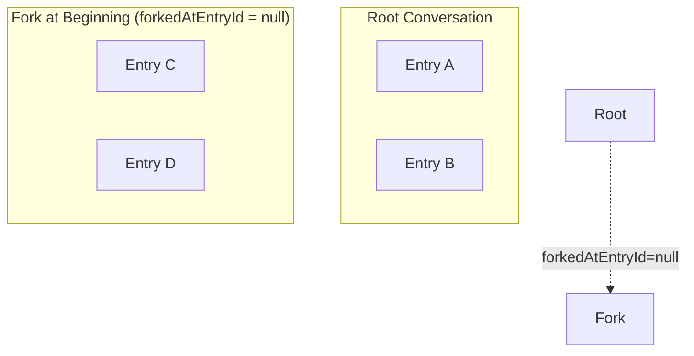
```mermaid
flowchart TB
    subgraph "Root Conversation"
        RA[Entry A]
        RB[Entry B]
    end

    subgraph "Fork at Beginning (forkedAtEntryId = null)"
        FC[Entry C]
        FD[Entry D]
    end

    Root[Root] -.->|forkedAtEntryId=null| Fork[Fork]
```

This fork sees **none** of the parent's entries - it's a "blank slate" that shares the conversation group (for access control) but starts fresh.

### Multi-Level Forks

Forks can be nested arbitrarily deep:

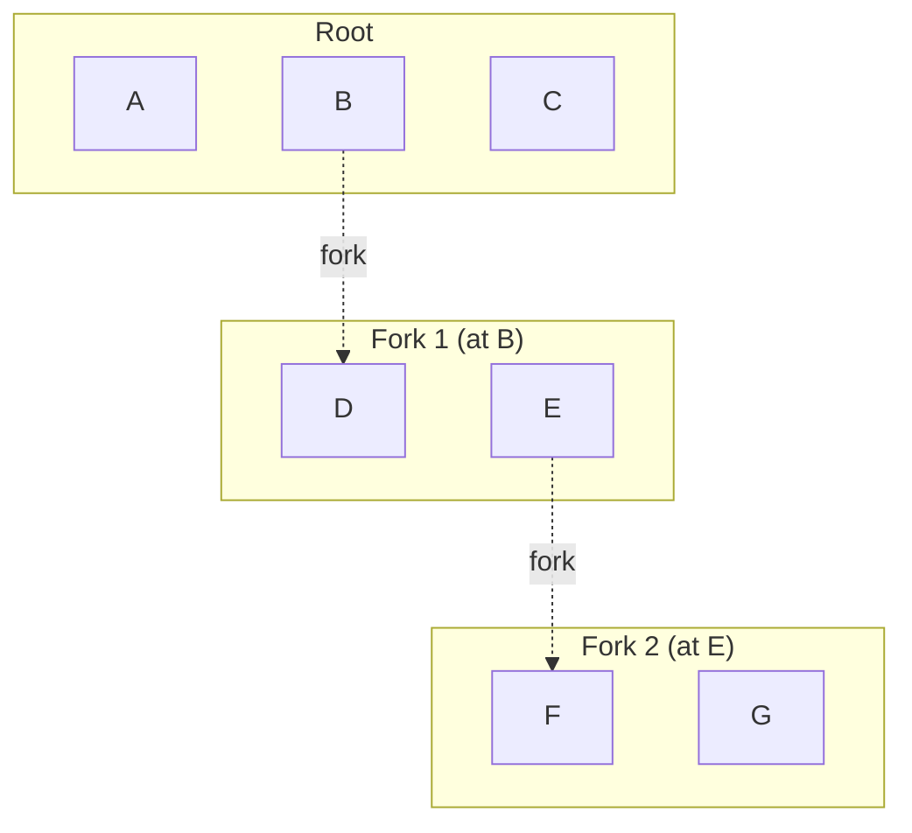
```mermaid
flowchart TB
    subgraph "Root"
        R_A[A]
        R_B[B]
        R_C[C]
    end

    subgraph "Fork 1 (at B)"
        F1_D[D]
        F1_E[E]
    end

    subgraph "Fork 2 (at E)"
        F2_F[F]
        F2_G[G]
    end

    R_B -.->|fork| F1_D
    F1_E -.->|fork| F2_F
```

When querying Fork 2:
- Ancestry chain: Root → Fork 1 → Fork 2
- Fork 2 sees: A, D, F, G

### Entry Retrieval Algorithm

When fetching entries for a forked conversation, the algorithm:

1. **Build ancestry stack**: Walk up the parent chain collecting `(conversationId, forkPointEntryId)` pairs
2. **Query by conversation group**: Fetch all entries ordered by `createdAt`
3. **Filter based on ancestry**: Include entries according to the fork boundaries

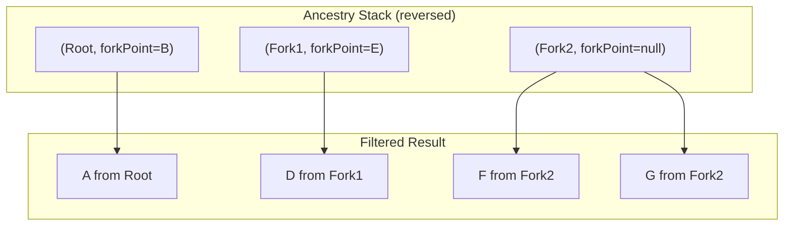
```mermaid
flowchart TB
    subgraph "Ancestry Stack (reversed)"
        S1["(Root, forkPoint=B)"]
        S2["(Fork1, forkPoint=E)"]
        S3["(Fork2, forkPoint=null)"]
    end

    subgraph "Filtered Result"
        R1[A from Root]
        R2[D from Fork1]
        R3[F from Fork2]
        R4[G from Fork2]
    end

    S1 --> R1
    S2 --> R2
    S3 --> R3
    S3 --> R4
```

**Important**: The fork point stored on a conversation indicates where it was forked **FROM** in its parent. When building the ancestry stack, this fork point is "shifted" to apply to the parent conversation:

| Conversation | Fork Point (stop before this entry) |
|--------------|------------------------------------|
| Root         | B (from Fork1's `forkedAtEntryId`) |
| Fork1        | E (from Fork2's `forkedAtEntryId`) |
| Fork2        | null (include all its entries)     |

---

## Epochs in Forked Conversations

Context epochs interact with forking in a specific way: epochs are per-conversation, not per-group. A fork starts its own independent epoch sequence.

### Epoch Divergence at Fork Points

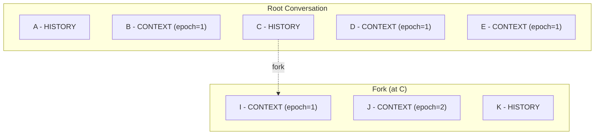
```mermaid
flowchart TB
    subgraph "Root Conversation"
        R_A[A - HISTORY]
        R_B["B - CONTEXT (epoch=1)"]
        R_C[C - HISTORY]
        R_D["D - CONTEXT (epoch=1)"]
        R_E["E - CONTEXT (epoch=1)"]
    end

    subgraph "Fork (at C)"
        F_I["I - CONTEXT (epoch=1)"]
        F_J["J - CONTEXT (epoch=2)"]
        F_K[K - HISTORY]
    end

    R_C -.->|fork| F_I
```

**Key concept**: Epochs with the same number in different conversations are **completely independent**. The root's epoch=1 is different from the fork's epoch=1.

### Query Results with Epochs

When querying CONTEXT with `epoch=latest` from the fork:

| Scenario | Result | Explanation |
|----------|--------|-------------|
| Fork has epoch 2 | J only | Fork's epoch 2 supersedes all previous |
| Fork only has epoch 1 | B, I | Both at epoch 1 from their respective conversations |
| Query root with `epoch=latest` | B, D, E | Root's entries only, fork doesn't affect it |

### Epoch Filtering Algorithm

When iterating through entries in fork order, track the maximum epoch seen for the conversation-scoped context stream:

```
maxEpochSeen = 0
result = []

for entry in entries (following fork ancestry path):
    if entry.channel == CONTEXT:
        if entry.epoch > maxEpochSeen:
            result.clear()  // New epoch supersedes all previous
            maxEpochSeen = entry.epoch
        if entry.epoch == maxEpochSeen:
            result.add(entry)
```

This ensures that when a fork creates a new epoch, it supersedes both its own previous epochs AND any inherited parent epochs.

---

## Edge Cases

### 1. Fork at First Entry

When forking at the very first HISTORY entry:

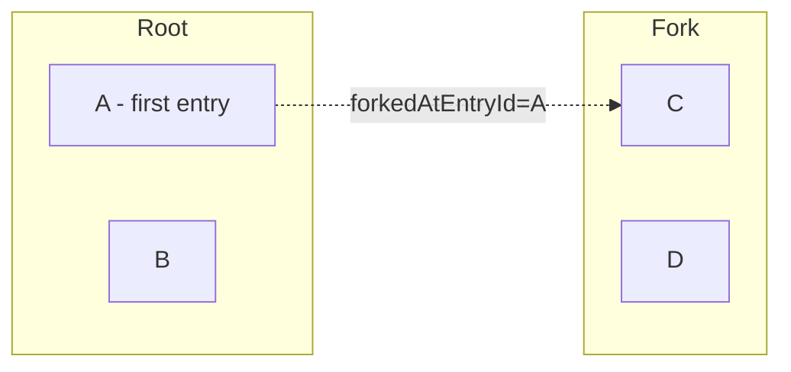
```mermaid
flowchart LR
    subgraph Root
        R_A[A - first entry]
        R_B[B]
    end
    subgraph Fork
        F_C[C]
        F_D[D]
    end
    R_A -.->|forkedAtEntryId=A| F_C
```

- `forkedAtEntryId = A` (the first parent entry to exclude)
- Fork sees none of the parent's entries
- Fork has its own independent entry sequence

### 2. Fork with No Context Entries

A fork may not have any context entries of its own:

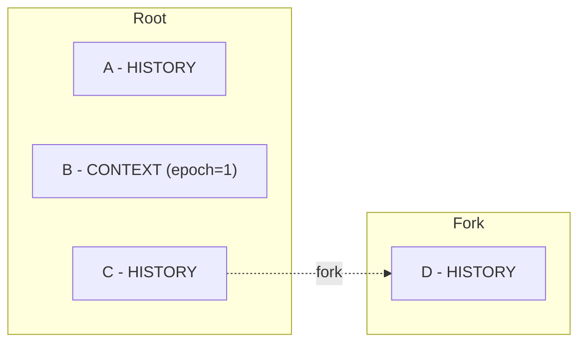
```mermaid
flowchart LR
    subgraph Root
        R_A[A - HISTORY]
        R_B["B - CONTEXT (epoch=1)"]
        R_C[C - HISTORY]
    end
    subgraph Fork
        F_D[D - HISTORY]
    end
    R_C -.->|fork| F_D
```

Querying `context` from the fork returns B (inherited from parent at epoch=1) when no newer fork context epoch supersedes it.

### 3. Child Or Forked Conversations Keep Independent Context

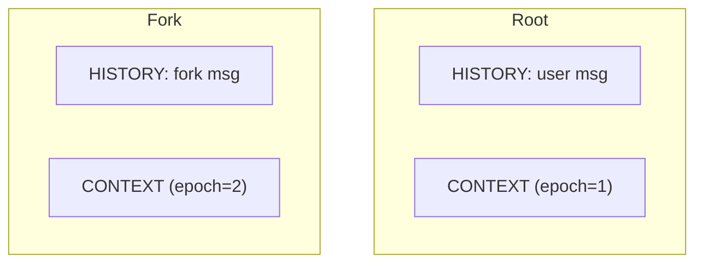
```mermaid
flowchart TB
    subgraph "Root"
        R_H1[HISTORY: user msg]
        R_MA["CONTEXT (epoch=1)"]
    end
    subgraph "Fork"
        F_H1[HISTORY: fork msg]
        F_MA["CONTEXT (epoch=2)"]
    end
```

- Querying the fork with `epoch=latest` returns the fork's epoch 2 context.
- Querying the root with `epoch=latest` still returns the root's own latest context.
- Parent and forked conversations do not share a single context stream.

### 4. Sibling Forks

Multiple forks can branch from the same point:

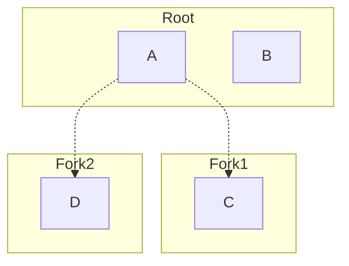
```mermaid
flowchart TB
    subgraph Root
        R_A[A]
        R_B[B]
    end
    subgraph Fork1
        F1_C[C]
    end
    subgraph Fork2
        F2_D[D]
    end
    R_A -.-> F1_C
    R_A -.-> F2_D
```

- Fork1 and Fork2 both have `forkedAtEntryId = A`
- They exclude entry A from the root
- They are independent and don't see each other's entries
- The `forks=all` query option returns entries from all forks

### 5. Deleted Parent Entry at Fork Point

Entries are never deleted individually - they are only removed when the entire conversation group is deleted. If you see a "deleted" entry in the fork ancestry, the entire group would be inaccessible.

### 6. Empty Content Arrays

A `context` entry can have an empty content array `[]` after all messages are removed. This is valid and represents "context cleared":

```json
{
  "channel": "context",
  "epoch": 3,
  "content": []
}
```

The empty content at epoch 3 supersedes all entries from epochs 1 and 2.

---

## API Query Parameters

### Entry Retrieval Parameters

| Parameter | Description | Default |
|-----------|-------------|---------|
| `channel` | Filter by channel (`history`, `context`, `journal`) | `history` for user-only reads; all visible channels for authenticated clients |
| `epoch` | Epoch filter (`latest`, `all`, or specific number) | `latest` for `context` |
| `fromSeq` | Return entries with `seq >= fromSeq`, ordered by sequence. When omitted, default ordering is `createdAt` ASC, `seq` ASC NULLS FIRST for timestamp ties, then `id` ASC. | None |
| `afterEntryId` | Pagination cursor | None (start from beginning) |
| `limit` | Maximum entries to return | 50 |
| `forks` | `none` for ancestry path, `all` for every fork in the group | `none` |

### Example Queries

```bash
# Get all HISTORY entries for a conversation
GET /v1/conversations/{id}/entries?channel=history

# Get latest CONTEXT entries for a conversation
GET /v1/conversations/{id}/entries?channel=context&epoch=latest

# Replay sequenced entries across channels
GET /v1/conversations/{id}/entries?fromSeq=100

# Get all entries across all forks (admin/debug)
GET /v1/conversations/{id}/entries?forks=all

# Paginated retrieval
GET /v1/conversations/{id}/entries?afterEntryId={lastSeenId}&limit=50
```

---

## Summary

The entry data model supports:

1. **Multiple channels** for different data types (`history`, `context`, `journal`)
2. **Conversation-scoped context** authorized by conversation `clientId`
3. **Client-scoped journal records** for opaque execution/replay state
4. **Context epochs** for versioning agent context with superseding semantics
5. **Optional sequence numbers** for deterministic cross-channel replay
6. **Efficient forking** without copying data, using ancestry-based retrieval
7. **Nested forks** with proper epoch handling across fork boundaries

The key insight for forked entry retrieval is the "fork point shifting" - each conversation in the ancestry chain uses its child's `forkedAtEntryId` to determine where to stop including entries.
