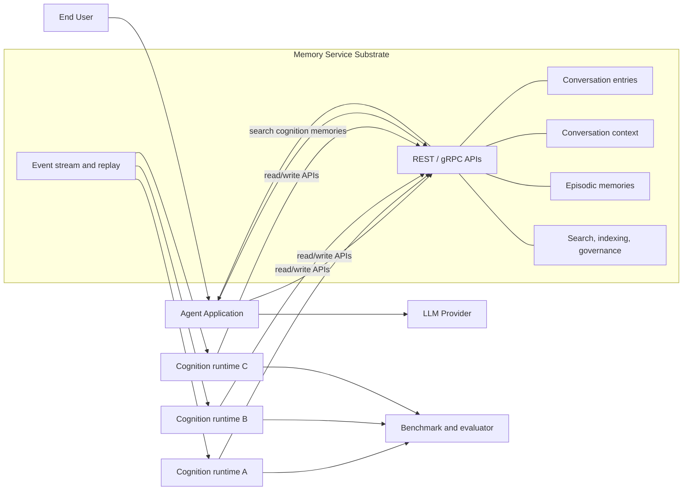
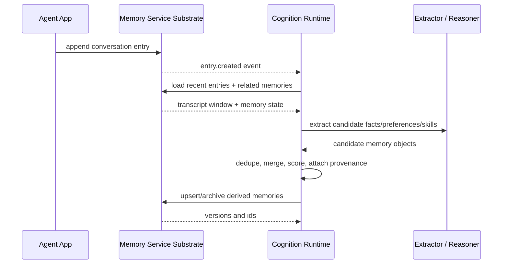
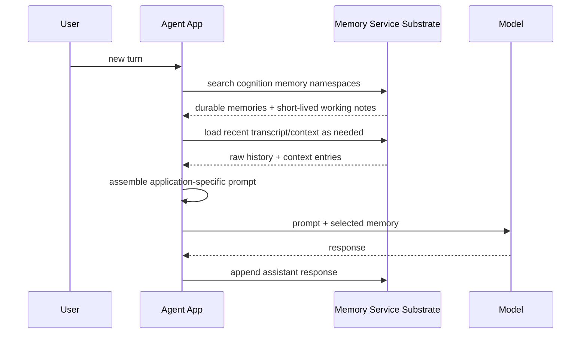

# Memory Cognition

Memory Service today is primarily a memory substrate. It captures, stores, indexes, retrieves, scopes, and governs memory. It answers questions such as:

- Where does memory live?
- How is it keyed?
- How is it searched?
- Who can access it?
- How long does it last?

That layer remains necessary. It is the system of record.

The next layer is memory cognition. This is the layer that interprets, organizes, updates, and injects memory so the agent can think better. It answers questions such as:

- What should be remembered?
- How should it be structured?
- How should it be merged, summarized, or updated?
- What should the agent see right now?

This document describes that cognition layer as a pluggable system that runs on top of the existing Memory Service substrate.

For a concrete proposed implementation, see [Quarkus + LangChain4j Cognition Processor](enhancements/099-quarkus-cognition-processor.md).

## Summary

The V2 architecture keeps the current memory-service focused on durable infrastructure:

- conversation history and replay
- per-conversation `context` state
- episodic `/v1/memories`
- search and indexing
- identity, scoping, and governance
- events and lifecycle management

The cognition layer sits above that substrate and turns raw stored data into higher-level memory products:

- typed memories
- consolidated facts and preferences
- skills and procedures
- summaries and rollups
- retrieval-ready memory products for the next model call

The substrate remains the source of truth. Cognition runtimes are replaceable processors that read from the substrate, reason over it, and write derived state back through substrate APIs.

## Goals

- Preserve the current memory-service as the durable source of truth for raw entries, memories, access control, and lifecycle.
- Make cognition pluggable so multiple implementations can run side by side and be benchmarked against each other.
- Keep cognition mostly asynchronous and event-driven so extraction and consolidation do not bloat the agent hot path.
- Preserve provenance, scope, and governance for all derived memories.
- Support both external-process cognition runtimes and optional embedded runtimes when latency or deployment simplicity matters.
- Make cognition outputs replayable and rebuildable from substrate data and event history.

## Non-Goals

- Replacing the current conversation, `context`, or `/v1/memories` substrate APIs.
- Hard-coding one cognition strategy, one LLM provider, or one prompt format into the substrate.
- Moving all reasoning into the memory-service process.
- Treating cognition outputs as ungoverned side data that bypasses the substrate's access-control model.

## Two-Layer Model

The cleanest way to think about the system is as two layers with different responsibilities.

| Layer | Responsibility | Typical Data |
|------|----------------|--------------|
| Substrate | Capture, persist, scope, search, govern, replay | conversation entries, `context` entries, episodic memories, events, embeddings, ACLs |
| Cognition | Interpret, extract, consolidate, organize, inject | facts, preferences, skills, summaries, relationship views, retrieval-ready memory products |

The substrate is about durability and control. The cognition layer is about usefulness.

## Memory Layers Inside Cognition

Different cognition runtimes may choose different internal models, but the architecture should support a common stack of memory products:

| Memory Layer | Purpose | Likely Backing Store |
|-------------|---------|----------------------|
| Transcript layer | Raw conversation history and tool traces | conversation `entries` |
| Working context layer | Per-conversation agent working state and checkpoints | conversation `context` entries |
| Episodic layer | Durable user, project, or task memories across conversations | `/v1/memories` |
| Semantic/profile layer | Facts, preferences, identity, stable traits | derived `/v1/memories` |
| Procedural layer | Skills, workflows, decision policies, playbooks | derived `/v1/memories` or runtime-owned IR |
| Runtime retrieval layer | The subset of cognition-produced memory candidates likely to help the next model call | `/v1/memories` search over durable and TTL-backed cognition namespaces |

The first three layers already exist in the substrate. The latter layers are where cognition adds value.

## High-Level Architecture

The default deployment model should treat cognition as a separate runtime that uses the memory-service as its data plane.

This separation is important:

- the substrate can stay focused on correctness, durability, and governance
- cognition can evolve faster than the substrate
- different cognition implementations can be tested without changing core storage
- cognition can be written in the language and framework best suited to the algorithm

## Cognition Runtime Contract

Every cognition runtime should fit the same basic contract.

### Inputs

- substrate event stream for new conversation and memory activity
- replay or cursor-based catch-up so runtimes can resume after downtime
- durable admin checkpoints via `GET`/`PUT /v1/admin/checkpoints/{clientId}` so processors can store the last accepted event cursor and resume quickly after restart
- substrate read APIs for conversation windows, `context`, episodic memories, and search
- optional periodic reprocessing triggers for backfills, rescoring, or global consolidation

### Outputs

- create, update, archive, or supersede derived memories through substrate APIs
- optional materialized per-conversation `context` updates
- optional retrieval-ready memory products returned through `/v1/memories` search
- metrics and evaluation records for benchmark comparison

### Required invariants

- derived memories must preserve provenance back to source entries or source memories
- derived memories must never widen access beyond the source data's effective scope
- consolidation must be idempotent so event replay does not duplicate memory state
- runtimes must tolerate eventual consistency and partial failure

## Reference Pipeline

The cognition layer is not a single algorithm. It is a pipeline with replaceable stages.

1. Observe: Subscribe to substrate events and identify impacted conversations, users, projects, or namespaces.
2. Interpret: Read the relevant transcript and memory window, then extract candidate facts, preferences, summaries, skills, or relationships.
3. Consolidate: Compare candidates to existing memory, resolve duplicates or conflicts, update freshness/confidence, and archive stale state.
4. Inject: Retrieve cognition-produced memories and working notes that the agent app can assemble into the next model prompt.

Some runtimes may use an LLM heavily. Others may use clustering, rules, graph updates, or deterministic summarization. The substrate should not care.

## Event-Driven Extraction and Consolidation

One common flow is an async cognition worker that listens for new conversation events, extracts candidate memory, and writes consolidated state back through the substrate.

This is the critical interaction between the two layers:

- the substrate emits durable events and serves raw state
- cognition interprets and consolidates
- the substrate stores the resulting memory products under the same governance model

## Runtime Context Injection

Extraction is not enough. The cognition layer also needs to decide what the agent should see at inference time.

This keeps cognition outputs in the governed memory substrate without forcing the substrate to own application-specific prompt assembly.

The memory retrieval step may return:

- a compact set of facts and preferences
- one or more relevant skills or procedures
- short-lived bridge, topic, or summary notes
- provenance fields so the agent can inspect why each item exists

## Pluggability and Benchmarking

We should assume there will be multiple cognition strategies, not one.

Examples:

- LLM-first extraction and summarization
- clustering-first deterministic structuring plus light LLM labeling
- rules plus embeddings plus targeted LLM conflict resolution
- graph-backed entity memory with symbolic consolidation

The system should support running these in parallel against the same substrate.

### Recommended benchmark model

- Feed each runtime the same event stream or replay window.
- Isolate outputs by runtime identity, namespace, or another explicit partition key.
- Measure extraction latency, token cost, memory churn, retrieval hit rate, and quality against evaluation tasks.
- Allow one runtime to be active for production context injection while others run in shadow mode.

Using the substrate as the shared source of truth makes this practical. Each runtime sees the same raw evidence and can be evaluated on both quality and cost.

## Deployment Models

### External process

This should be the default.

Benefits:

- strongest isolation from substrate failures
- independent scaling
- polyglot implementations
- easier A/B and shadow benchmarking
- easier experimentation with different model providers and prompt stacks

### Embedded runtime

This should remain an option, not the default.

Benefits:

- lower latency for small deployments
- simpler local development
- fewer moving pieces for single-binary installs

Tradeoff:

- tighter coupling between substrate release cadence and cognition experiments

## Data Ownership and Provenance

The cognition layer will only be trustworthy if every derived memory can be explained.

At minimum, derived memories should carry:

- source conversation ids
- source entry ids or source memory ids
- runtime identifier
- extraction or consolidation timestamp
- confidence or freshness metadata

That metadata is necessary for:

- debugging incorrect memories
- re-running or replacing a cognition runtime
- supporting archive and supersede semantics
- comparing multiple runtimes fairly

## Likely Substrate Enhancements

The current substrate is already close to what cognition needs, but this architecture will likely benefit from additional first-class support.

Likely enhancements include:

- batch read and batch write APIs so cognition workers do not need many small round trips
- bulk upsert, archive, and supersede operations for derived memories
- compare-and-set or version-aware writes to avoid consolidation races
- richer query filters on derived memories, including type, confidence, freshness, provenance, and runtime id
- graph-style access patterns for entity relationships, citations, and memory-to-memory links
- first-class provenance fields instead of encoding source references only inside opaque payloads
- richer filtered memory search so runtimes can expose cognition outputs through `/v1/memories`

Event replay and cursoring are especially important. A cognition runtime must be able to stop, resume, rebuild, and backfill without losing correctness. Processors should persist their last accepted admin event cursor through the admin checkpoint APIs and use that checkpoint to reconnect to the event stream near their previous position instead of replaying from the beginning on every restart.

## Relationship to Existing Enhancement Work

This document is the top-level architecture for cognition. Existing enhancement work can fit underneath it.

- [Adaptive Knowledge Clustering](enhancements/090-adaptive-knowledge-clustering.md) is one example of a cognition-stage implementation for organizing memory without LLM-heavy extraction.
- [Skill Extraction](enhancements/partial/091-skill-extraction.md) is one example of a cognition-stage implementation that turns verified procedural memories into reusable user-facing skills.
- [Quarkus + LangChain4j Cognition Processor](enhancements/099-quarkus-cognition-processor.md) is the concrete reference strategy for building a high-quality extraction, verification, consolidation, and memory-retrieval runtime on top of the substrate.
- [Enhanced Episodic Memory Search](enhancements/100-enhanced-memory-search.md) defines the generic `/v1/memories/search` improvements that cognition runtimes use for governed retrieval.

Those enhancements describe specific cognition capabilities. This document defines the layer they belong to.

## Recommended Direction

The near-term architecture should be:

1. Keep memory-service focused on substrate responsibilities.
2. Introduce a pluggable cognition runtime contract over events plus read/write APIs.
3. Start with an external cognition process so multiple implementations can be benchmarked safely.
4. Add substrate enhancements only where cognition proves the current primitives are too chatty or too weak.

That gives us a clean split:

- V1 memory-service: memory infrastructure
- V2 memory-service ecosystem: memory cognition on top of that infrastructure
