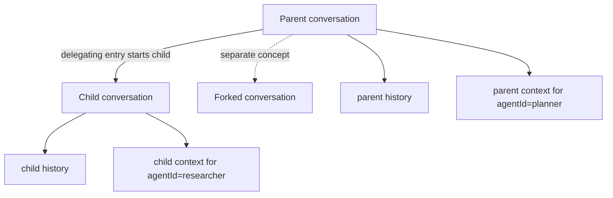

Agent and sub-agent workflows let one logical agent open a new conversation for a delegated task while it is working inside another conversation. This is different from forking: a fork creates an alternate branch of visible history, while a child conversation creates a separate conversation with its own history and its own agent-scoped context.

## The Core Idea

When an agent delegates work, it usually needs three things:

- a new conversation for the sub-task,
- the same access envelope as the parent conversation, and
- explicit attribution for which logical agent wrote each entry.

Memory Service models that with:

- `agentId` on entries for logical agent attribution,
- `startedByConversationId` and `startedByEntryId` on child conversations, and
- `ancestry` filters plus `/children` listing APIs for discovery.

## Client ID vs Agent ID

`clientId` and `agentId` are not the same thing.

- `clientId` is the authenticated app or system identity.
- `agentId` is the logical agent operating inside that client.

One client can host many agents:

```text
clientId = assistant-platform
agentId  = planner
agentId  = researcher
agentId  = summarizer
```

This matters most for the `context` channel. Context is isolated by `(conversationId, clientId, agentId)`, so two agents in the same client do not overwrite or read each other's working state.

History entries stay visible through normal conversation access rules.

## Parent and Child Conversations

A child conversation is created when an agent appends the first entry to a new conversation ID and includes `startedByConversationId`.

The child conversation:

- gets its own conversation ID,
- starts with the delegating entry as its first history entry,
- copies the parent conversation's ownership and memberships, and
- does not inherit or replay the parent conversation's history.

That last point is intentional. Parent and child conversations are separate tasks, not two views of the same transcript.



## How This Differs from Forking

Use a child conversation when you are delegating work to another agent or isolating a sub-task.

Use a fork when you want an alternate branch of the same visible conversation history.

| Use case | Child conversation | Fork |
| --- | --- | --- |
| Delegate work to another agent | Yes | No |
| Preserve separate transcript for a sub-task | Yes | No |
| Explore an alternate branch of the same discussion | No | Yes |
| Inherit parent history entries | No | Yes |
| Copy memberships from the source conversation | Yes | No special copy step |

## Starting a Child Conversation

The existing append-entry API creates the child conversation atomically with its first entry.

```bash
curl -X POST "http://localhost:8080/v1/conversations/$CHILD_ID/entries" \
  -H "Content-Type: application/json" \
  -H "Authorization: Bearer <token>" \
  -d '{
    "agentId": "planner",
    "startedByConversationId": "'"$PARENT_ID"'",
    "startedByEntryId": "'"$SOURCE_ENTRY_ID"'",
    "channel": "history",
    "contentType": "history",
    "content": [
      {
        "role": "USER",
        "text": "Research the vendor pricing options and summarize the tradeoffs."
      }
    ]
  }'
```

The server creates the child conversation and writes that first entry in one operation. If the parent conversation is later deleted, its started child-conversation tree is cascade-deleted as well.

## Listing Root and Child Conversations

Conversation listing can now filter by ancestry before applying the existing fork-tree `mode`.

- `ancestry=roots` returns conversations that were not started from another conversation.
- `ancestry=children` returns only child conversations.
- `ancestry=all` returns both.

Examples:

```bash
# Default top-level list
curl "http://localhost:8080/v1/conversations?ancestry=roots"

# Only child conversations visible to the caller
curl "http://localhost:8080/v1/conversations?ancestry=children&mode=all"

# One latest visible child conversation per fork tree
curl "http://localhost:8080/v1/conversations?ancestry=children&mode=latest-fork"
```

This keeps the default list focused on top-level user-facing conversations while still letting orchestration tooling inspect delegated work.

## Listing the Children of a Conversation

To inspect direct children of a parent conversation:

```bash
curl "http://localhost:8080/v1/conversations/$PARENT_ID/children?limit=20" \
  -H "Authorization: Bearer <token>"
```

Child conversations are ordered by `createdAt` ascending, with `conversationId` as the tie-breaker. Pagination resumes strictly after the child identified by `afterCursor`.

Example response:

```json
{
  "data": [
    {
      "id": "6dc8df4e-5713-4f84-b10d-132836acbcb5",
      "title": "Research sub-task",
      "startedByEntryId": "d4e5efc7-1035-48bf-bef6-ab7d0e1a4cb8",
      "createdAt": "2026-03-23T12:00:00Z"
    }
  ],
  "afterCursor": null
}
```

## A Typical Delegation Flow

1. The planner agent is working in a parent conversation.
2. It decides a sub-task should be isolated.
3. It appends the first entry to a new conversation ID with `startedByConversationId`.
4. The new child conversation is created with copied memberships and ownership.
5. The researcher agent writes follow-up entries in that child conversation with its own `agentId`.
6. The parent workflow can later list child conversations or retrieve the child's history directly.

## When to Use This Pattern

Use child conversations when:

- an agent is invoking another agent as a tool,
- the delegated task should have its own transcript,
- each agent needs isolated `context` state, or
- you want to inspect or audit sub-agent work separately from the parent conversation.

Stay in one conversation when the work is still part of the same visible transcript and does not need separate task boundaries.

## Next Steps

- See [Conversations](/docs/concepts/conversations/) for the base conversation model.
- See [Entries](/docs/concepts/entries/) for history and context channels.
- See [Forking](/docs/concepts/forking/) for alternate-history branching.
