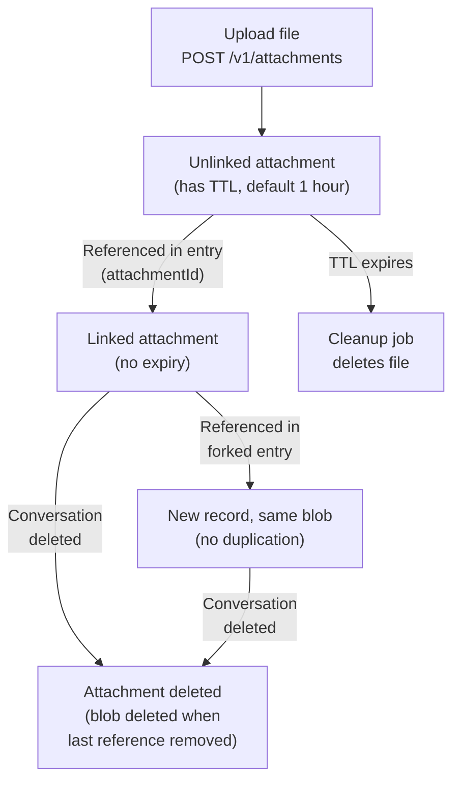

Attachments let you include binary files — images, audio, video, documents — in conversation entries, with server-managed storage, access control, signed download URLs, and automatic lifecycle management.

## Overview

There are two ways to attach files to conversation entries:

1. **External URL references** — Provide an `href` and `contentType` to point at an externally-hosted resource. The Memory Service stores the reference but does not manage the file.
2. **Server-stored attachments** — Upload the file to the Memory Service, receive an `attachmentId`, and include it when appending an entry. The server stores the file, manages access control, and handles cleanup.

## External URL References

The simplest way to attach files is to reference an externally-hosted resource directly. Provide an `href` and `contentType` in the content block's `attachments` array when appending an entry:

```bash
curl -X POST "http://localhost:8080/v1/conversations/{conversationId}/entries" \
  -H "Content-Type: application/json" \
  -H "Authorization: Bearer <token>" \
  -d '{
    "channel": "history",
    "contentType": "history",
    "content": [
      {
        "role": "USER",
        "text": "Analyze this diagram",
        "attachments": [
          {
            "href": "https://example.com/diagram.png",
            "contentType": "image/png",
            "name": "architecture-diagram.png"
          }
        ]
      }
    ]
  }'
```

The Memory Service stores the reference as-is — it does not download or manage the external file. This works well when your files are already hosted elsewhere and you just need to record them alongside the conversation.

The rest of this page covers **server-stored attachments**, where the Memory Service manages the file for you.

## Server-Stored Attachment Lifecycle



An attachment moves through three states:

- **Uploading** — File is being transferred to the server. A short-lived expiration is set to handle abandoned uploads.
- **Unlinked** — Upload complete but not yet referenced by any entry. Has a finite TTL (default 1 hour). The uploader can delete it manually or let it expire.
- **Linked** — Referenced by an entry. Expiration is cleared. The attachment persists as long as the conversation exists.

## Uploading Files

Upload a file with a multipart form POST:

```bash
curl -X POST "http://localhost:8080/v1/attachments?expiresIn=PT1H" \
  -H "Authorization: Bearer <token>" \
  -F "file=@photo.jpg"
```

Response:

```json
{
  "id": "7c9e6679-7425-40de-944b-e07fc1f90ae7",
  "href": "/v1/attachments/7c9e6679-7425-40de-944b-e07fc1f90ae7",
  "contentType": "image/jpeg",
  "filename": "photo.jpg",
  "size": 204800,
  "sha256": "e3b0c44298fc1c149afbf4c8996fb924...",
  "expiresAt": "2025-01-28T11:30:00Z"
}
```

| Field | Description |
|-------|-------------|
| `id` | Unique attachment identifier (use as `attachmentId` when appending entries) |
| `href` | Server path to download the attachment |
| `contentType` | Detected MIME type |
| `filename` | Original filename |
| `size` | File size in bytes |
| `sha256` | SHA-256 hash of the file contents |
| `expiresAt` | When the unlinked attachment will be cleaned up |

**Notes:**
- `expiresIn` is an ISO 8601 duration (default `PT1H`, max `PT24H`)
- Maximum file size is [10 MB by default (configurable)](/docs/configuration/#attachment-storage)
- The uploaded attachment is unlinked until referenced in an entry

## Referencing Uploaded Attachments in Entries

After uploading, include the `attachmentId` in the content block's `attachments` array when appending an entry:

```bash
curl -X POST "http://localhost:8080/v1/conversations/{conversationId}/entries" \
  -H "Content-Type: application/json" \
  -H "Authorization: Bearer <token>" \
  -d '{
    "channel": "history",
    "contentType": "history",
    "content": [
      {
        "role": "USER",
        "text": "What breed is this dog?",
        "attachments": [
          {
            "attachmentId": "7c9e6679-7425-40de-944b-e07fc1f90ae7"
          }
        ]
      }
    ]
  }'
```

On persistence, the server:
1. Links the attachment to the entry (clears the TTL)
2. Rewrites `attachmentId` to an `href` in the stored content
3. Auto-populates `contentType`, `name`, `size`, and `sha256` from the attachment record

The stored entry content will look like:

```json
{
  "role": "USER",
  "text": "What breed is this dog?",
  "attachments": [
    {
      "href": "/v1/attachments/7c9e6679-7425-40de-944b-e07fc1f90ae7",
      "contentType": "image/jpeg",
      "name": "photo.jpg",
      "size": 204800,
      "sha256": "e3b0c44298fc1c149afbf4c8996fb924..."
    }
  ]
}
```

### Attachment Properties

| Property | Required | Description |
|----------|----------|-------------|
| `attachmentId` | One of `href` or `attachmentId` | ID of a server-stored attachment |
| `href` | One of `href` or `attachmentId` | URL to an external resource |
| `contentType` | Required with `href` | MIME type (auto-populated for `attachmentId`) |
| `name` | No | Display name |
| `description` | No | Alt text or description |
| `size` | No | File size in bytes (auto-populated for `attachmentId`) |
| `sha256` | No | SHA-256 hash (auto-populated for `attachmentId`) |

## Multi-Modal Content

The Memory Service stores and serves all file types. How attachments are rendered is determined by the consuming application (agent framework or frontend). Common patterns:

| Content Type | Typical Use |
|-------------|-------------|
| `image/*` | Inline image display, vision model input |
| `audio/*` | Audio player, speech-to-text input |
| `video/*` | Video player, video analysis |
| `application/pdf` | PDF viewer, document analysis |
| Other | Generic file download |

Agent frameworks like LangChain4j and Spring AI map these content types to their native multi-modal content objects when building LLM requests.

## Downloading Attachments

### Direct Download

Retrieve attachment content with an Authorization header:

```bash
curl "http://localhost:8080/v1/attachments/{id}" \
  -H "Authorization: Bearer <token>" \
  -o downloaded-file.jpg
```

Access control:
- **Unlinked attachments** — Only the original uploader can download
- **Linked attachments** — Anyone with read access to the conversation can download

### Signed Download URLs

Browser elements like ``, `<audio>`, `<video>`, and `<a>` tags cannot send Authorization headers. Signed download URLs solve this by embedding a time-limited token in the URL itself.

```bash
curl "http://localhost:8080/v1/attachments/{id}/download-url" \
  -H "Authorization: Bearer <token>"
```

Response:

```json
{
  "url": "/v1/attachments/download/dG9rZW4.../photo.jpg",
  "expiresIn": 300
}
```

The returned URL requires no authentication — it can be used directly in HTML tags or opened in a browser. The URL expires after 5 minutes by default.

How signed URLs are generated depends on the storage backend:
- **S3 storage** — Returns an S3 pre-signed URL pointing directly to the object
- **Database storage** — Returns an HMAC-signed token URL served by the Memory Service

## Forking with Attachments

When creating an entry in a [forked conversation](/docs/concepts/forking/) that references an attachment from the parent conversation, the server creates a new attachment record that shares the same stored file — no duplication occurs.

```
Parent Conversation
├── Entry A
│   └── Attachment #1 (storageKey: "abc123")
│
Fork (new conversation)
├── (inherited entries from parent)
└── New Entry B (references attachment #1 via attachmentId)
    └── Attachment #2 (storageKey: "abc123")  ← same blob, new record
```

Include the parent's `attachmentId` in the forked entry just like any other attachment reference:

```json
{
  "forkedAtConversationId": "{parentConversationId}",
  "forkedAtEntryId": "{entryId}",
  "channel": "history",
  "contentType": "history",
  "content": [
    {
      "role": "USER",
      "text": "Let me try a different question about that image",
      "attachments": [
        { "attachmentId": "{attachmentIdFromParent}" }
      ]
    }
  ]
}
```

**Key details:**
- The source attachment must belong to the same conversation group (fork tree). Cross-group references are rejected.
- Multiple attachment records can share the same blob via reference counting. The stored file is only deleted when the last record referencing it is removed.
- You can mix references to parent attachments with fresh uploads in the same entry.

## Retention & Cleanup

### Unlinked Attachments (Temporary)

Uploaded files that are never referenced in an entry expire automatically:
- Default TTL: 1 hour (`PT1H`)
- Maximum TTL: 24 hours (`PT24H`)
- A cleanup job runs periodically (every 5 minutes by default) to delete expired files
- Users can delete unlinked attachments manually via `DELETE /v1/attachments/{id}`

### Linked Attachments (Permanent)

Once referenced in an entry, the attachment's expiration is cleared. It persists as long as the conversation exists and is deleted when the conversation (or its fork tree) is deleted.

### Shared Blobs

When multiple attachment records share a blob (from forking), the file is only deleted when the last record is removed. A soft-delete protocol ensures crash safety:

1. Lock all records sharing the same storage key
2. If other active records remain — hard-delete this record only (blob stays)
3. If this is the last record — soft-delete, delete the file, then hard-delete the record

All attachment settings (max file size, TTLs, cleanup interval, storage backend) are configured via environment variables. See the [Attachment Storage](/docs/configuration/#attachment-storage) section of the configuration guide.

## API Summary

### REST

- `POST /v1/attachments` — Upload a file
- `GET /v1/attachments/{id}` — Download attachment content
- `GET /v1/attachments/{id}/download-url` — Get a signed download URL
- `DELETE /v1/attachments/{id}` — Delete an unlinked attachment
- `GET /v1/attachments/download/{token}/{filename}` — Download via signed token (no auth required)

### gRPC

- `AttachmentsService.UploadAttachment` — Client-streaming upload
- `AttachmentsService.GetAttachment` — Get attachment metadata
- `AttachmentsService.DownloadAttachment` — Server-streaming download

## Next Steps

- Learn about [Entries](/docs/concepts/entries/) to understand content blocks
- Explore [Conversation Forking](/docs/concepts/forking/) for branching with attachments
- See the [API Contracts](/docs/api-contracts/) for full endpoint specifications
