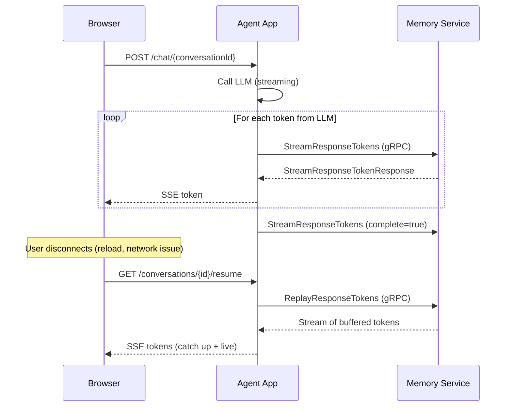
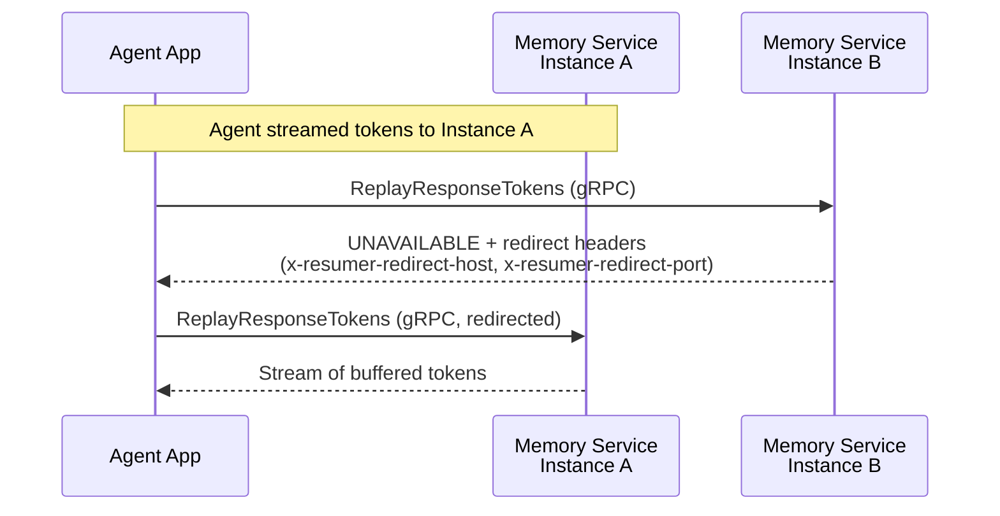

Response resumption lets users reconnect after a disconnect and pick up a streaming response where it left off. The Memory Service acts as a buffer between the agent producing tokens and clients consuming them, so a page reload or network blip doesn't lose the response.

## How It Works

When an agent generates a streaming response, it sends each token to the Memory Service via the `ResponseResumerService` gRPC API. The Memory Service buffers these tokens. Frontend clients consume the stream through the agent app's REST/SSE endpoints. If a client disconnects and reconnects, the agent app asks the Memory Service to replay the buffered tokens from the beginning, and the client catches up.



### Multi-Instance Redirect

When the Memory Service runs as multiple instances, the tokens for a given conversation are buffered on whichever instance the agent streamed them to. If a replay or cancel request arrives at a different instance, that instance returns a gRPC `UNAVAILABLE` status with custom trailing metadata containing the correct host and port. This is **not** a standard gRPC feature — raw gRPC clients will simply see an `UNAVAILABLE` error. The Quarkus and Spring client libraries provided by Memory Service handle this automatically, parsing the redirect metadata and retrying against the correct instance (up to 3 times).



The client library handles up to 3 consecutive redirects automatically. The same redirect mechanism applies to `CancelResponse` requests.

## gRPC Service

The `ResponseResumerService` provides five operations:

### StreamResponseTokens

Bidirectional streaming RPC used by the agent app to send response tokens to the Memory Service for buffering.

```protobuf
rpc StreamResponseTokens(stream StreamResponseTokenRequest)
    returns (stream StreamResponseTokenResponse);
```

**Request stream** — the agent sends one message per token:

| Field | Type | Description |
|-------|------|-------------|
| `conversation_id` | `bytes` | UUID (16-byte big-endian). Required in the **first** message only. |
| `token` | `string` | The token content. |
| `complete` | `bool` | Set to `true` in the **final** message to signal the response is finished. |

**Response stream** — the server acknowledges each token:

| Field | Type | Description |
|-------|------|-------------|
| `success` | `bool` | Whether the token was recorded. |
| `error_message` | `string` | Set only when `success` is `false`. |
| `current_offset` | `int64` | Cumulative byte offset after this token. |
| `cancel_requested` | `bool` | `true` if a user requested cancellation — the agent should stop generating. |

The agent should monitor `cancel_requested` on each response. When it becomes `true`, the agent should stop calling the LLM and close the stream.

### ReplayResponseTokens

Server-streaming RPC that replays all buffered tokens for a conversation.

```protobuf
rpc ReplayResponseTokens(ReplayResponseTokensRequest)
    returns (stream ReplayResponseTokensResponse);
```

**Request:**

| Field | Type | Description |
|-------|------|-------------|
| `conversation_id` | `bytes` | UUID (16-byte big-endian). |

**Response stream:**

| Field | Type | Description |
|-------|------|-------------|
| `token` | `string` | Token content. |
| `offset` | `int64` | Cumulative byte offset after this token. |

If the response is still in progress, the replay stream stays open and delivers new tokens as they arrive. Once the response completes, the stream closes.

If the tokens are buffered on a different instance, the server returns gRPC status `UNAVAILABLE` with `x-resumer-redirect-host` and `x-resumer-redirect-port` in the trailing metadata.

### CancelResponse

Unary RPC that requests cancellation of an in-progress response.

```protobuf
rpc CancelResponse(CancelResponseRequest)
    returns (CancelResponseResponse);
```

**Request:**

| Field | Type | Description |
|-------|------|-------------|
| `conversation_id` | `bytes` | UUID (16-byte big-endian). |

**Response:**

| Field | Type | Description |
|-------|------|-------------|
| `accepted` | `bool` | `true` if the cancellation was accepted. |

After cancellation is accepted, the server waits (up to 30 seconds) for the agent's `StreamResponseTokens` call to finish, then the `cancel_requested` flag is set on the next `StreamResponseTokenResponse` so the agent knows to stop.

Like `ReplayResponseTokens`, this operation returns a redirect if the tokens are buffered on a different instance.

### CheckConversations

Unary RPC to check which conversations have responses currently in progress.

```protobuf
rpc CheckConversations(CheckConversationsRequest)
    returns (CheckConversationsResponse);
```

**Request:**

| Field | Type | Description |
|-------|------|-------------|
| `conversation_ids` | `repeated bytes` | List of UUIDs to check. |

**Response:**

| Field | Type | Description |
|-------|------|-------------|
| `conversation_ids` | `repeated bytes` | Subset of the input IDs that have responses in progress. |

This is useful for frontends that need to show a "response in progress" indicator when a user opens a conversation list. The agent app can batch-check multiple conversations in a single call.

### IsEnabled

Unary RPC to check whether the response resumer is available.

```protobuf
rpc IsEnabled(google.protobuf.Empty) returns (IsEnabledResponse);
```

**Response:**

| Field | Type | Description |
|-------|------|-------------|
| `enabled` | `bool` | `true` if response resumption is available. |

## Agent Integration Flow

A typical agent app integrates response resumption as follows:

1. **Start streaming** — When the agent receives a chat request, it calls the LLM with streaming enabled and opens a `StreamResponseTokens` gRPC stream to the Memory Service.

2. **Forward tokens** — As each token arrives from the LLM, the agent sends it to both the Memory Service (for buffering) and the client (via SSE or similar).

3. **Monitor cancellation** — On each `StreamResponseTokenResponse`, the agent checks `cancel_requested`. If `true`, it stops the LLM call and sends `complete=true`.

4. **Complete the stream** — After the last token, the agent sends a final message with `complete=true` and closes the gRPC stream.

5. **Handle resume requests** — When a client reconnects, the agent calls `ReplayResponseTokens` and forwards the replayed tokens to the client. If the response is still in progress, the replay stream stays open and delivers new tokens live.

6. **Handle cancel requests** — When a user clicks "stop", the agent calls `CancelResponse`. The Memory Service signals the streaming agent via `cancel_requested`.

## Access Control

- **StreamResponseTokens** requires `WRITER` access to the conversation (or a valid API key).
- **ReplayResponseTokens** requires `READER` access.
- **CancelResponse** requires `WRITER` access (API key auth is not accepted for cancel).
- **CheckConversations** requires `READER` access; conversations the user cannot access are silently excluded from the response.

## Next Steps

- See the [Quarkus Response Resumption](/docs/quarkus/response-resumption/) guide for a framework-specific implementation walkthrough.
- Learn about [Conversation Forking](/docs/concepts/forking/) to understand branching conversations.
- Learn about [Entries](/docs/concepts/entries/) to understand how messages are stored.
